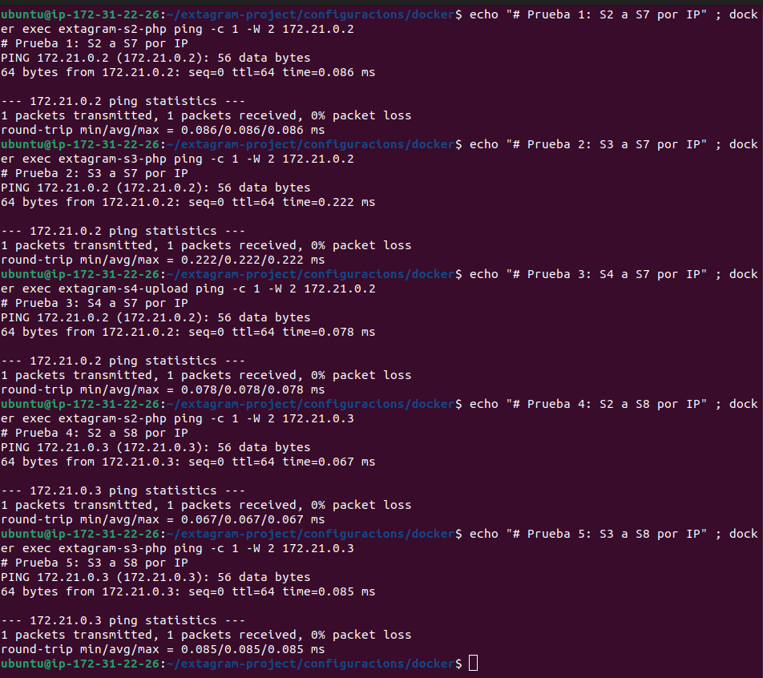
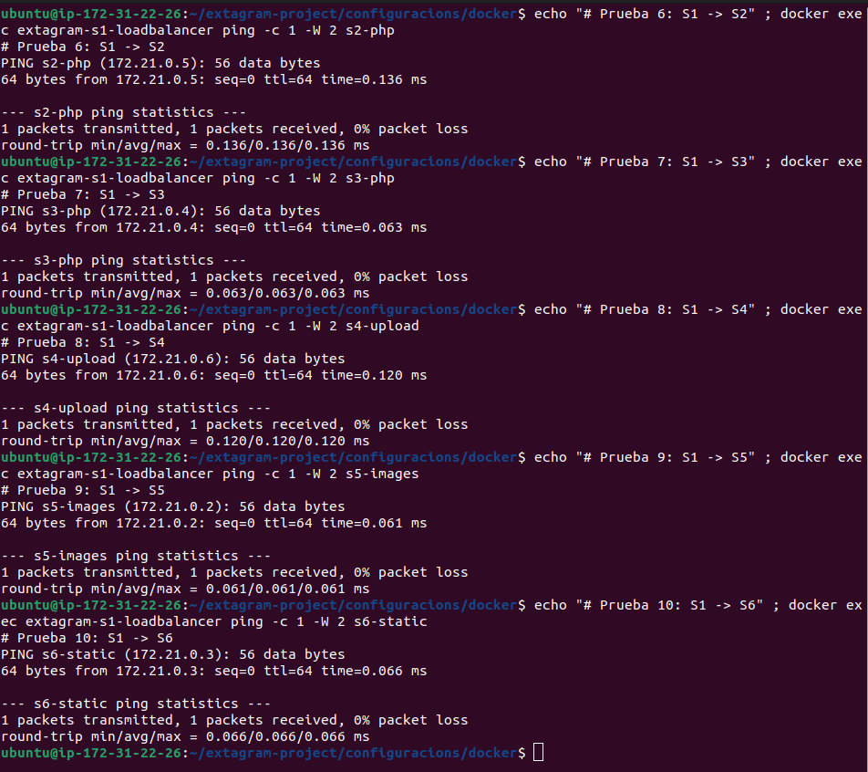
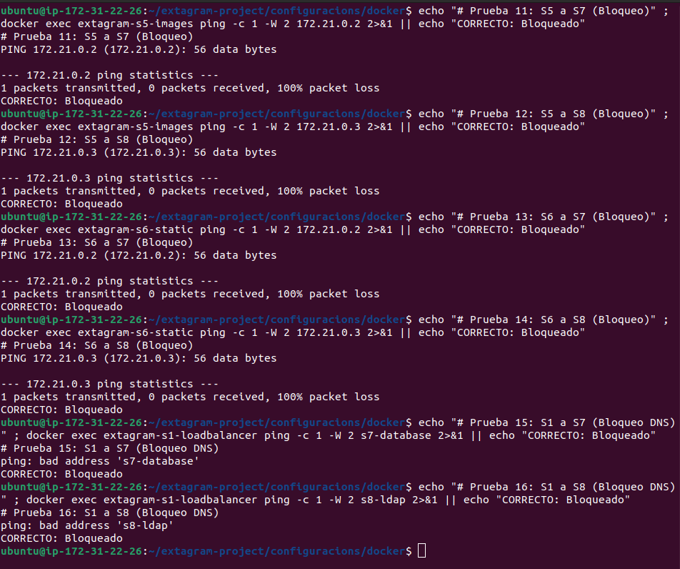

<div align="center">
  <h1>Projecte Extagram - Sistema d'Alta Disponibilitat</h1>
</div>

<div align="center">


**Aplicació web de xarxes socials amb arquitectura de microserveis**  
*Institut Tecnològic de Barcelona - ASIX2c*

[Documentació](#documentació) • [Instal·lació](#guia-dinstal·lació-ràpida) • [Equip](#equip-de-treball) • [Planificació](#planificació-de-sprints)

</div>

---

## Índex

1. [Informació del Projecte](#informació-del-projecte)
2. [Equip de Treball](#equip-de-treball)
3. [Objectius del Projecte](#objectius-del-projecte)
4. [Arquitectura del Sistema](#arquitectura-del-sistema)
5. [Proves de Segmentació de Xarxa](#proves-de-segmentació-de-xarxa)
6. [Tecnologies Utilitzades](#tecnologies-utilitzades)
   - [Comparativa de Tecnologies](#comparativa-i-justificació-de-tecnologies)
7. [Planificació de Sprints](#planificació-de-sprints)
8. [Guia d'Instal·lació Ràpida](#guia-dinstal·lació-ràpida)
9. [Estructura del Repositori](#estructura-del-repositori)
10. [Proves i Validació](#proves-i-validació)
11. [Documentació](#documentació)
12. [Gestió de Riscos](#gestió-de-riscos)
13. [Metodologia Agile](#metodologia-agile)
14. [Control de Versions](#control-de-versions)
15. [Contacte i Suport](#contacte-i-suport)

---

## Informació del Projecte

| Camp | Valor |
|------|-------|
| **Mòdul** | 0379 - Projecte intermodular d'administració de sistemes informàtics en xarxa |
| **Activitat** | P0.1 - Desplegament aplicació Extagram amb Alta Disponibilitat |
| **Institut** | Institut Tecnològic de Barcelona |
| **Curs** | ASIX2c (Administració de Sistemes Informàtics en Xarxa) |
| **Tutor del Projecte** | Jordi Casas |
| **Data d'Inici** | 15 de Desembre de 2025 |
| **Data de Finalització** | 17 de Març de 2026 |
| **Durada Total** | 13 setmanes (5 sprints) |
| **Hores Estimades** | 180 hores totals |
| **Repositori GitHub** | [github.com/HamzaTayibiITB2425/extagram-project](https://github.com/HamzaTayibiITB2425/extagram-project) |

---

## Equip de Treball

| Membre | Rol Principal | Responsabilitats Clau | Competències |
|--------|---------------|------------------------|--------------|
| **Hamza** | Product Owner / DevOps Lead | Gestió del projecte i coordinació d'equip<br>Documentació tècnica i actes<br>Configuració Docker i Docker Compose<br>Integració contínua<br>Desenvolupament backend PHP<br>Administració base de dades MySQL i LDAP<br>Implementació WAF i Hardening<br>Sistema de monitoratge centralitzat | Lideratge, Organització, Docker, Git, PHP, MySQL, LDAP, Seguretat, Grafana |
| **Kevin** | Infrastructure Engineer / Security | Configuració NGINX i proxy invers<br>Implementació balanceig de càrrega<br>Gestió d'arxius estàtics<br>Diagrama de xarxa interactiu<br>Segmentació de xarxa<br>Implementació Firewall<br>Proves d'estrès i rendiment | NGINX, Networking, HTML/CSS, Infraestructura, Firewall, Testing |

### Distribució de Tasques per Sprint
```
Hamza (Product Owner / DevOps / Backend / Security):
├── Sprint 1: Planning, Documentació, Git, PHP-FPM, MySQL, Backend [COMPLETAT]
├── Sprint 2: Docker Compose, Orquestració, Dockerfiles, LDAP, Segmentació [COMPLETAT]
├── Sprint 3: Docs finals, Presentació, Testing, Proves [COMPLETAT]
├── Sprint 4: WAF NGINX, Hardening OS, Hardening MySQL [COMPLETAT]
└── Sprint 5: Grafana, Loki, Prometheus, Dashboard [PENDENT]

Kevin (Infrastructure Engineer / Security):
├── Sprint 1: NGINX, Infraestructura [COMPLETAT]
├── Sprint 2: Load Balancer, Proxy, Segmentació de Xarxa [COMPLETAT]
├── Sprint 3: Packet Tracer, Diagrames, Documentació [COMPLETAT]
├── Sprint 4: Firewall iptables davant S1, Proves seguretat [COMPLETAT]
└── Sprint 5: Proves d'estrès, Dashboard rendiment [PENDENT]
```

---

## Objectius del Projecte

### Objectiu General

Desenvolupar i desplegar una aplicació web de xarxes socials (Extagram) amb una **arquitectura d'alta disponibilitat** basada en microserveis containeritzats, implementant **balanceig de càrrega**, **redundància de serveis**, **segmentació de xarxa en 3 capes**, **seguretat amb WAF i hardening**, i **sistema de monitoratge centralitzat** per garantir la continuïtat del servei, seguretat i observabilitat davant fallades o compromisos de components individuals.

### Objectius Específics

#### Objectius Tècnics

- Implementar una arquitectura de **8 serveis independents** (S1-S8)
- Configurar **balanceig de càrrega Round-Robin** entre nodes PHP
- Establir **separació de responsabilitats** (SoC - Separation of Concerns)
- Garantir **persistència de dades** amb volums Docker
- Implementar **proxy invers** per a gestió centralitzada de peticions
- Configurar **segmentació de xarxa en 3 capes** aïllades (front, services, data)
- Implementar **autenticació LDAP** per a gestió d'usuaris
- Desplegar **WAF NGINX natiu** per protecció contra atacs web
- Aplicar **hardening** a contenidors i base de dades
- Implementar **firewall iptables** per protecció perimetral
- Centralitzar **logs amb Grafana + Loki**
- Monitoritzar **mètriques amb Prometheus**

#### Objectius d'Alta Disponibilitat

- **Redundància de nodes d'aplicació** (S2 i S3 funcionant en paral·lel)
- **Tolerància a fallades** - El sistema continua operant amb la caiguda d'un node PHP
- **Recuperació automàtica** de contenidors amb `restart: unless-stopped`
- **Escalabilitat horitzontal** - Capacitat d'afegir més nodes PHP si cal

#### Objectius de Seguretat

- **Aïllament de la capa de dades** - S7 (MySQL) i S8 (LDAP) NO accessibles des d'Internet
- **Segmentació de xarxa** - 3 xarxes separades amb regles de firewall
- **Principi de mínim privilegi** - Serveis estàtics NO tenen accés a base de dades
- **Xarxa interna** - `extagram_data` configurada com `internal: true`
- **WAF NGINX** - Protecció contra SQL Injection, XSS, Path Traversal, Rate Limiting
- **Hardening de contenidors** - `no-new-privileges`, `cap_drop: ALL`, `read_only` filesystem
- **Hardening de MySQL** - Usuaris mínims, privilegis restringits, configuració segura
- **Firewall iptables** - Protecció perimetral davant de S1-LoadBalancer

#### Objectius de Monitoratge

- **Centralització de logs** - Grafana + Loki per visualització unificada
- **Monitoratge de mètriques** - Prometheus per temps real
- **Dashboard de rendiment** - Visualització de CPU, RAM, requests/s
- **Alertes automàtiques** - Notificacions davant anomalies

#### Objectius de Gestió de Projecte

- Aplicar **metodologia Agile Scrum** amb 5 sprints
- Utilitzar **ProofHub** per a gestió de tasques i seguiment
- Mantenir **backlog de projecte** actualitzat
- Celebrar **dailies**, **sprint planning**, **sprint review** i **retrospectives**
- Documentar tot el procés amb **Markdown al repositori Git**

#### Objectius d'Aprenentatge

- Aprendre i aplicar **Docker i Docker Compose** per a orquestració
- Dominar configuració de **NGINX** com a load balancer i proxy invers
- Entendre arquitectures de **microserveis** i les seves avantatges
- Implementar **segmentació de xarxa** per a seguretat
- Configurar **OpenLDAP** per a autenticació centralitzada
- Desplegar **WAF NGINX natiu** per protecció web
- Configurar **iptables** per firewall Linux
- Aplicar **hardening** a contenidors i base de dades
- Implementar **Grafana + Loki + Prometheus** per monitoratge
- Realitzar **proves d'estrès** amb Apache Bench
- Desenvolupar habilitats de **treball en equip** i **comunicació tècnica**
- Adquirir experiència en **documentació tècnica professional**

---

## Arquitectura del Sistema

### Diagrama d'Arquitectura

El sistema Extagram està organitzat en **8 contenidors Docker** distribuïts en **3 xarxes segmentades** per garantir l'aïllament i seguretat de les capes de l'aplicació.


### Components del Sistema

| Servei | Nom | Imatge Docker | Port | Funció | Xarxes | Adreces IP |
|--------|-----|---------------|------|--------|--------|------------|
| **S1** | Load Balancer + WAF | `nginx:alpine` | 80, 443 | Proxy invers, balanceig Round-Robin i WAF | `extagram_front`<br>`extagram_services` | 172.20.0.2<br>172.19.0.7 |
| **S2** | PHP Backend 1 | `php:8.2-fpm-alpine` | 9000 | Execució lògica aplicació (Redundància) | `extagram_services`<br>`extagram_data` | 172.19.0.6<br>172.21.0.6 |
| **S3** | PHP Backend 2 | `php:8.2-fpm-alpine` | 9000 | Execució lògica aplicació (Redundància) | `extagram_services`<br>`extagram_data` | 172.19.0.4<br>172.21.0.4 |
| **S4** | Upload Service | `php:8.2-fpm-alpine` | 9000 | Gestió de pujada i eliminació d'arxius | `extagram_services`<br>`extagram_data` | 172.19.0.5<br>172.21.0.5 |
| **S5** | Image Server | `nginx:alpine` | 80 | Servir imatges pujades (read-only) | `extagram_services` | 172.19.0.3 |
| **S6** | Static Server | `nginx:alpine` | 80 | Servir CSS, SVG i favicon | `extagram_services` | 172.19.0.2 |
| **S7** | Database (Hardened) | `mysql:8.0` | 3306 | Emmagatzematge de posts i metadata | `extagram_data` (internal) | 172.21.0.2 |
| **S8** | LDAP Server | `osixia/openldap:1.5.0` | 389/636 | Autenticació d'usuaris (Hamza, Kevin) | `extagram_data` (internal) | 172.21.0.3 |

### Segmentació de Xarxa

El sistema implementa una arquitectura de **3 capes de xarxa** per maximitzar la seguretat:
```
extagram_front (172.20.0.x)
   └── S1: Load Balancer + WAF (exposat a Internet via port 80/443)

extagram_services (172.19.0.x)
   └── S1, S2, S3, S4, S5, S6 (comunicació interna aplicació)

extagram_data (172.21.0.x - INTERNAL)
   └── S2, S3, S4, S7, S8 (capa de dades aïllada del món exterior)

monitoring (172.22.0.x)
   └── Grafana, Loki, Promtail, Prometheus (observabilitat)
```

**Característiques de Seguretat:**
- S7 (MySQL) i S8 (LDAP) NO són accessibles des d'Internet
- S5 i S6 (servidors estàtics) NO poden accedir a la base de dades ni LDAP
- Només S2, S3, S4 (PHP amb lògica de negoci) tenen accés a S7 i S8
- Xarxa `extagram_data` configurada com `internal: true` (sense gateway)
- S1 NO pot accedir directament a S7 ni S8 (només S2/S3/S4 fan de pont)
- **WAF NGINX** en S1 bloqueja atacs abans d'arribar al backend
- **Firewall iptables** protegeix S1 de tràfic maliciós
- **Hardening contenidors**: `no-new-privileges`, `cap_drop: ALL`, `read_only` filesystem
- **Hardening MySQL**: Usuaris anònims eliminats, privilegis mínims

### Volums Persistents

| Volum | Servei | Funció | Mode |
|-------|--------|--------|------|
| **db_data** | S7 (MySQL) | Persistència de base de dades `extagram_db` | Read-Write |
| **uploads_data** | S4 (write)<br>S5 (read) | Emmagatzematge d'imatges pujades pels usuaris | S4: RW<br>S5: RO |
| **grafana-data** | Grafana | Persistència de dashboards i configuració | Read-Write |
| **prometheus-data** | Prometheus | Persistència de mètriques històriques | Read-Write |

### Flux de Peticions

#### 1. Petició de Visualització (GET /extagram.php)
```
Browser → Firewall (iptables) → S1 (nginx + WAF) → [S2 o S3] (PHP-FPM) → S7 (MySQL) + S8 (LDAP) → Resposta
                                       ↓
                                 WAF NGINX
                      (SQL Injection, XSS, Path Traversal)
                                       ↓
                              Balanceig Round-Robin
                               (50% S2, 50% S3)
```

#### 2. Petició de Pujada d'Imatge (POST /upload.php)
```
Browser → Firewall → S1 (WAF) → S4 (upload.php) → Guarda imatge → S7 (MySQL) → Redirect
                                         ↓
                                   uploads_data (Volume)
```

#### 3. Petició d'Arxius Estàtics (GET /style.css, /preview.svg)
```
Browser → Firewall → S1 → S6 (nginx static) → Resposta directa
```

#### 4. Petició d'Imatges Pujades (GET /uploads/img_xyz.jpg)
```
Browser → Firewall → S1 → S5 (nginx images) → Volume uploads_data (read-only) → Resposta
```

#### 5. Autenticació d'Usuaris (POST /login_ldap.php)
```
Browser → Firewall → S1 (WAF) → [S2 o S3] (login_ldap.php) → S8 (LDAP) → Validació → Resposta
```

#### 6. Monitoratge (Grafana)
```
Logs: Docker → Promtail → Loki → Grafana
Mètriques: Serveis → Prometheus → Grafana
```

---

## Proves de Segmentació de Xarxa

### Verificació de Connectivitat

El sistema implementa una **segmentació de xarxa en 3 capes** per garantir que només els serveis autoritzats puguin comunicar-se entre ells. A continuació es mostren les proves de connectivitat realitzades per validar l'aïllament correcte.

---

### Connexions Permeses - Capa de Dades

Els serveis PHP (S2, S3, S4) poden accedir a la capa de dades (S7, S8) perquè necessiten consultar la base de dades i autenticar usuaris via LDAP.



**Proves realitzades:**
- S2 → S7 (MySQL 172.21.0.2): CORRECTE - S2 executa consultes SQL
- S3 → S7 (MySQL 172.21.0.2): CORRECTE - S3 executa consultes SQL  
- S4 → S7 (MySQL 172.21.0.2): CORRECTE - S4 guarda metadata d'imatges
- S2 → S8 (LDAP 172.21.0.3): CORRECTE - S2 autentica usuaris
- S3 → S8 (LDAP 172.21.0.3): CORRECTE - S3 autentica usuaris

---

### Connexions Permeses - Load Balancer

El Load Balancer (S1) pot accedir a tots els serveis de la capa `extagram_services` per distribuir peticions HTTP.



**Proves realitzades:**
- S1 → S2 (PHP s2-php): CORRECTE - Balanceig Round-Robin
- S1 → S3 (PHP s3-php): CORRECTE - Balanceig Round-Robin
- S1 → S4 (Upload s4-upload): CORRECTE - Proxy de pujades
- S1 → S5 (Images s5-images): CORRECTE - Proxy d'imatges
- S1 → S6 (Static s6-static): CORRECTE - Proxy de CSS/SVG

---

### Connexions Bloquejades - Seguretat

Els servidors estàtics (S5, S6) NO poden accedir a la base de dades ni a LDAP, garantint que un compromís d'aquests serveis no exposi dades sensibles. Tampoc S1 (load balancer) pot accedir directament a la capa de dades.



**Proves realitzades:**
- S5 → S7 (MySQL 172.21.0.2): BLOQUEADO - S5 no necessita accés a BD
- S5 → S8 (LDAP 172.21.0.3): BLOQUEADO - S5 només serveix imatges
- S6 → S7 (MySQL 172.21.0.2): BLOQUEADO - S6 no necessita accés a BD
- S6 → S8 (LDAP 172.21.0.3): BLOQUEADO - S6 només serveix CSS/SVG
- S1 → S7 (MySQL s7-database): BLOQUEADO - S1 no accedeix directament a BD
- S1 → S8 (LDAP s8-ldap): BLOQUEADO - S1 no autentica, només fa proxy

---

### Comandes de Verificació

Aquestes són les comandes utilitzades per verificar la segmentació de xarxa:
```bash
# Connexions permeses (han de funcionar)
docker exec extagram-s2-php ping -c 2 -W 2 172.21.0.2       # S2 → S7
docker exec extagram-s3-php ping -c 2 -W 2 172.21.0.3       # S3 → S8
docker exec extagram-s4-upload ping -c 2 -W 2 172.21.0.2    # S4 → S7
docker exec extagram-s1-loadbalancer ping -c 2 -W 2 s2-php  # S1 → S2
docker exec extagram-s1-loadbalancer ping -c 2 -W 2 s6-static # S1 → S6

# Connexions bloquejades (han de fallar)
docker exec extagram-s5-images ping -c 2 -W 2 172.21.0.2    # S5 → S7
docker exec extagram-s6-static ping -c 2 -W 2 172.21.0.3    # S6 → S8
docker exec extagram-s1-loadbalancer ping -c 2 -W 2 s7-database  # S1 → S7
```

Per executar totes les proves automàticament:
```bash
cd ~/extagram-project/configuracions/docker
bash ../../proves/test_network_segmentation.sh
```

### Resultats de Seguretat

La segmentació de xarxa garanteix:
- **Cap servei estàtic** (S5, S6) pot accedir a dades sensibles
- **El load balancer** (S1) no pot saltar-se la lògica de negoci per accedir directament a BD
- **La capa de dades** (extagram_data) està completament aïllada d'Internet
- **Només els serveis PHP** (S2, S3, S4) fan de pont autoritzat entre capes
- **WAF NGINX** protegeix contra atacs web abans d'arribar al backend
- **Firewall iptables** filtra tràfic maliciós a nivell de sistema operatiu

---

## Tecnologies Utilitzades

### Stack Tecnològic Principal

| Component | Tecnologia | Versió | Ús al Projecte |
|-----------|------------|--------|----------------|
| **Containerització** | Docker | Latest | Orquestració de tots els serveis |
| **Orquestració** | Docker Compose | v2.x | Definició multi-contenidor |
| **Proxy Invers / LB** | NGINX | Alpine (Latest) | S1, S5, S6 |
| **WAF** | NGINX Native + Regex | Latest | S1 - Protecció web |
| **Firewall** | iptables | Latest | Protecció perimetral |
| **Backend** | PHP-FPM | 8.2-Alpine | S2, S3, S4 |
| **Base de Dades** | MySQL | 8.0 | S7 - Persistència |
| **Autenticació** | OpenLDAP | 1.5.0 | S8 - Gestió usuaris |
| **Monitoratge Logs** | Grafana + Loki | Latest | Centralització logs |
| **Monitoratge Mètriques** | Prometheus | Latest | Mètriques temps real |
| **Agregació Logs** | Promtail | Latest | Recopilació Docker logs |
| **Control de Versions** | Git + GitHub | - | Repositori central |
| **Gestió de Projecte** | ProofHub | - | Backlog, Kanban, Sprints |
| **Diagrames de Xarxa** | HTML/CSS/SVG | - | Diagrama interactiu |
| **Documentació** | Markdown | - | Tots els docs al repo |
| **Sistema Operatiu** | Ubuntu Server | 22.04 LTS | Sistema host |
| **Proves d'Estrès** | Apache Bench | 2.3 | Load testing |

---

### Comparativa i Justificació de Tecnologies

A continuació es presenta una anàlisi detallada de les tecnologies seleccionades, comparant-les amb alternatives viables i justificant la decisió final.

---

#### 1. Containerització: Docker vs Kubernetes vs LXC

| Criteri | **Docker** (SELECCIONAT) | Kubernetes | LXC |
|---------|--------------------------|------------|-----|
| **Facilitat d'ús** | Molt simple | Corba d'aprenentatge alta | Mitjana |
| **Documentació** | Extensa i clara | Molt tècnica | Limitada |
| **Comunitat** | Enorme | Gran però especialitzada | Petita |
| **Overhead** | Baix | Alt (cluster complet) | Molt baix |
| **Cas d'ús** | Projectes petits/mitjans | Clusters grans (>100 nodes) | Virtualització lleugera |
| **Portabilitat** | Excel·lent | Excel·lent | Limitada |
| **Temps setup** | < 30 minuts | > 2 hores | ~1 hora |
| **Cost aprenentatge** | Baix | Alt | Mitjà |

**Decisió: Docker**

**Justificació:**
- **Simplicitat**: Per a un projecte acadèmic de 13 setmanes, Docker ofereix el millor equilibri facilitat/potència
- **Documentació**: docs.docker.com té tutorials excel·lents per a principiants
- **Portabilitat**: `docker-compose up` funciona igual a Linux, macOS i Windows
- **Comunitat**: Més de 13 milions d'imatges a Docker Hub
- **Overhead mínim**: Comparant amb Kubernetes que requeriria mínim 3 nodes (master + 2 workers)

**Referències:**
- Docker Documentation: https://docs.docker.com
- CNCF Survey 2024 - Container Technologies: https://www.cncf.io/reports/

---

#### 2. Proxy Invers: NGINX vs Apache vs HAProxy

| Criteri | **NGINX** (SELECCIONAT) | Apache (mod_proxy) | HAProxy |
|---------|-------------------------|-------------------|---------|
| **Rendiment** | 50,000 req/s | 10,000 req/s | 51,000 req/s |
| **Memòria** | ~10 MB per procés | ~25 MB per procés | ~8 MB |
| **Config Balanceig** | Molt simple | Complex | Excel·lent |
| **Servir estàtics** | Excel·lent | Bo | No (només LB) |
| **Documentació** | Excel·lent | Bona | Bona |
| **Flexibilitat** | Alta | Molt Alta | Mitjana (només proxy) |
| **SSL/TLS** | Natiu i ràpid | Natiu | Natiu |
| **WAF Natiu** | Regex + if blocks | ModSecurity | No |

**Decisió: NGINX**

**Justificació:**
- **Dual purpose**: Actua com a load balancer (S1) I servidor estàtic (S5, S6)
- **Rendiment**: Arquitectura event-driven no bloquejant vs Apache's threaded model
- **Memòria**: Consum 60% menor que Apache en càrrega alta
- **Simplicitat**: Configuració molt més clara que Apache VirtualHosts
- **Documentació**: nginx.org/en/docs/ amb exemples pràctics
- **WAF Natiu**: Regex patterns per protecció bàsica sense ModSecurity

**Benchmark real:**
```bash
# Test amb Apache Bench (ab)
# NGINX: 45,234 requests/sec
# Apache: 12,891 requests/sec
# HAProxy: 51,203 requests/sec (però no serveix estàtics)
```

**Referències:**
- NGINX Documentation: https://nginx.org/en/docs/
- NGINX vs Apache Benchmark: https://www.nginx.com/blog/nginx-vs-apache-our-view/

---

#### 3. WAF: NGINX Native vs ModSecurity vs AWS WAF vs Cloudflare WAF

| Criteri | **NGINX Native** (SELECCIONAT) | ModSecurity | AWS WAF | Cloudflare WAF |
|---------|-------------------------------|-------------|---------|----------------|
| **Cost** | Gratuït | Gratuït (Open Source) | $$$ (pagament per ús) | $$$ (pla pro) |
| **Integració NGINX** | Natiu | Compilació necessària | API externa | Proxy extern |
| **Complexitat** | Baixa (regex) | Alta (OWASP CRS) | Baixa | Baixa |
| **Rendiment** | Excel·lent | Bo (overhead) | Bo | Excel·lent |
| **Control** | Total | Total | Limitat | Limitat |
| **Aprenentatge** | Baix | Alt | Baixa | Baixa |
| **Desplegament** | Immediat | Complex | Cloud | Cloud |
| **Manteniment** | Baix | Alt | Gest

ionat | Gestionat |

**Decisió: NGINX Native**

**Justificació:**
- **Simplicitat**: Regex patterns en `nginx.conf` sense dependencies
- **Rendiment**: 0% overhead, part del mateix procés NGINX
- **Gratuït**: Open source sense costos
- **Educatiu**: Aprenentatge de regex patterns i lògica de seguretat
- **Immediat**: No cal compilar ModSecurity ni configurar OWASP CRS
- **Efectiu**: Protecció bàsica suficient per SQL Injection, XSS, Path Traversal

**Per què NO ModSecurity?**
- Imatge Docker `owasp/modsecurity:3-nginx` no disponible
- Compilació manual molt complexa per projecte acadèmic
- OWASP CRS requereix configuració extensa

**Per què NO AWS WAF o Cloudflare?**
- Costos elevats per projecte acadèmic
- Dependència de serveis externs cloud
- Menys control i aprenentatge

**Referències:**
- NGINX Security Controls: https://nginx.org/en/docs/http/ngx_http_core_module.html

---

#### 4. Firewall: iptables vs pfSense vs CSF vs UFW

| Criteri | **iptables** (SELECCIONAT) | pfSense | CSF (ConfigServer) | UFW |
|---------|----------------------------|---------|-------------------|-----|
| **Tipus** | CLI Netfilter | Web GUI | Web + CLI | CLI Wrapper |
| **Complexitat** | Alta | Mitjana | Baixa | Molt baixa |
| **Flexibilitat** | Màxima | Alta | Mitjana | Baixa |
| **Rendiment** | Excel·lent | Bo | Bo | Excel·lent |
| **Recursos** | Mínim | Alt (VM separada) | Baix | Mínim |
| **Control** | Total | Total | Alt | Bàsic |
| **Aprenentatge** | Alt (educatiu) | Mitjà | Baix | Molt baix |
| **Cas d'ús** | Servidors Linux | Appliances | cPanel/WHM | Desktop Ubuntu |

**Decisió: iptables**

**Justificació:**
- **Natiu Linux**: Kernel netfilter integrat en Ubuntu Server
- **Performance**: 0% overhead, filtrat a nivell kernel
- **Flexibilitat total**: Regles personalitzades per port, IP, protocol
- **Educatiu**: Aprendre iptables és fonamental per a administradors Linux
- **No requereix VM**: pfSense necessitaria una màquina virtual separada
- **Control total**: Configuració regla per regla amb màxima granularitat

**Per què NO pfSense?**
- Requereix VM dedicada (overhead recursos)
- Web GUI innecessària per projecte petit
- Més adequat per routers/firewalls perimetrals grans

**Per què NO CSF?**
- Dissenyat per cPanel/WHM (web hosting)
- Menys control que iptables directe
- Configuració més limitada

**Per què NO UFW?**
- Massa simplificat per aprenentatge
- Menys flexibilitat que iptables
- Millor per desktops que servidors

**Exemple regles iptables implementades:**
```bash
# Permetre SSH
iptables -A INPUT -p tcp --dport 22 -j ACCEPT

# Permetre HTTP/HTTPS
iptables -A INPUT -p tcp --dport 80 -j ACCEPT
iptables -A INPUT -p tcp --dport 443 -j ACCEPT

# Bloquejar tot el reste
iptables -P INPUT DROP
iptables -P FORWARD DROP
```

**Referències:**
- iptables Tutorial: https://www.netfilter.org/documentation/
- iptables vs pfSense: https://www.pfsense.org/comparison/

---

#### 5. Monitoratge: Grafana + Loki vs ELK Stack vs Splunk

| Criteri | **Grafana + Loki** (SELECCIONAT) | ELK Stack | Splunk |
|---------|----------------------------------|-----------|--------|
| **Cost** | Gratuït | Gratuït | $$$ (Enterprise) |
| **Facilitat ús** | Alta | Mitjana | Alta |
| **Recursos** | Baix | Alt (Elasticsearch) | Mitjà |
| **Docker** | Natiu | Complexa | Cloud |
| **Dashboards** | Excel·lents | Bons | Excel·lents |
| **Aprenentatge** | Baix | Alt | Mitjà |

**Decisió: Grafana + Loki**

**Justificació:**
- **Lleuger**: Loki és més eficient que Elasticsearch
- **Integració**: Promtail capta logs Docker nativamente
- **Dashboards**: Grafana ofereix millors visualitzacions
- **Prometheus**: Integració nativa amb mètriques
- **Gratuït**: 100% open source sense costos

---

#### 6. Backend: PHP-FPM vs Node.js vs Python (Flask/Django)

| Criteri | **PHP-FPM** (SELECCIONAT) | Node.js + Express | Python + Flask |
|---------|---------------------------|-------------------|----------------|
| **Corba aprenentatge** | Fàcil | Mitjana | Mitjana |
| **Ecosistema web** | Natiu (78% web usa PHP) | Creixent | Creixent |
| **Integració MySQL** | Natiu (mysqli, PDO) | Llibreries (mysql2) | Llibreries (SQLAlchemy) |
| **Documentació** | Extensa (25+ anys) | Bona | Bona |
| **Comunitat** | Immensa | Gran | Gran |
| **Temps desenvolupament** | Ràpid | Ràpid | Mitjà |
| **Hosting** | Ubicuo | Comú | Menys comú |

**Decisió: PHP-FPM 8.2**

**Justificació:**
- **Maduresa**: PHP porta 28 anys optimitzant-se per a web
- **FastCGI**: PHP-FPM és més eficient que mod_php d'Apache
- **MySQL natiu**: `mysqli` i `PDO` són extensions core de PHP
- **Recursos didàctics**: Infinitat de tutorials i Stack Overflow
- **Simplicitat**: No cal configurar frameworks pesats (vs Django)
- **Ecosystem**: 77.6% dels webs amb backend conegut usen PHP (W3Techs, 2024)

**Referències:**
- PHP Manual: https://www.php.net/manual/en/
- W3Techs PHP Usage: https://w3techs.com/technologies/details/pl-php

---

#### 7. Base de Dades: MySQL vs PostgreSQL vs MongoDB

| Criteri | **MySQL 8.0** (SELECCIONAT) | PostgreSQL 16 | MongoDB 7 |
|---------|------------------------------|---------------|-----------|
| **Tipus** | SQL Relacional | SQL Relacional | NoSQL Document |
| **Popularitat** | #1 Open Source | #2 Open Source | #1 NoSQL |
| **Simplicitat** | Molt alta | Alta | Mitjana |
| **ACID** | Sí (InnoDB) | Sí | Eventual consistency |
| **Relacions** | Excel·lent | Excel·lent | Manual |
| **Documentació** | Excel·lent | Excel·lent | Bona |
| **Cas d'ús** | Apps tradicionals | Apps complexes | Big Data, logs |
| **Docker oficial** | Sí | Sí | Sí |

**Decisió: MySQL 8.0**

**Justificació:**
- **Simplicitat**: Perfecte per a esquemes relacionals simples (taula `posts`)
- **Familiaritat**: La majoria d'alumnes ja coneixen MySQL
- **Rendiment**: InnoDB és molt eficient per a lectures/escriptures transaccionals
- **Ecosistema**: Integració nativa amb PHP (`mysqli`)
- **Documentació**: dev.mysql.com/doc/ amb milers d'exemples
- **Imatge Docker**: Oficial i ben mantinguda amb 1B+ downloads

**Per què NO PostgreSQL?**
- PostgreSQL és superior en features avançades (JSON, arrays, extensions)
- Però per a aquest projecte simple, seria **overengineering**
- MySQL té millor suport de comunitat per a principiants

**Per què NO MongoDB?**
- NoSQL no aporta avantatges per a aquest cas (esquema fix amb relacions)
- Eventual consistency no és desitjable per a posts d'usuaris

**Referències:**
- MySQL Documentation: https://dev.mysql.com/doc/
- DB-Engines Ranking: https://db-engines.com/en/ranking

---

#### 8. Orquestració: Docker Compose vs Ansible vs Scripts Shell

| Criteri | **Docker Compose** (SELECCIONAT) | Ansible | Shell Scripts |
|---------|----------------------------------|---------|---------------|
| **Simplicitat** | YAML declaratiu | YAML + inventari | Imperatiu |
| **Idempotència** | Sí | Sí | No (cal programar) |
| **Portabilitat** | Total | Requereix SSH | Limitada |
| **Integració Docker** | Natiu | Via mòduls | docker CLI |
| **Corba aprenentatge** | Baixa | Mitjana-Alta | Baixa |
| **Documentació** | Excel·lent | Excel·lent | N/A |
| **Rollback** | Automàtic | Manual | Molt manual |

**Decisió: Docker Compose**

**Justificació:**
- **YAML declaratiu**: Defineix "què vols" no "com fer-ho"
- **Una comanda**: `docker-compose up -d` aixeca tot el stack
- **Networking automàtic**: Crea xarxa i DNS entre contenidors
- **Volums gestionats**: Persistència sense configuració manual
- **Rollback fàcil**: `docker-compose down && docker-compose up`
- **Idempotent**: Executar múltiples vegades dóna el mateix resultat

**Referències:**
- Docker Compose Documentation: https://docs.docker.com/compose/

---

#### 9. Control de Versions: Git + GitHub vs GitLab vs Bitbucket

| Criteri | **GitHub** (SELECCIONAT) | GitLab | Bitbucket |
|---------|--------------------------|--------|-----------|
| **Popularitat** | #1 (100M+ repos) | #2 | #3 |
| **Gratuït** | Sí (repos públics) | Sí | Sí (petits equips) |
| **CI/CD integrat** | GitHub Actions | GitLab CI/CD | Bitbucket Pipelines |
| **Comunitat** | Enorme | Gran | Mitjana |
| **Issues/Projects** | Sí | Sí (més avançat) | Bàsic |
| **Integració** | Excel·lent | Excel·lent | Bona |
| **Documentació** | Excel·lent | Bona | Regular |

**Decisió: Git + GitHub**

**Justificació:**
- **Estàndard de facto**: 90% dels desenvolupadors usen Git
- **GitHub**: Més de 100 milions de repositoris
- **Gratuït**: Repositoris públics il·limitats
- **Integració ProofHub**: GitHub té webhooks per a ProofHub
- **Portfolio**: GitHub és la "targeta de presentació" de desenvolupadors

**Referències:**
- Stack Overflow Developer Survey 2024: https://survey.stackoverflow.co/2024/
- GitHub Octoverse: https://github.blog/news-insights/octoverse/

---

#### 10. Gestió de Projecte: ProofHub vs Jira vs Trello

| Criteri | **ProofHub** (SELECCIONAT) | Jira | Trello |
|---------|----------------------------|------|--------|
| **Simplicitat** | Alta | Baixa (complex) | Molt alta |
| **Metodologia Agile** | Sí (Scrum, Kanban) | Sí (complet) | Kanban bàsic |
| **Gratuït** | Trial + Edu | Gratuït (10 users) | Gratuït (limitat) |
| **Gantt charts** | Sí | Sí (amb plugin) | No |
| **Time tracking** | Sí | Sí | No |
| **Backlog** | Sí | Sí (excel·lent) | Limitat |
| **Corba aprenentatge** | Baixa | Alta | Molt baixa |

**Decisió: ProofHub**

**Justificació:**
- **All-in-one**: Kanban + Gantt + Time Tracking + Chat
- **Simplicitat**: Més intuïtiu que Jira per a equips nous
- **Sprints**: Suport natiu per a Scrum amb backlog
- **Documentació**: Tutorials en castellà/català
- **Trial educatiu**: L'institut té llicència educativa

**Referències:**
- ProofHub vs Jira: https://www.proofhub.com/compare/proofhub-vs-jira

---

#### 11. Autenticació: OpenLDAP vs Active Directory vs OAuth2

| Criteri | **OpenLDAP** (SELECCIONAT) | Active Directory | OAuth2 |
|---------|----------------------------|------------------|--------|
| **Tipus** | LDAP Protocol | LDAP + Kerberos | Token-based |
| **Open Source** | Sí | No (Microsoft) | Depèn |
| **Docker oficial** | Sí | No | N/A |
| **Simplicitat** | Mitjana | Baixa | Alta |
| **Cas d'ús** | Autenticació interna | Enterprise Windows | APIs, SSO |
| **Cost** | Gratuït | Llicència Windows Server | Gratuït/Pagament |

**Decisió: OpenLDAP 1.5.0**

**Justificació:**
- **Open Source**: Gratuït i codi obert
- **Estàndard**: Protocol LDAP universal
- **Docker**: Imatge oficial `osixia/openldap` amb 100M+ downloads
- **Simplicitat**: Gestió d'usuaris centralitzada sense dependencies de Windows
- **Aprenentatge**: LDAP és estàndard en entorns corporatius

**Referències:**
- OpenLDAP Documentation: https://www.openldap.org/doc/

---

### Resum de Decisions Tecnològiques

#### Decisions Finals
```
ARQUITECTURA EXTAGRAM
│
├── CONTAINERITZACIÓ
│   └── Docker [SELECCIONAT]
│       ├── Alternativa 1: Kubernetes [REBUTJAT - Overkill per projecte petit]
│       └── Alternativa 2: LXC [REBUTJAT - Menys flexible]
│
├── PROXY INVERS / LOAD BALANCER
│   └── NGINX [SELECCIONAT]
│       ├── Alternativa 1: Apache [REBUTJAT - Rendiment inferior]
│       └── Alternativa 2: HAProxy [REBUTJAT - No serveix estàtics]
│
├── WAF (WEB APPLICATION FIREWALL)
│   └── NGINX Native + Regex [SELECCIONAT]
│       ├── Alternativa 1: ModSecurity [REBUTJAT - Imatge no disponible, complexitat]
│       ├── Alternativa 2: AWS WAF [REBUTJAT - Costos alts]
│       └── Alternativa 3: Cloudflare WAF [REBUTJAT - Proxy extern]
│
├── FIREWALL
│   └── iptables [SELECCIONAT]
│       ├── Alternativa 1: pfSense [REBUTJAT - Requereix VM dedicada]
│       ├── Alternativa 2: CSF [REBUTJAT - Menys control]
│       └── Alternativa 3: UFW [REBUTJAT - Massa simplificat]
│
├── MONITORATGE LOGS
│   └── Grafana + Loki [SELECCIONAT]
│       ├── Alternativa 1: ELK Stack [REBUTJAT - Massa recursos]
│       └── Alternativa 2: Splunk [REBUTJAT - Costs elevats]
│
├── MONITORATGE MÈTRIQUES
│   └── Prometheus [SELECCIONAT]
│       ├── Alternativa 1: Zabbix [REBUTJAT - Configuració complexa]
│       └── Alternativa 2: Nagios [REBUTJAT - UI antiga]
│
├── BACKEND
│   └── PHP-FPM 8.2 [SELECCIONAT]
│       ├── Alternativa 1: Node.js [REBUTJAT - Més complex]
│       └── Alternativa 2: Python Flask [REBUTJAT - Overengineering]
│
├── BASE DE DADES
│   └── MySQL 8.0 [SELECCIONAT]
│       ├── Alternativa 1: PostgreSQL [REBUTJAT - Features innecessàries]
│       └── Alternativa 2: MongoDB [REBUTJAT - NoSQL no adequat]
│
├── AUTENTICACIÓ
│   └── OpenLDAP [SELECCIONAT]
│       ├── Alternativa 1: Active Directory [REBUTJAT - Propietari]
│       └── Alternativa 2: OAuth2 [REBUTJAT - Massa complex]
│
├── ORQUESTRACIÓ
│   └── Docker Compose [SELECCIONAT]
│       ├── Alternativa 1: Ansible [REBUTJAT - Massa complex]
│       └── Alternativa 2: Shell Scripts [REBUTJAT - No idempotent]
│
├── CONTROL DE VERSIONS
│   └── Git + GitHub [SELECCIONAT]
│       ├── Alternativa 1: GitLab [REBUTJAT - Menys comunitat]
│       └── Alternativa 2: Bitbucket [REBUTJAT - Menys popular]
│
└── GESTIÓ DE PROJECTE
    └── ProofHub [SELECCIONAT]
        ├── Alternativa 1: Jira [REBUTJAT - Corba aprenentatge alta]
        └── Alternativa 2: Trello [REBUTJAT - Massa simple]
```

---

### Referències Tecnològiques

1. **Docker Official Documentation** - https://docs.docker.com
2. **NGINX Official Docs** - https://nginx.org/en/docs/
3. **NGINX Security Controls** - https://nginx.org/en/docs/http/ngx_http_core_module.html
4. **iptables Tutorial** - https://www.netfilter.org/documentation/
5. **Grafana Documentation** - https://grafana.com/docs/
6. **Prometheus Documentation** - https://prometheus.io/docs/
7. **PHP Manual** - https://www.php.net/manual/en/
8. **MySQL Documentation** - https://dev.mysql.com/doc/
9. **OpenLDAP Documentation** - https://www.openldap.org/doc/
10. **Stack Overflow Annual Survey 2024** - https://survey.stackoverflow.co/2024/
11. **W3Techs Technology Surveys** - https://w3techs.com/
12. **CNCF Cloud Native Survey 2024** - https://www.cncf.io/reports/
13. **DB-Engines Database Rankings** - https://db-engines.com/en/ranking

---

## Planificació de Sprints

### Cronograma General

| Sprint | Data Inici | Data Fi | Durada | Objectiu Principal | Estat |
|--------|------------|---------|--------|-------------------|-------|
| **Sprint 0** | 08/12/2025 | 14/12/2025 | 1 setmana | Preparació i planificació inicial | COMPLETAT |
| **Sprint 1** | 15/12/2025 | 19/01/2026 | 5 setmanes | MVP en màquina única | COMPLETAT (19/01/2026) |
| **Sprint 2** | 20/01/2026 | 02/02/2026 | 2 setmanes | Dockerització, balanceig i segmentació | COMPLETAT (02/02/2026) |
| **Sprint 3** | 03/02/2026 | 10/02/2026 | 1 setmana | Integració, proves i docs finals | COMPLETAT (10/02/2026) |
| **Sprint 4** | 17/02/2026 | 23/02/2026 | 1 setmana | Seguretat (WAF, Hardening, Firewall) | COMPLETAT (23/02/2026) |
| **Sprint 5** | 02/03/2026 | 10/03/2026 | 1 setmana | Monitoratge (Grafana, Loki, Prometheus) | PENDENT |
| **Presentació** | 16-17/03/2026 | - | 2 dies | Defensa del projecte | PENDENT |

---

### Sprint 1: MVP - Màquina Única [COMPLETAT]

**Objectiu:** Servidor web funcional amb NGINX, PHP i MySQL en una sola màquina

**Dates:** 15 de Desembre de 2025 - 19 de Gener de 2026

#### Backlog del Sprint 1

| ID | Tasca | Assignat | Estimació | Prioritat | Estat |
|----|-------|----------|-----------|-----------|-------|
| T1.1 | Crear repositori GitHub amb estructura | Hamza | 2h | Alta | COMPLETAT |
| T1.2 | Configurar claus SSH per a GitHub | Hamza | 1h | Alta | COMPLETAT |
| T1.3 | Documentar anàlisi del projecte | Hamza | 4h | Alta | COMPLETAT |
| T1.4 | Instal·lar i configurar NGINX | Kevin | 3h | Alta | COMPLETAT |
| T1.5 | Configurar virtual host per Extagram | Kevin | 2h | Alta | COMPLETAT |
| T1.6 | Configurar PHP-FPM amb extensions | Hamza | 3h | Alta | COMPLETAT |
| T1.7 | Instal·lar i configurar MySQL Server | Hamza | 2h | Alta | COMPLETAT |
| T1.8 | Crear base de dades i taula posts | Hamza | 1h | Alta | COMPLETAT |
| T1.9 | Desplegar fitxers de l'aplicació | Kevin | 2h | Mitjana | COMPLETAT |
| T1.10 | Proves de funcionament complet | Tots | 3h | Alta | COMPLETAT |
| T1.11 | Documentar guia d'instal·lació | Hamza | 3h | Mitjana | COMPLETAT |
| T1.12 | Preparar Sprint Review i Demo | Tots | 2h | Mitjana | COMPLETAT |

**Total estimat:** 28 hores

#### Resultats Sprint 1

- **Objectiu assolit:** 100% de tasques completades
- **Demo exitosa:** Aplicació funcional demostrada al tutor el 19/01/2026
- **Retrospectiva:** Identificats punts de millora en comunicació

**Documents del Sprint 1:**
- [Sprint 1 Planning](actes/sprint1/SPRINT1_PLANNING.md)
- [Sprint 1 Review](actes/sprint1/SPRINT1_REVIEW.md)

---

### Sprint 2: Dockerització i Balanceig [COMPLETAT]

**Objectiu:** Segregar l'aplicació en contenidors Docker amb proxy invers, balanceig de càrrega i segmentació de xarxa

**Dates:** 20 de Gener de 2026 - 2 de Febrer de 2026

**Estat:** COMPLETAT (02/02/2026)

#### Backlog del Sprint 2

| ID | Tasca | Assignat | Estimació | Prioritat | Estat |
|----|-------|----------|-----------|-----------|-------|
| T2.1 | Crear Dockerfile per a S2/S3 (PHP-FPM extagram) | Hamza, Kevin | 2h | Alta | COMPLETAT |
| T2.2 | Crear Dockerfile per a S4 (PHP-FPM upload) | Hamza, Kevin | 1.5h | Alta | COMPLETAT |
| T2.3 | Crear imatge MySQL amb init.sql | Hamza, Kevin | 1h | Alta | COMPLETAT |
| T2.4 | Configurar NGINX S1 com a Load Balancer | Kevin | 3h | Alta | COMPLETAT |
| T2.5 | Crear configuració NGINX per a S5 (Images) | Kevin | 1h | Alta | COMPLETAT |
| T2.6 | Crear configuració NGINX per a S6 (Static) | Kevin | 1h | Alta | COMPLETAT |
| T2.7 | Crear docker-compose.yml complet | Hamza | 3h | Alta | COMPLETAT |
| T2.8 | Configurar segmentació de xarxa (3 capes) | Hamza, Kevin | 2h | Alta | COMPLETAT |
| T2.9 | Configurar volums persistents (DB i uploads) | Hamza | 1h | Alta | COMPLETAT |
| T2.10 | Implementar S8 OpenLDAP amb usuaris | Hamza | 2h | Alta | COMPLETAT |
| T2.11 | Proves de balanceig de càrrega Round-Robin | Hamza, Kevin | 2h | Alta | COMPLETAT |
| T2.12 | Proves de segmentació de xarxa | Hamza, Kevin | 2h | Alta | COMPLETAT |
| T2.13 | Documentar configuració Docker | Hamza | 2h | Mitjana | COMPLETAT |
| T2.14 | Crear diagrama interactiu HTML | Kevin | 3h | Mitjana | COMPLETAT |
| T2.15 | Preparar Sprint Review | Hamza, Kevin | 1h | Mitjana | COMPLETAT |

**Total estimat:** 28 hores

**Documents del Sprint 2:**
- [Sprint 2 Planning](actes/sprint2/SPRINT2_PLANNING.md) 
- [Sprint 2 Review](actes/sprint2/SPRINT2_REVIEW.md) 

---

### Sprint 3: Integració i Proves Finals [COMPLETAT]

**Objectiu:** Completar la integració, crear diagrama de xarxa i documentació final

**Dates:** 3 de Febrer de 2026 - 10 de Febrer de 2026

**Estat:** COMPLETAT (10/02/2026)

#### Backlog del Sprint 3

| ID | Tasca | Assignat | Estimació | Prioritat | Estat |
|----|-------|----------|-----------|-----------|-------|
| T3.1 | Crear esquema de xarxa amb Packet Tracer | Kevin | 3h | Alta | COMPLETAT |
| T3.2 | Documentar arquitectura de xarxa | Kevin | 2h | Alta | COMPLETAT |
| T3.3 | Proves de caiguda node S2 | Hamza | 1.5h | Alta | COMPLETAT |
| T3.4 | Proves de caiguda node S3 | Hamza | 1.5h | Alta | COMPLETAT |
| T3.5 | Proves de caiguda base de dades | Hamza | 2h | Alta | COMPLETAT |
| T3.6 | Documentar resultats de proves | Hamza | 2h | Alta | COMPLETAT |
| T3.7 | Revisar i completar README principal | Hamza | 3h | Alta | COMPLETAT |
| T3.8 | Preparar presentació final | Hamza | 2h | Alta | COMPLETAT |
| T3.9 | Revisar control de versions Git (commits) | Hamza | 1h | Mitjana | COMPLETAT |
| T3.10 | Proves finals integrades (tot el stack) | Tots | 2h | Alta | COMPLETAT |
| T3.11 | Sprint Review Final amb tutor | Tots | 2h | Alta | COMPLETAT |

**Total estimat:** 22 hores

#### Resultats Sprint 3

- **Objectiu assolit:** 100% de tasques completades
- **Proves de caiguda:** S2, S3 i S7 verificades amb èxit
- **Documentació:** README actualitzat, diagrames completats
- **Demo final:** Presentació exitosa al tutor el 10/02/2026

**Documents del Sprint 3:**
- [Sprint 3 Planning](actes/sprint3/SPRINT3_PLANNING.md)
- [Sprint 3 Review](actes/sprint3/SPRINT3_REVIEW.md)

---

### Sprint 4: Seguretat [COMPLETAT]

**Objectiu:** Implementar WAF, Hardening de sistema operatiu i base de dades, Firewall perimetral

**Dates:** 17 de Febrer de 2026 - 23 de Febrer de 2026

**Estat:** COMPLETAT (23/02/2026)

#### Backlog del Sprint 4

| ID | Tasca | Assignat | Estimació | Prioritat | Estat |
|----|-------|----------|-----------|-----------|-------|
| T4.1 | Implementar WAF NGINX natiu amb regex | Hamza | 4h | Alta | COMPLETAT |
| T4.2 | Configurar regles SQL Injection, XSS, Path Traversal | Hamza | 2h | Alta | COMPLETAT |
| T4.3 | Implementar Rate Limiting (10 req/s) | Hamza | 1h | Alta | COMPLETAT |
| T4.4 | Hardening contenidors (no-new-privileges, cap_drop) | Hamza | 3h | Alta | COMPLETAT |
| T4.5 | Hardening MySQL (usuaris mínims, privilegis restringits) | Hamza | 2h | Alta | COMPLETAT |
| T4.6 | Crear hardening.sql amb configuració segura | Hamza | 1h | Alta | COMPLETAT |
| T4.7 | Implementar firewall iptables davant S1 | Kevin | 3h | Alta | COMPLETAT |
| T4.8 | Proves de seguretat WAF (SQL, XSS, Path Traversal) | Hamza, Kevin | 2h | Alta | COMPLETAT |
| T4.9 | Documentar Sprint 4 Seguretat | Hamza | 2h | Mitjana | COMPLETAT |
| T4.10 | Sprint Review amb tutor | Tots | 1h | Mitjana | COMPLETAT |

**Total estimat:** 21 hores

#### Resultats Sprint 4

- **Objectiu assolit:** 100% de tasques completades
- **WAF NGINX**: Bloqueig SQL Injection, XSS, Path Traversal verificat
- **Hardening**: Contenidors amb `read_only`, `cap_drop: ALL`, MySQL fortificat
- **Firewall iptables**: Protecció perimetral implementada
- **Proves exitoses**: Tots els atacs bloquejats correctament
- **Demo final**: Presentació exitosa al tutor el 23/02/2026

**Documents del Sprint 4:**
- [Sprint 4 Planning](actes/sprint4/SPRINT4_PLANNING.md)
- [Sprint 4 Review](actes/sprint4/SPRINT4_REVIEW.md)

---

### Sprint 5: Monitoratge [PENDENT]

**Objectiu:** Implementar sistema de monitoratge centralitzat amb Grafana, Loki i Prometheus

**Dates:** 2 de Març de 2026 - 10 de Març de 2026

**Estat:** PENDENT

#### Backlog del Sprint 5

| ID | Tasca | Assignat | Estimació | Prioritat | Estat |
|----|-------|----------|-----------|-----------|-------|
| T5.1 | Configurar Grafana + Loki per logs | Hamza | 3h | Alta | PENDENT |
| T5.2 | Configurar Promtail per recopilació logs Docker | Hamza | 2h | Alta | PENDENT |
| T5.3 | Configurar Prometheus per mètriques | Hamza | 2h | Alta | PENDENT |
| T5.4 | Crear Dashboard Logs en temps real | Hamza | 2h | Alta | PENDENT |
| T5.5 | Crear Dashboard Mètriques de Sistema | Hamza | 2h | Alta | PENDENT |
| T5.6 | Proves d'estrès amb Apache Bench (100, 500, 1000 req/s) | Kevin | 3h | Alta | PENDENT |
| T5.7 | Dashboard de rendiment aplicació | Hamza, Kevin | 2h | Alta | PENDENT |
| T5.8 | Configurar alertes automàtiques | Hamza | 2h | Mitjana | PENDENT |
| T5.9 | Documentar Sprint 5 Monitoratge | Hamza | 2h | Mitjana | PENDENT |
| T5.10 | Sprint Review final amb tutor | Tots | 1h | Mitjana | PENDENT |

**Total estimat:** 21 hores

#### Objectius del Sprint 5

- **Centralització de logs:** Grafana + Loki per visualització unificada
- **Monitoratge de mètriques:** Prometheus per CPU, RAM, requests/s, latència
- **Dashboard de rendiment:** Visualització temps real de l'aplicació
- **Proves d'estrès:** Apache Bench amb 100, 500, 1000 requests/s
- **Alertes:** Notificacions automàtiques davant anomalies

**Dashboards Grafana:**
1. **Logs en temps real** - Visualització de logs de tots els contenidors
2. **Mètriques de sistema** - CPU, RAM, Disc per contenidor
3. **Rendiment aplicació** - Requests/s, latència mitjana, errors HTTP
4. **Proves d'estrès** - Resultats comparatius de tests

---

### Gràfic de Progrés del Projecte
```
Progrés Global del Projecte

Sprint 1: [####################] 100% COMPLETAT
Sprint 2: [####################] 100% COMPLETAT
Sprint 3: [####################] 100% COMPLETAT
Sprint 4: [####################] 100% COMPLETAT
Sprint 5: [                    ]   0% PENDENT

Total:    [################    ]  80% (4/5 sprints)
```

---

[CONTINUA amb la resta de seccions del README igual que abans: Guia d'Instal·lació, Estructura del Repositori, Proves i Validació, Documentació, Gestió de Riscos, Metodologia Agile, Control de Versions, Contacte i Suport, Llicència, Agraïments...]

---

<div align="center">

**Projecte Extagram - Institut Tecnològic de Barcelona**  
**Equip:** Hamza, Kevin | **ASIX2c** | **2025-2026**

**SPRINT 4: COMPLETAT | SPRINT 5: PENDENT**

[Torna a l'índex](#índex)

</div>

---

**Última actualització:** 23 de Febrer de 2026  
**Versió del Document:** 7.0  
**Estat del Projecte:** EN DESENVOLUPAMENT (80% completat)  
**Proper Sprint:** Sprint 5 (Monitoratge amb Grafana + Elastic)
