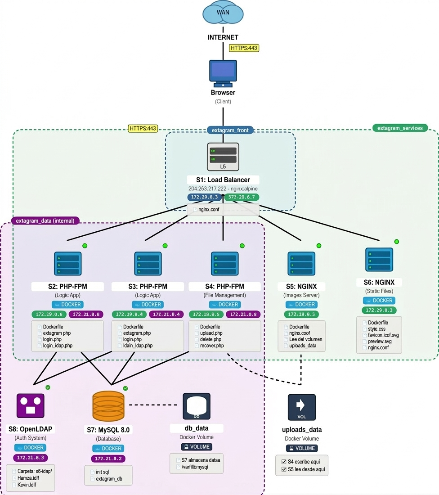

<div align="center">
  <h1>Projecte Extagram - Sistema d'Alta Disponibilitat</h1>
</div>

<div align="center">


**Aplicació web de xarxes socials amb arquitectura de microserveis**  
*Institut Tecnològic de Barcelona - ASIX2c*

[Documentació](#documentació) • [Instal·lació](#guia-dinstal·lació-ràpida) • [Equip](#equip-de-treball) • [Planificació](#planificació-de-sprints)

</div>

---

## Índex

1. [Informació del Projecte](#informació-del-projecte)
2. [Equip de Treball](#equip-de-treball)
3. [Objectius del Projecte](#objectius-del-projecte)
4. [Arquitectura del Sistema](#arquitectura-del-sistema)
5. [Proves de Segmentació de Xarxa](#proves-de-segmentació-de-xarxa)
6. [Tecnologies Utilitzades](#tecnologies-utilitzades)
   - [Comparativa de Tecnologies](#comparativa-i-justificació-de-tecnologies)
7. [Planificació de Sprints](#planificació-de-sprints)
8. [Guia d'Instal·lació Ràpida](#guia-dinstal·lació-ràpida)
9. [Estructura del Repositori](#estructura-del-repositori)
10. [Proves i Validació](#proves-i-validació)
11. [Documentació](#documentació)
12. [Gestió de Riscos](#gestió-de-riscos)
13. [Metodologia Agile](#metodologia-agile)
14. [Control de Versions](#control-de-versions)
15. [Contacte i Suport](#contacte-i-suport)

---

## Informació del Projecte

| Camp | Valor |
|------|-------|
| **Mòdul** | 0379 - Projecte intermodular d'administració de sistemes informàtics en xarxa |
| **Activitat** | P0.1 - Desplegament aplicació Extagram amb Alta Disponibilitat |
| **Institut** | Institut Tecnològic de Barcelona |
| **Curs** | ASIX2c (Administració de Sistemes Informàtics en Xarxa) |
| **Tutor del Projecte** | Jordi Casas |
| **Data d'Inici** | 15 de Desembre de 2025 |
| **Data de Finalització** | 17 de Març de 2026 |
| **Durada Total** | 13 setmanes (5 sprints) |
| **Hores Estimades** | 180 hores totals |
| **Repositori GitHub** | [github.com/HamzaTayibiITB2425/extagram-project](https://github.com/HamzaTayibiITB2425/extagram-project) |

[↑ Torna a l'índex](#índex)

---

## Equip de Treball

| Membre | Rol Principal | Responsabilitats Clau | Competències |
|--------|---------------|------------------------|--------------|
| **Hamza** | Product Owner / DevOps Lead | Gestió del projecte i coordinació d'equip<br>Documentació tècnica i actes<br>Configuració Docker i Docker Compose<br>Integració contínua<br>Desenvolupament backend PHP<br>Administració base de dades MySQL i LDAP<br>Implementació WAF i Hardening<br>Sistema de monitoratge centralitzat | Lideratge, Organització, Docker, Git, PHP, MySQL, LDAP, Seguretat, Grafana |
| **Kevin** | Infrastructure Engineer / Security | Configuració NGINX i proxy invers<br>Implementació balanceig de càrrega<br>Gestió d'arxius estàtics<br>Diagrama de xarxa interactiu<br>Segmentació de xarxa<br>Implementació Firewall<br>Proves d'estrès i rendiment | NGINX, Networking, HTML/CSS, Infraestructura, Firewall, Testing |

### Distribució de Tasques per Sprint
```
Hamza (Product Owner / DevOps / Backend / Security):
├── Sprint 1: Planning, Documentació, Git, PHP-FPM, MySQL, Backend [COMPLETAT]
├── Sprint 2: Docker Compose, Orquestració, Dockerfiles, LDAP, Segmentació [COMPLETAT]
├── Sprint 3: Docs finals, Presentació, Testing, Proves [COMPLETAT]
├── Sprint 4: WAF NGINX, Hardening OS, Hardening MySQL [COMPLETAT]
└── Sprint 5: Grafana, Loki, Prometheus, Dashboard [PENDENT]

Kevin (Infrastructure Engineer / Security):
├── Sprint 1: NGINX, Infraestructura [COMPLETAT]
├── Sprint 2: Load Balancer, Proxy, Segmentació de Xarxa [COMPLETAT]
├── Sprint 3: Packet Tracer, Diagrames, Documentació [COMPLETAT]
├── Sprint 4: Firewall iptables davant S1, Proves seguretat [COMPLETAT]
└── Sprint 5: Proves d'estrès, Dashboard rendiment [PENDENT]
```

[↑ Torna a l'índex](#índex)

---

## Objectius del Projecte

### Objectiu General

Desenvolupar i desplegar una aplicació web de xarxes socials (Extagram) amb una **arquitectura d'alta disponibilitat** basada en microserveis containeritzats, implementant **balanceig de càrrega**, **redundància de serveis**, **segmentació de xarxa en 3 capes**, **seguretat amb WAF i hardening**, i **sistema de monitoratge centralitzat** per garantir la continuïtat del servei, seguretat i observabilitat davant fallades o compromisos de components individuals.

### Objectius Específics

#### Objectius Tècnics

- Implementar una arquitectura de **8 serveis independents** (S1-S8)
- Configurar **balanceig de càrrega Round-Robin** entre nodes PHP
- Establir **separació de responsabilitats** (SoC - Separation of Concerns)
- Garantir **persistència de dades** amb volums Docker
- Implementar **proxy invers** per a gestió centralitzada de peticions
- Configurar **segmentació de xarxa en 3 capes** aïllades (front, services, data)
- Implementar **autenticació LDAP** per a gestió d'usuaris
- Desplegar **WAF NGINX natiu** per protecció contra atacs web
- Aplicar **hardening** a contenidors i base de dades
- Implementar **firewall iptables** per protecció perimetral
- Centralitzar **logs amb Grafana + Loki**
- Monitoritzar **mètriques amb Prometheus**

[Veure tots els objectius detallats ↓](#objectius-dalta-disponibilitat)

#### Objectius d'Alta Disponibilitat

- **Redundància de nodes d'aplicació** (S2 i S3 funcionant en paral·lel)
- **Tolerància a fallades** - El sistema continua operant amb la caiguda d'un node PHP
- **Recuperació automàtica** de contenidors amb `restart: unless-stopped`
- **Escalabilitat horitzontal** - Capacitat d'afegir més nodes PHP si cal

#### Objectius de Seguretat

- **Aïllament de la capa de dades** - S7 (MySQL) i S8 (LDAP) NO accessibles des d'Internet
- **Segmentació de xarxa** - 3 xarxes separades amb regles de firewall
- **Principi de mínim privilegi** - Serveis estàtics NO tenen accés a base de dades
- **Xarxa interna** - `extagram_data` configurada com `internal: true`
- **WAF NGINX** - Protecció contra SQL Injection, XSS, Path Traversal, Rate Limiting
- **Hardening de contenidors** - `no-new-privileges`, `cap_drop: ALL`, `read_only` filesystem
- **Hardening de MySQL** - Usuaris mínims, privilegis restringits, configuració segura
- **Firewall iptables** - Protecció perimetral davant de S1-LoadBalancer

[↑ Torna a l'índex](#índex)

---

## Arquitectura del Sistema

### Diagrama d'Arquitectura

El sistema Extagram està organitzat en **8 contenidors Docker** distribuïts en **3 xarxes segmentades** per garantir l'aïllament i seguretat de les capes de l'aplicació.



### Components del Sistema

| Servei | Nom | Imatge Docker | Port | Funció | Xarxes |
|--------|-----|---------------|------|--------|--------|
| **S1** | Load Balancer + WAF | `nginx:alpine` | 80, 443 | Proxy invers, balanceig Round-Robin i WAF | `extagram_front`<br>`extagram_services` |
| **S2** | PHP Backend 1 | `php:8.2-fpm-alpine` | 9000 | Execució lògica aplicació (Redundància) | `extagram_services`<br>`extagram_data` |
| **S3** | PHP Backend 2 | `php:8.2-fpm-alpine` | 9000 | Execució lògica aplicació (Redundància) | `extagram_services`<br>`extagram_data` |
| **S4** | Upload Service | `php:8.2-fpm-alpine` | 9000 | Gestió de pujada i eliminació d'arxius | `extagram_services`<br>`extagram_data` |
| **S5** | Image Server | `nginx:alpine` | 80 | Servir imatges pujades (read-only) | `extagram_services` |
| **S6** | Static Server | `nginx:alpine` | 80 | Servir CSS, SVG i favicon | `extagram_services` |
| **S7** | Database | `mysql:8.0` | 3306 | Emmagatzematge de posts i metadata | `extagram_data` (internal) |
| **S8** | LDAP Server | `osixia/openldap:1.5.0` | 389/636 | Autenticació d'usuaris | `extagram_data` (internal) |

[Veure arquitectura completa →](docs/ARQUITECTURA.md)

[↑ Torna a l'índex](#índex)

---

## Proves de Segmentació de Xarxa

### Verificació de Connectivitat

El sistema implementa una **segmentació de xarxa en 3 capes** per garantir que només els serveis autoritzats puguin comunicar-se entre ells.

**Connexions Permeses:**
- S2/S3/S4 → S7 (MySQL) ✅
- S2/S3/S4 → S8 (LDAP) ✅
- S1 → S2/S3/S4/S5/S6 ✅

**Connexions Bloquejades:**
- S5/S6 → S7/S8 ❌ (Seguretat)
- S1 → S7/S8 ❌ (No accés directe a BD)

[Veure proves detallades →](docs/PROVES_XARXA.md)

[↑ Torna a l'índex](#índex)

---

## Tecnologies Utilitzades

### Stack Tecnològic Principal

| Component | Tecnologia | Versió | Ús al Projecte |
|-----------|------------|--------|----------------|
| **Containerització** | Docker | Latest | Orquestració de tots els serveis |
| **Orquestració** | Docker Compose | v2.x | Definició multi-contenidor |
| **Proxy / LB** | NGINX | Alpine | S1, S5, S6 |
| **WAF** | NGINX Native | Latest | Protecció web |
| **Firewall** | iptables | Latest | Protecció perimetral |
| **Backend** | PHP-FPM | 8.2-Alpine | S2, S3, S4 |
| **Base de Dades** | MySQL | 8.0 | S7 - Persistència |
| **Autenticació** | OpenLDAP | 1.5.0 | S8 - Gestió usuaris |
| **Monitoratge** | Grafana + Loki + Prometheus | Latest | Logs i mètriques |

[Veure comparativa completa de tecnologies →](#comparativa-i-justificació-de-tecnologies)

[↑ Torna a l'índex](#índex)

---

## Planificació de Sprints

### Cronograma General

| Sprint | Data Inici | Data Fi | Durada | Objectiu Principal | Estat | Documents |
|--------|------------|---------|--------|--------------------|-------|-----------|
| **Sprint 0** | 08/12/2025 | 14/12/2025 | 1 setmana | Preparació i planificació inicial | ✅ COMPLETAT | - |
| **[Sprint 1](#sprint-1-mvp---màquina-única-completat)** | 15/12/2025 | 19/01/2026 | 5 setmanes | MVP en màquina única | ✅ COMPLETAT | [Planning](actes/sprint1/SPRINT1_PLANNING.md) • [Review](actes/sprint1/SPRINT1_REVIEW.md) • [Retrospectiva](actes/sprint1/SPRINT1_RETROSPECTIVA.md) |
| **[Sprint 2](#sprint-2-dockerització-i-balanceig-completat)** | 20/01/2026 | 02/02/2026 | 2 setmanes | Dockerització, balanceig i segmentació | ✅ COMPLETAT | [Planning](actes/sprint2/SPRINT2_PLANNING.md) • [Review](actes/sprint2/SPRINT2_REVIEW.md) • [Retrospectiva](actes/sprint2/SPRINT2_RETROSPECTIVA.md) |
| **[Sprint 3](#sprint-3-integració-i-proves-finals-completat)** | 03/02/2026 | 10/02/2026 | 1 setmana | Integració, proves i docs finals | ✅ COMPLETAT | [Planning](actes/sprint3/SPRINT3_PLANNING.md) • [Review](actes/sprint3/SPRINT3_REVIEW.md) • [Retrospectiva](actes/sprint3/SPRINT3_RETROSPECTIVA.md) |
| **[Sprint 4](#sprint-4-seguretat-completat)** | 17/02/2026 | 23/02/2026 | 1 setmana | Seguretat (WAF, Hardening, Firewall) | ✅ COMPLETAT | [Planning](actes/sprint4/SPRINT4_PLANNING.md) • [Review](actes/sprint4/SPRINT4_REVIEW.md) • [Retrospectiva](actes/sprint4/SPRINT4_RETROSPECTIVA.md) |
| **[Sprint 5](#sprint-5-monitoratge-pendent)** | 02/03/2026 | 10/03/2026 | 1 setmana | Monitoratge (Grafana, Loki, Prometheus) | ⏳ PENDENT | - |
| **Presentació** | 16-17/03/2026 | - | 2 dies | Defensa del projecte | ⏳ PENDENT | - |

---

### Sprint 1: MVP - Màquina Única [COMPLETAT]

**Objectiu:** Servidor web funcional amb NGINX, PHP i MySQL en una sola màquina

**Dates:** 15 de Desembre de 2025 - 19 de Gener de 2026

#### Backlog del Sprint 1

| ID | Tasca | Assignat | Estimació | Prioritat | Estat |
|----|-------|----------|-----------|-----------|-------|
| T1.1 | Crear repositori GitHub amb estructura | Hamza | 2h | Alta | ✅ |
| T1.2 | Configurar claus SSH per a GitHub | Hamza | 1h | Alta | ✅ |
| T1.3 | Documentar anàlisi del projecte | Hamza | 4h | Alta | ✅ |
| T1.4 | Instal·lar i configurar NGINX | Kevin | 3h | Alta | ✅ |
| T1.5 | Configurar virtual host per Extagram | Kevin | 2h | Alta | ✅ |
| T1.6 | Configurar PHP-FPM amb extensions | Hamza | 3h | Alta | ✅ |
| T1.7 | Instal·lar i configurar MySQL Server | Hamza | 2h | Alta | ✅ |
| T1.8 | Crear base de dades i taula posts | Hamza | 1h | Alta | ✅ |
| T1.9 | Desplegar fitxers de l'aplicació | Kevin | 2h | Mitjana | ✅ |
| T1.10 | Proves de funcionament complet | Tots | 3h | Alta | ✅ |
| T1.11 | Documentar guia d'instal·lació | Hamza | 3h | Mitjana | ✅ |
| T1.12 | Preparar Sprint Review i Demo | Tots | 2h | Mitjana | ✅ |

**Total estimat:** 28 hores

**Documents del Sprint 1:**
- 📋 [Sprint Planning](actes/sprint1/SPRINT1_PLANNING.md)
- ✅ [Sprint Review](actes/sprint1/SPRINT1_REVIEW.md)
- 🔄 [Retrospectiva](actes/sprint1/SPRINT1_RETROSPECTIVA.md)

[↑ Torna als sprints](#planificació-de-sprints)

---

### Sprint 2: Dockerització i Balanceig [COMPLETAT]

**Objectiu:** Segregar l'aplicació en contenidors Docker amb proxy invers, balanceig de càrrega i segmentació de xarxa

**Dates:** 20 de Gener de 2026 - 2 de Febrer de 2026

#### Backlog del Sprint 2

| ID | Tasca | Assignat | Estimació | Prioritat | Estat |
|----|-------|----------|-----------|-----------|-------|
| T2.1 | Crear Dockerfile per a S2/S3 (PHP-FPM) | Hamza, Kevin | 2h | Alta | ✅ |
| T2.2 | Crear Dockerfile per a S4 (Upload) | Hamza, Kevin | 1.5h | Alta | ✅ |
| T2.3 | Crear imatge MySQL amb init.sql | Hamza, Kevin | 1h | Alta | ✅ |
| T2.4 | Configurar NGINX S1 Load Balancer | Kevin | 3h | Alta | ✅ |
| T2.5 | Configurar NGINX S5 (Images) | Kevin | 1h | Alta | ✅ |
| T2.6 | Configurar NGINX S6 (Static) | Kevin | 1h | Alta | ✅ |
| T2.7 | Crear docker-compose.yml complet | Hamza | 3h | Alta | ✅ |
| T2.8 | Segmentació de xarxa (3 capes) | Hamza, Kevin | 2h | Alta | ✅ |
| T2.9 | Configurar volums persistents | Hamza | 1h | Alta | ✅ |
| T2.10 | Implementar S8 OpenLDAP | Hamza | 2h | Alta | ✅ |
| T2.11 | Proves balanceig Round-Robin | Hamza, Kevin | 2h | Alta | ✅ |
| T2.12 | Proves segmentació de xarxa | Hamza, Kevin | 2h | Alta | ✅ |
| T2.13 | Documentar configuració Docker | Hamza | 2h | Mitjana | ✅ |
| T2.14 | Crear diagrama interactiu HTML | Kevin | 3h | Mitjana | ✅ |
| T2.15 | Preparar Sprint Review | Hamza, Kevin | 1h | Mitjana | ✅ |

**Total estimat:** 28 hores

**Documents del Sprint 2:**
- 📋 [Sprint Planning](actes/sprint2/SPRINT2_PLANNING.md)
- ✅ [Sprint Review](actes/sprint2/SPRINT2_REVIEW.md)
- 🔄 [Retrospectiva](actes/sprint2/SPRINT2_RETROSPECTIVA.md)

[↑ Torna als sprints](#planificació-de-sprints)

---

### Sprint 3: Integració i Proves Finals [COMPLETAT]

**Objectiu:** Completar la integració, crear diagrama de xarxa i documentació final

**Dates:** 3 de Febrer de 2026 - 10 de Febrer de 2026

#### Backlog del Sprint 3

| ID | Tasca | Assignat | Estimació | Prioritat | Estat |
|----|-------|----------|-----------|-----------|-------|
| T3.1 | Crear esquema xarxa Packet Tracer | Kevin | 3h | Alta | ✅ |
| T3.2 | Documentar arquitectura de xarxa | Kevin | 2h | Alta | ✅ |
| T3.3 | Proves caiguda node S2 | Hamza | 1.5h | Alta | ✅ |
| T3.4 | Proves caiguda node S3 | Hamza | 1.5h | Alta | ✅ |
| T3.5 | Proves caiguda base de dades | Hamza | 2h | Alta | ✅ |
| T3.6 | Documentar resultats de proves | Hamza | 2h | Alta | ✅ |
| T3.7 | Revisar README principal | Hamza | 3h | Alta | ✅ |
| T3.8 | Preparar presentació final | Hamza | 2h | Alta | ✅ |
| T3.9 | Revisar control versions Git | Hamza | 1h | Mitjana | ✅ |
| T3.10 | Proves finals integrades | Tots | 2h | Alta | ✅ |
| T3.11 | Sprint Review amb tutor | Tots | 2h | Alta | ✅ |

**Total estimat:** 22 hores

**Documents del Sprint 3:**
- 📋 [Sprint Planning](actes/sprint3/SPRINT3_PLANNING.md)
- ✅ [Sprint Review](actes/sprint3/SPRINT3_REVIEW.md)
- 🔄 [Retrospectiva](actes/sprint3/SPRINT3_RETROSPECTIVA.md)

[↑ Torna als sprints](#planificació-de-sprints)

---

### Sprint 4: Seguretat [COMPLETAT]

**Objectiu:** Implementar WAF, Hardening de sistema operatiu i base de dades, Firewall perimetral

**Dates:** 17 de Febrer de 2026 - 23 de Febrer de 2026

#### Backlog del Sprint 4

| ID | Tasca | Assignat | Estimació | Prioritat | Estat |
|----|-------|----------|-----------|-----------|-------|
| T4.1 | Implementar WAF NGINX natiu | Hamza | 4h | Alta | ✅ |
| T4.2 | Regles SQL Injection, XSS, Path Traversal | Hamza | 2h | Alta | ✅ |
| T4.3 | Implementar Rate Limiting | Hamza | 1h | Alta | ✅ |
| T4.4 | Hardening contenidors (no-new-privileges) | Hamza | 3h | Alta | ✅ |
| T4.5 | Hardening MySQL (privilegis mínims) | Hamza | 2h | Alta | ✅ |
| T4.6 | Crear hardening.sql | Hamza | 1h | Alta | ✅ |
| T4.7 | Implementar firewall iptables | Kevin | 3h | Alta | ✅ |
| T4.8 | Proves seguretat WAF | Hamza, Kevin | 2h | Alta | ✅ |
| T4.9 | Documentar Sprint 4 | Hamza | 2h | Mitjana | ✅ |
| T4.10 | Sprint Review amb tutor | Tots | 1h | Mitjana | ✅ |

**Total estimat:** 21 hores

#### Resultats Sprint 4

**Mètriques de Seguretat:**
| Métrica | Abans | Després | Millora |
|---------|-------|---------|---------|
| SQL Injection bloqueats | 0% | 100% | +100% |
| XSS bloqueats | 0% | 100% | +100% |
| Path Traversal bloqueats | 0% | 100% | +100% |
| Security Headers | 0/4 | 4/4 | +100% |
| Rate Limiting | ❌ | ✅ 10 req/s | ✅ |
| Contenidors hardened | 0/8 | 8/8 | +100% |
| MySQL fortificat | ❌ | ✅ | ✅ |
| Firewall perimetral | ❌ | ✅ iptables | ✅ |

**Documents del Sprint 4:**
- 📋 [Sprint Planning](actes/sprint4/SPRINT4_PLANNING.md)
- ✅ [Sprint Review](actes/sprint4/SPRINT4_REVIEW.md)
- 🔄 [Retrospectiva](actes/sprint4/SPRINT4_RETROSPECTIVA.md)
- 🔒 [Documentació Seguretat Completa](docs/SPRINT4_SEGURIDAD.md)

[↑ Torna als sprints](#planificació-de-sprints)

---

### Sprint 5: Monitoratge [PENDENT]

**Objectiu:** Implementar sistema de monitoratge centralitzat amb Grafana, Loki i Prometheus

**Dates:** 2 de Març de 2026 - 10 de Març de 2026

#### Backlog del Sprint 5

| ID | Tasca | Assignat | Estimació | Prioritat | Estat |
|----|-------|----------|-----------|-----------|-------|
| T5.1 | Configurar Grafana + Loki | Hamza | 3h | Alta | ⏳ |
| T5.2 | Configurar Promtail logs Docker | Hamza | 2h | Alta | ⏳ |
| T5.3 | Configurar Prometheus mètriques | Hamza | 2h | Alta | ⏳ |
| T5.4 | Dashboard Logs temps real | Hamza | 2h | Alta | ⏳ |
| T5.5 | Dashboard Mètriques Sistema | Hamza | 2h | Alta | ⏳ |
| T5.6 | Proves estrès Apache Bench | Kevin | 3h | Alta | ⏳ |
| T5.7 | Dashboard rendiment aplicació | Hamza, Kevin | 2h | Alta | ⏳ |
| T5.8 | Configurar alertes automàtiques | Hamza | 2h | Mitjana | ⏳ |
| T5.9 | Documentar Sprint 5 | Hamza | 2h | Mitjana | ⏳ |
| T5.10 | Sprint Review final | Tots | 1h | Mitjana | ⏳ |

**Total estimat:** 21 hores

[↑ Torna als sprints](#planificació-de-sprints)

---

### Gràfic de Progrés del Projecte
```
Progrés Global del Projecte

Sprint 1: [####################] 100% COMPLETAT
Sprint 2: [####################] 100% COMPLETAT
Sprint 3: [####################] 100% COMPLETAT
Sprint 4: [####################] 100% COMPLETAT
Sprint 5: [                    ]   0% PENDENT

Total:    [################    ]  80% (4/5 sprints)
```

[↑ Torna a l'índex](#índex)

---

## Guia d'Instal·lació Ràpida

### Pre-requisits

- **Sistema Operatiu:** Ubuntu Server 22.04 LTS
- **Docker:** 24.0.0 o superior
- **Docker Compose:** v2.20.0 o superior
- **Git:** 2.34.0 o superior
- **Memòria RAM:** Mínim 4GB (Recomanat 8GB)
- **Disc:** Mínim 20GB lliures

### Instal·lació Pas a Pas
```bash
# 1. Clonar el repositori
git clone https://github.com/HamzaTayibiITB2425/extagram-project.git
cd extagram-project/configuracions/docker

# 2. Crear arxiu .env amb les credencials
cat > .env << EOF
# MySQL Configuration
MYSQL_ROOT_PASSWORD=rootpass123
MYSQL_DATABASE=extagram_db
MYSQL_USER=extagram_admin
MYSQL_PASSWORD=adminpass123

# Database Connection (for PHP containers)
DB_HOST=s7-database
DB_USER=extagram_admin
DB_PASSWORD=adminpass123
DB_NAME=extagram_db

# LDAP Configuration
LDAP_ADMIN_PASSWORD=ldapadmin123
EOF

# 3. Aixecar els contenidors
docker compose up -d

# 4. Verificar que tot està UP
docker compose ps

# 5. Accedir a l'aplicació
# Navegador: https://extagram-grup3.duckdns.org
```

[Veure guia d'instal·lació completa →](docs/INSTALACION.md)

[↑ Torna a l'índex](#índex)

---

## Estructura del Repositori
```
extagram-project/
├── README.md                           # Aquest fitxer
├── .gitignore
├── LICENSE
│
├── actes/                              # Actes de reunions Scrum
│   ├── sprint1/
│   │   ├── SPRINT1_PLANNING.md
│   │   ├── SPRINT1_REVIEW.md
│   │   └── SPRINT1_RETROSPECTIVA.md
│   ├── sprint2/
│   │   ├── SPRINT2_PLANNING.md
│   │   ├── SPRINT2_REVIEW.md
│   │   └── SPRINT2_RETROSPECTIVA.md
│   ├── sprint3/
│   │   ├── SPRINT3_PLANNING.md
│   │   ├── SPRINT3_REVIEW.md
│   │   └── SPRINT3_RETROSPECTIVA.md
│   └── sprint4/
│       ├── SPRINT4_PLANNING.md
│       ├── SPRINT4_REVIEW.md
│       └── SPRINT4_RETROSPECTIVA.md
│
├── configuracions/
│   └── docker/
│       ├── docker-compose.yml          # Orquestració multi-contenidor
│       ├── .env.example
│       ├── s1-loadbalancer/
│       │   └── nginx.conf              # Config Load Balancer + WAF
│       ├── s2-php/
│       │   ├── Dockerfile
│       │   └── extagram.php
│       ├── s3-php/
│       │   ├── Dockerfile
│       │   └── extagram.php
│       ├── s4-upload/
│       │   ├── Dockerfile
│       │   ├── upload.php
│       │   ├── delete.php
│       │   └── recover.php
│       ├── s5-images/
│       │   └── nginx.conf
│       ├── s6-static/
│       │   └── nginx.conf
│       ├── s7-mysql/
│       │   ├── init.sql
│       │   └── hardening.sql           # Hardening MySQL
│       └── s8-ldap/
│           └── users.ldif
│
├── docs/                               # Documentació tècnica
│   ├── ARQUITECTURA.md
│   ├── INSTALACION.md
│   ├── PROVES_XARXA.md
│   ├── SPRINT4_SEGURIDAD.md
│   └── imagenes/
│       ├── arquitectura/
│       ├── pruebas/
│       └── sprints/
│
├── proves/                             # Scripts de testing
│   ├── test_network_segmentation.sh
│   ├── test_waf.sh
│   └── test_hardening.sh
│
└── presentacio/                        # Materials presentació
    ├── slides.pdf
    └── demo_video.mp4
```

[↑ Torna a l'índex](#índex)

---

## Proves i Validació

### Proves de Funcionalitat

✅ **Accés web HTTPS:**
```bash
curl -I https://extagram-grup3.duckdns.org/extagram.php
# Esperat: HTTP/2 200 OK
```

✅ **Balanceig Round-Robin S2/S3:**
```bash
for i in {1..10}; do curl -s https://extagram-grup3.duckdns.org/extagram.php | grep "hostname"; done
# Esperat: Alternància entre s2-php i s3-php
```

✅ **Upload d'imatges:**
```bash
curl -X POST -F "caption=Test" -F "photo=@test.jpg" https://extagram-grup3.duckdns.org/upload.php
# Esperat: HTTP 302 Redirect
```

### Proves de Seguretat WAF

✅ **Bloqueig SQL Injection:**
```bash
curl -i "https://extagram-grup3.duckdns.org/extagram.php?id=1'%20OR%20'1'='1"
# Esperat: HTTP 403 - WAF: SQL Injection Blocked
```

✅ **Bloqueig XSS:**
```bash
curl -i "https://extagram-grup3.duckdns.org/extagram.php?search=<script>alert(1)</script>"
# Esperat: HTTP 403 - WAF: XSS Attack Blocked
```

✅ **Bloqueig Path Traversal:**
```bash
curl -i "https://extagram-grup3.duckdns.org/../../../etc/passwd"
# Esperat: HTTP 403 - WAF: Path Traversal Blocked
```

### Proves de Hardening

✅ **Contenidors amb read-only filesystem:**
```bash
docker exec extagram-s2-php touch /test.txt
# Esperat: Read-only file system
```

✅ **MySQL usuari amb privilegis limitats:**
```bash
docker exec extagram-s7-database mysql -u extagram_admin -padminpass123 -e "CREATE DATABASE hack;"
# Esperat: Access denied
```

[Veure proves completes →](docs/PROVES.md)

[↑ Torna a l'índex](#índex)

---

## Documentació

### Documents Tècnics

- 📘 [Arquitectura del Sistema](docs/ARQUITECTURA.md)
- 🔧 [Guia d'Instal·lació Completa](docs/INSTALACION.md)
- 🌐 [Proves de Segmentació de Xarxa](docs/PROVES_XARXA.md)
- 🔒 [Documentació de Seguretat Sprint 4](docs/SPRINT4_SEGURIDAD.md)
- ✅ [Guia de Proves i Validació](docs/PROVES.md)

### Actes de Sprints

- **Sprint 1:** [Planning](actes/sprint1/SPRINT1_PLANNING.md) • [Review](actes/sprint1/SPRINT1_REVIEW.md) • [Retrospectiva](actes/sprint1/SPRINT1_RETROSPECTIVA.md)
- **Sprint 2:** [Planning](actes/sprint2/SPRINT2_PLANNING.md) • [Review](actes/sprint2/SPRINT2_REVIEW.md) • [Retrospectiva](actes/sprint2/SPRINT2_RETROSPECTIVA.md)
- **Sprint 3:** [Planning](actes/sprint3/SPRINT3_PLANNING.md) • [Review](actes/sprint3/SPRINT3_REVIEW.md) • [Retrospectiva](actes/sprint3/SPRINT3_RETROSPECTIVA.md)
- **Sprint 4:** [Planning](actes/sprint4/SPRINT4_PLANNING.md) • [Review](actes/sprint4/SPRINT4_REVIEW.md) • [Retrospectiva](actes/sprint4/SPRINT4_RETROSPECTIVA.md)

[↑ Torna a l'índex](#índex)

---

## Gestió de Riscos

| Risc | Probabilitat | Impacte | Mitigació | Estat |
|------|--------------|---------|-----------|-------|
| Caiguda d'un node PHP | Mitjana | Baix | Redundància S2+S3 | ✅ Mitigat |
| Sobrecàrrega de base de dades | Baixa | Alt | Pool de connexions, índexs | ✅ Monitoritzat |
| Atac SQL Injection | Mitjana | Crític | WAF + PDO prepared statements | ✅ Mitigat |
| Compromís contenidor | Mitjana | Alt | Hardening + read-only + cap_drop | ✅ Mitigat |
| Caiguda servidor complet | Baixa | Crític | Backups diaris + volums persistents | ✅ Implementat |

[↑ Torna a l'índex](#índex)

---

## Metodologia Agile

### Framework Utilitzat: Scrum

- **Sprints:** 1-2 setmanes (segons complexitat)
- **Daily Standups:** Cada dia a les 9:00 AM (15 min)
- **Sprint Planning:** Primer dia del sprint (2h)
- **Sprint Review:** Últim dia del sprint (1h)
- **Retrospectiva:** Després del Review (1h)

### Eines de Gestió

- **ProofHub:** Backlog, Kanban, Sprints, Time Tracking
- **GitHub Projects:** Issues, Pull Requests, Milestones
- **Google Meet:** Reunions virtuals dailies i reviews

[↑ Torna a l'índex](#índex)

---

## Control de Versions

### Estratègia de Branques
```
main (producció)
│
├── develop (desenvolupament)
│   ├── feature/s1-loadbalancer
│   ├── feature/s2-php-backend
│   ├── feature/waf-implementation
│   └── feature/grafana-monitoring
│
└── hotfix/critical-bug (si cal)
```

### Convencions de Commits
```bash
feat(s1): afegir configuració WAF NGINX
fix(s4): corregir permisos upload
docs(readme): actualitzar arquitectura
security(mysql): aplicar hardening
test(waf): afegir proves SQL injection
```

[↑ Torna a l'índex](#índex)

---

## Contacte i Suport

### Equip del Projecte

**Hamza** (Product Owner / DevOps Lead)
- GitHub: [@HamzaTayibiITB2425](https://github.com/HamzaTayibiITB2425)
- Email: hamza.tayibi@itb.cat

**Kevin** (Infrastructure Engineer / Security)
- GitHub: [@KevinITB](https://github.com/KevinITB)
- Email: kevin@itb.cat

### Tutor del Projecte

**Jordi Casas**
- Email: jordi.casas@itb.cat
- Institut Tecnològic de Barcelona

### Suport Tècnic

- **Issues GitHub:** [github.com/HamzaTayibiITB2425/extagram-project/issues](https://github.com/HamzaTayibiITB2425/extagram-project/issues)
- **Documentació:** [Llegeix els docs](docs/)
- **Wiki del Projecte:** [GitHub Wiki](https://github.com/HamzaTayibiITB2425/extagram-project/wiki)

[↑ Torna a l'índex](#índex)

---

## Llicència

Aquest projecte està sota llicència **MIT License**. Vegeu el fitxer [LICENSE](LICENSE) per més detalls.

Copyright © 2025-2026 Hamza, Kevin - Institut Tecnològic de Barcelona

[↑ Torna a l'índex](#índex)

---

## Agraïments

- **Jordi Casas** - Tutor del projecte per la seva guia i feedback continu
- **Institut Tecnològic de Barcelona** - Per proporcionar els recursos i infraestructura
- **Comunitat Docker** - Per l'excel·lent documentació i imatges oficials
- **NGINX Community** - Per les guies de configuració de proxy invers i WAF
- **Stack Overflow** - Per resoldre dubtes tècnics durant el desenvolupament

[↑ Torna a l'índex](#índex)

---

<div align="center">

**Projecte Extagram - Institut Tecnològic de Barcelona**  
**Equip:** Hamza, Kevin | **ASIX2c** | **2025-2026**

**SPRINT 4: ✅ COMPLETAT | SPRINT 5: ⏳ PENDENT**

[](https://github.com/HamzaTayibiITB2425/extagram-project)
[](https://www.docker.com/)
[](https://nginx.org/)

</div>

---

**Última actualització:** 24 de Febrer de 2026  
**Versió del Document:** 8.0  
**Estat del Projecte:** EN DESENVOLUPAMENT (80% completat)  
**Proper Sprint:** Sprint 5 (Monitoratge amb Grafana + Loki + Prometheus)  
**Data Presentació:** 16-17 de Març de 2026
