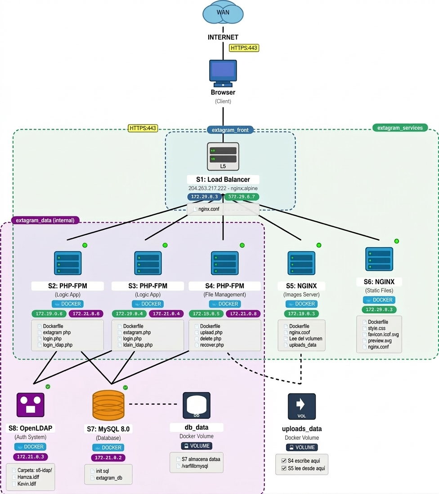
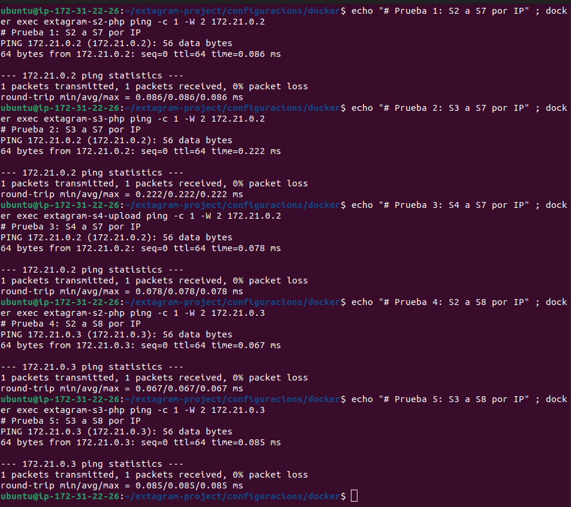
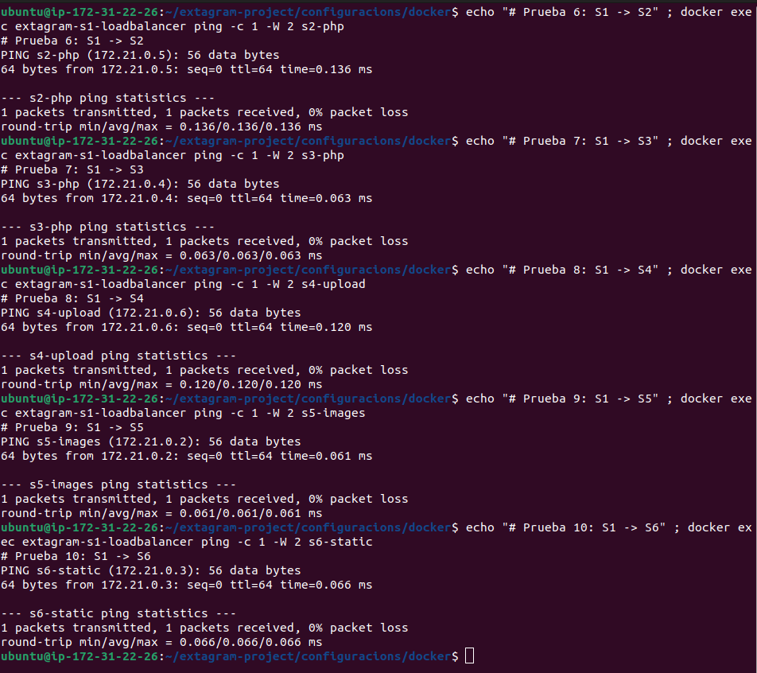
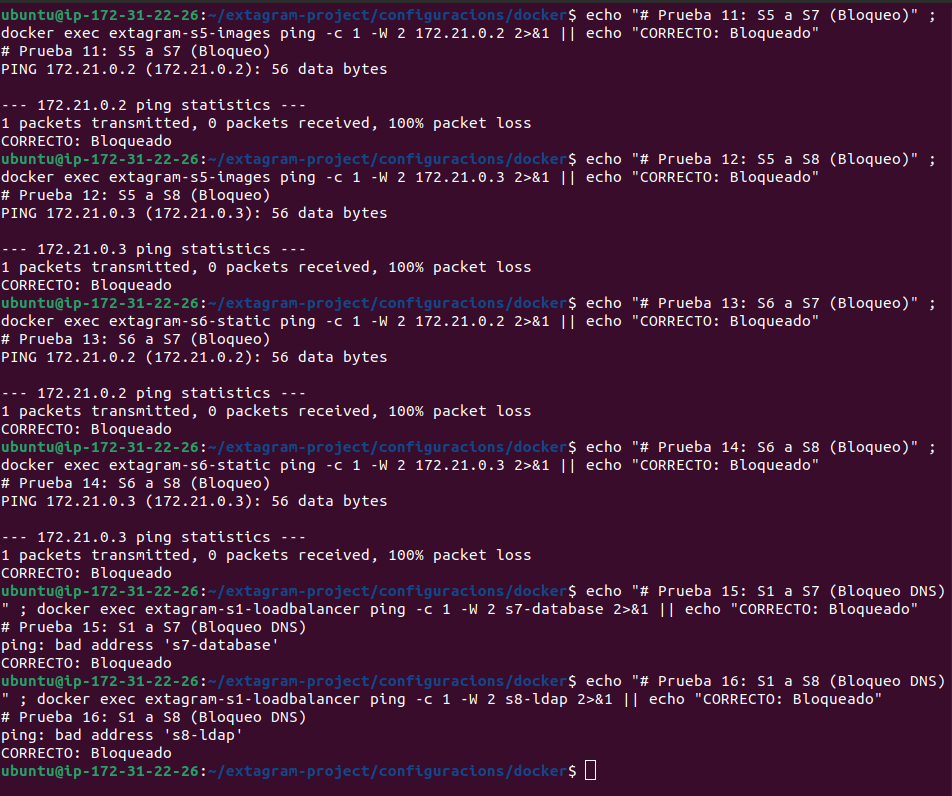

<div align="center">
  <h1>Projecte Extagram - Sistema d'Alta Disponibilitat</h1>
</div>

<div align="center">


**Servidor web de xarxes socials amb arquitectura de microserveis**  
*Institut Tecnològic de Barcelona - ASIX2c*

[Documentació](#documentació) • [Instal·lació](#guia-dinstal·lació-ràpida) • [Equip](#equip-de-treball) • [Planificació](#planificació-de-sprints)

</div>

---

## Índex

1. [Informació del Projecte](#informació-del-projecte)
2. [Equip de Treball](#equip-de-treball)
3. [Objectius del Projecte](#objectius-del-projecte)
4. [Arquitectura del Sistema](#arquitectura-del-sistema)
   - [Components del Sistema](#components-del-sistema)
   - [Segmentació de Xarxa](#segmentació-de-xarxa)
   - [Volums Persistents](#volums-persistents)
   - [Flux de Peticions](#flux-de-peticions)
5. [Proves de Segmentació de Xarxa](#proves-de-segmentació-de-xarxa)
6. [Tecnologies Utilitzades](#tecnologies-utilitzades)
   - [Stack Tecnològic Principal](#stack-tecnològic-principal)
   - [Comparativa de Tecnologies](#comparativa-de-tecnologies)
7. [Seguretat del Sistema](#seguretat-del-sistema)
   - [Web Application Firewall (WAF)](#web-application-firewall-waf)
   - [Firewall Perimetral (iptables)](#firewall-perimetral-iptables)
   - [Hardening de Contenidors](#hardening-de-contenidors)
   - [Hardening de Base de Dades](#hardening-de-base-de-dades)
8. [Sistema de Monitoratge](#sistema-de-monitoratge)
   - [Arquitectura de Monitoratge](#arquitectura-de-monitoratge)
   - [Grafana Dashboards](#grafana-dashboards)
   - [Loki - Agregació de Logs](#loki---agregació-de-logs)
   - [Prometheus - Mètriques en Temps Real](#prometheus---mètriques-en-temps-real)
   - [Promtail - Recopilació de Logs](#promtail---recopilació-de-logs)
9. [Automatització amb Ansible](#automatització-amb-ansible)
   - [Inventari i Variables](#inventari-i-variables)
   - [Playbooks Disponibles](#playbooks-disponibles)
   - [Comandes Útils Ansible](#comandes-útils-ansible)
10. [Planificació de Sprints](#planificació-de-sprints)
    - [Sprint 1: MVP - Màquina Única](#sprint-1-mvp---màquina-única-completat)
    - [Sprint 2: Dockerització i Balanceig](#sprint-2-dockerització-i-balanceig-completat)
    - [Sprint 3: Integració i Proves Finals](#sprint-3-integració-i-proves-finals-completat)
    - [Sprint 4: Seguretat](#sprint-4-seguretat-completat)
    - [Sprint 5: Monitoratge i Automatització](#sprint-5-monitoratge-i-automatització-completat)
11. [Guia d'Instal·lació Ràpida](#guia-dinstal·lació-ràpida)
12. [Estructura del Repositori](#estructura-del-repositori)
13. [Proves i Validació](#proves-i-validació)
    - [Proves de Funcionalitat](#proves-de-funcionalitat)
    - [Proves de Seguretat WAF](#proves-de-seguretat-waf)
    - [Proves de Hardening](#proves-de-hardening)
    - [Proves de Monitoratge](#proves-de-monitoratge)
14. [Documentació](#documentació)
    - [Documentació Tècnica](#documentació-tècnica)
    - [Guies d'Instal·lació](#guies-dinstal·lació)
    - [Actes de Sprints](#actes-de-sprints)
15. [Gestió de Riscos](#gestió-de-riscos)
16. [Metodologia Agile](#metodologia-agile)
17. [Control de Versions](#control-de-versions)
18. [Contacte i Suport](#contacte-i-suport)
19. [Llicència](#llicència)
20. [Agraïments](#agraïments)

---

## Informació del Projecte

| Camp | Valor |
|------|-------|
| **Mòdul** | 0379 - Projecte intermodular d'administració de sistemes informàtics en xarxa |
| **Activitat** | P0.1 - Desplegament aplicació Extagram amb Alta Disponibilitat |
| **Institut** | Institut Tecnològic de Barcelona |
| **Curs** | ASIX2c (Administració de Sistemes Informàtics en Xarxa) |
| **Tutor del Projecte** | Jordi Casas |
| **Data d'Inici** | 15 de Desembre de 2025 |
| **Data de Finalització** | 10 de Març de 2026 |
| **Durada Total** | 13 setmanes (5 sprints) |
| **Hores Estimades** | 200 hores totals |
| **Repositori GitHub** | [github.com/HamzaTayibiITB2425/extagram-project](https://github.com/HamzaTayibiITB2425/extagram-project) |

---

## Equip de Treball

| Membre | Rol Principal | Responsabilitats Clau | Competències |
|--------|---------------|------------------------|--------------|
| **Hamza** | Product Owner / DevOps Lead | Gestió del projecte i coordinació d'equip<br>Documentació tècnica i actes<br>Configuració Docker i Docker Compose<br>Integració contínua<br>Desenvolupament backend PHP<br>Administració base de dades MySQL i LDAP<br>Implementació WAF i Hardening<br>Sistema de monitoratge centralitzat<br>Automatització amb Ansible | Lideratge, Organització, Docker, Git, PHP, MySQL, LDAP, Seguretat, Grafana, Ansible |
| **Kevin** | Infrastructure Engineer / Security | Configuració NGINX i proxy invers<br>Implementació balanceig de càrrega<br>Gestió d'arxius estàtics<br>Diagrama de xarxa interactiu<br>Segmentació de xarxa<br>Implementació Firewall<br>Proves d'estrès i rendiment | NGINX, Networking, HTML/CSS, Infraestructura, Firewall, Testing |

### Distribució de Tasques per Sprint
```
Hamza (Product Owner / DevOps / Backend / Security):
├── Sprint 1: Planning, Documentació, Git, PHP-FPM, MySQL, Backend [COMPLETAT]
├── Sprint 2: Docker Compose, Orquestració, Dockerfiles, LDAP, Segmentació [COMPLETAT]
├── Sprint 3: Docs finals, Presentació, Testing, Proves [COMPLETAT]
├── Sprint 4: WAF NGINX, Hardening OS, Hardening MySQL [COMPLETAT]
└── Sprint 5: Grafana, Loki, Prometheus, Promtail, Ansible [COMPLETAT]

Kevin (Infrastructure Engineer / Security):
├── Sprint 1: NGINX, Infraestructura [COMPLETAT]
├── Sprint 2: Load Balancer, Proxy, Segmentació de Xarxa [COMPLETAT]
├── Sprint 3: Packet Tracer, Diagrames, Documentació [COMPLETAT]
├── Sprint 4: Firewall iptables davant S1, Proves seguretat [COMPLETAT]
└── Sprint 5: Proves d'estrès, Dashboard rendiment [COMPLETAT]
```

---

## Objectius del Projecte

### Objectiu General

Desenvolupar i desplegar una aplicació web de xarxes socials (Extagram) amb una **arquitectura d'alta disponibilitat** basada en microserveis containeritzats, implementant **balanceig de càrrega**, **redundància de serveis**, **segmentació de xarxa en 3 capes**, **seguretat amb WAF i hardening**, **sistema de monitoratge centralitzat** i **automatització amb Ansible** per garantir la continuïtat del servei, seguretat, observabilitat i desplegament repetible davant fallades o compromisos de components individuals.

### Objectius Específics

#### Objectius Tècnics

- Implementar una arquitectura de **8 serveis independents** (S1-S8)
- Configurar **balanceig de càrrega Round-Robin** entre nodes PHP
- Establir **separació de responsabilitats** (SoC - Separation of Concerns)
- Garantir **persistència de dades** amb volums Docker
- Implementar **proxy invers** per a gestió centralitzada de peticions
- Configurar **segmentació de xarxa en 3 capes** aïllades (front, services, data)
- Implementar **autenticació LDAP** per a gestió d'usuaris
- Desplegar **WAF NGINX natiu** per protecció contra atacs web
- Aplicar **hardening** a contenidors i base de dades
- Implementar **firewall iptables** per protecció perimetral
- Centralitzar **logs amb Grafana + Loki**
- Monitoritzar **mètriques amb Prometheus**
- Automatitzar desplegament amb **Ansible**

#### Objectius d'Alta Disponibilitat

- **Redundància de nodes d'aplicació** (S2 i S3 funcionant en paral·lel)
- **Tolerància a fallades** - El sistema continua operant amb la caiguda d'un node PHP
- **Recuperació automàtica** de contenidors amb `restart: unless-stopped`
- **Escalabilitat horitzontal** - Capacitat d'afegir més nodes PHP si cal
- **Auto-inicialització** - Servei systemd que configura Grafana automàticament després d'un reboot

#### Objectius de Seguretat

- **Aïllament de la capa de dades** - S7 (MySQL) i S8 (LDAP) NO accessibles des d'Internet
- **Segmentació de xarxa** - 3 xarxes separades amb regles de firewall
- **Principi de mínim privilegi** - Serveis estàtics NO tenen accés a base de dades
- **Xarxa interna** - `extagram_data` configurada com `internal: true`
- **WAF NGINX** - Protecció contra SQL Injection, XSS, Path Traversal, Rate Limiting
- **Hardening de contenidors** - `no-new-privileges`, `cap_drop: ALL`, `read_only` filesystem
- **Hardening de MySQL** - Usuaris mínims, privilegis restringits, configuració segura
- **Firewall iptables** - Protecció perimetral davant de S1-LoadBalancer

#### Objectius de Monitoratge

- **Centralització de logs** - Grafana + Loki per visualització unificada
- **Monitoratge de mètriques** - Prometheus per temps real
- **Dashboard de rendiment** - Visualització de CPU, RAM, Network I/O, Disk I/O
- **Logs en temps real** - Loki amb etiqueta `container_name` per filtrat per contenidor
- **Auto-inicialització** - Dashboard i datasources creats automàticament al reiniciar

#### Objectius d'Automatització

- **Ansible Playbooks** - Desplegament complet automatitzat
- **Verificació remota** - Comprovar estat del sistema des de qualsevol màquina
- **Scripts d'atajos** - Comandos ràpids per operacions comunes
- **Documentació completa** - Guies d'instal·lació i troubleshooting

#### Objectius de Gestió de Projecte

- Aplicar **metodologia Agile Scrum** amb 5 sprints
- Utilitzar **ProofHub** per a gestió de tasques i seguiment
- Mantenir **backlog de projecte** actualitzat
- Celebrar **dailies**, **sprint planning**, **sprint review** i **retrospectives**
- Documentar tot el procés amb **Markdown al repositori Git**

#### Objectius d'Aprenentatge

- Aprendre i aplicar **Docker i Docker Compose** per a orquestració
- Dominar configuració de **NGINX** com a load balancer i proxy invers
- Entendre arquitectures de **microserveis** i les seves avantatges
- Implementar **segmentació de xarxa** per a seguretat
- Configurar **OpenLDAP** per a autenticació centralitzada
- Desplegar **WAF NGINX natiu** per protecció web
- Configurar **iptables** per firewall Linux
- Aplicar **hardening** a contenidors i base de dades
- Implementar **Grafana + Loki + Prometheus** per monitoratge
- Automatitzar amb **Ansible** per desplegaments repetibles
- Realitzar **proves d'estrès** amb Apache Bench
- Desenvolupar habilitats de **treball en equip** i **comunicació tècnica**
- Adquirir experiència en **documentació tècnica professional**

---

## Arquitectura del Sistema

### Diagrama d'Arquitectura

El sistema Extagram està organitzat en **8 contenidors Docker** distribuïts en **3 xarxes segmentades** per garantir l'aïllament i seguretat de les capes de l'aplicació, més **4 contenidors de monitoratge** en una xarxa separada.



### Components del Sistema

| Servei | Nom | Imatge Docker | Port | Funció | Xarxes | Adreces IP |
|--------|-----|---------------|------|--------|--------|------------|
| **S1** | Load Balancer + WAF | `nginx:alpine` | 80, 443 | Proxy invers, balanceig Round-Robin i WAF | `extagram_front`<br>`extagram_services` | 172.20.0.2<br>172.19.0.7 |
| **S2** | PHP Backend 1 | `php:8.2-fpm-alpine` | 9000 | Execució lògica aplicació (Redundància) | `extagram_services`<br>`extagram_data` | 172.19.0.6<br>172.21.0.6 |
| **S3** | PHP Backend 2 | `php:8.2-fpm-alpine` | 9000 | Execució lògica aplicació (Redundància) | `extagram_services`<br>`extagram_data` | 172.19.0.4<br>172.21.0.4 |
| **S4** | Upload Service | `php:8.2-fpm-alpine` | 9000 | Gestió de pujada i eliminació d'arxius | `extagram_services`<br>`extagram_data` | 172.19.0.5<br>172.21.0.5 |
| **S5** | Image Server | `nginx:alpine` | 80 | Servir imatges pujades (read-only) | `extagram_services` | 172.19.0.3 |
| **S6** | Static Server | `nginx:alpine` | 80 | Servir CSS, SVG i favicon | `extagram_services` | 172.19.0.2 |
| **S7** | Database (Hardened) | `mysql:8.0` | 3306 | Emmagatzematge de posts i metadata | `extagram_data` (internal) | 172.21.0.2 |
| **S8** | LDAP Server | `osixia/openldap:1.5.0` | 389/636 | Autenticació d'usuaris (Hamza, Kevin) | `extagram_data` (internal) | 172.21.0.3 |

### Components de Seguretat (Sprint 4) - COMPLETAT

| Component | Tecnologia | Funció | Estat |
|-----------|------------|--------|-------|
| **WAF** | NGINX natiu + Regex Rules | Protecció SQL Injection, XSS, Path Traversal, Rate Limit | IMPLEMENTAT |
| **Hardening OS** | Docker security_opt, cap_drop, read_only | Contenidors immutables, mínim privilegi | IMPLEMENTAT |
| **Hardening MySQL** | Usuaris segurs, privilegis mínims | Base de dades fortificada | IMPLEMENTAT |
| **Firewall** | iptables | Protecció perimetral davant S1 | IMPLEMENTAT |

### Components de Monitoratge (Sprint 5) - COMPLETAT

| Component | Tecnologia | Port | Funció | Xarxa |
|-----------|------------|------|--------|-------|
| **Grafana** | Grafana OSS | 3000 | Visualització de logs i mètriques | monitoring |
| **Loki** | Grafana Loki | 3100 | Agregació i indexació de logs | monitoring |
| **Promtail** | Promtail | 9080 | Recopilació de logs Docker | monitoring |
| **Prometheus** | Prometheus | 9090 | Monitoratge de mètriques | monitoring |
| **cAdvisor** | Google cAdvisor | 8080 | Exposició de mètriques contenidors | monitoring |

### Segmentació de Xarxa

El sistema implementa una arquitectura de **4 capes de xarxa** per maximitzar la seguretat:
```
extagram_front (172.20.0.x)
   └── S1: Load Balancer + WAF (exposat a Internet via port 80/443)

extagram_services (172.19.0.x)
   └── S1, S2, S3, S4, S5, S6 (comunicació interna aplicació)

extagram_data (172.21.0.x - INTERNAL)
   └── S2, S3, S4, S7, S8 (capa de dades aïllada del món exterior)

monitoring (172.22.0.x)
   └── Grafana, Loki, Promtail, Prometheus, cAdvisor (observabilitat)
```

**Característiques de Seguretat:**
- S7 (MySQL) i S8 (LDAP) NO són accessibles des d'Internet
- S5 i S6 (servidors estàtics) NO poden accedir a la base de dades ni LDAP
- Només S2, S3, S4 (PHP amb lògica de negoci) tenen accés a S7 i S8
- Xarxa `extagram_data` configurada com `internal: true` (sense gateway)
- S1 NO pot accedir directament a S7 ni S8 (només S2/S3/S4 fan de pont)
- **WAF NGINX** en S1 bloqueja atacs abans d'arribar al backend
- **Firewall iptables** protegeix S1 de tràfic maliciós
- **Hardening contenidors**: `no-new-privileges`, `cap_drop: ALL`, `read_only` filesystem
- **Hardening MySQL**: Usuaris anònims eliminats, privilegis mínims
- Xarxa `monitoring` separada per no interferir amb el tràfic d'aplicació

### Volums Persistents

| Volum | Servei | Funció | Mode |
|-------|--------|--------|------|
| **db_data** | S7 (MySQL) | Persistència de base de dades `extagram_db` | Read-Write |
| **uploads_data** | S4 (write)<br>S5 (read) | Emmagatzematge d'imatges pujades pels usuaris | S4: RW<br>S5: RO |
| **grafana-data** | Grafana | Persistència de dashboards i configuració | Read-Write |
| **prometheus-data** | Prometheus | Persistència de mètriques històriques | Read-Write |

### Flux de Peticions

#### 1. Petició de Visualització (GET /extagram.php)
```
Browser → Firewall (iptables) → S1 (nginx + WAF) → [S2 o S3] (PHP-FPM) → S7 (MySQL) + S8 (LDAP) → Resposta
                                       ↓
                                 WAF NGINX
                      (SQL Injection, XSS, Path Traversal)
                                       ↓
                              Balanceig Round-Robin
                               (50% S2, 50% S3)
```

#### 2. Petició de Pujada d'Imatge (POST /upload.php)
```
Browser → Firewall → S1 (WAF) → S4 (upload.php) → Guarda imatge → S7 (MySQL) → Redirect
                                         ↓
                                   uploads_data (Volume)
```

#### 3. Petició d'Arxius Estàtics (GET /style.css, /preview.svg)
```
Browser → Firewall → S1 → S6 (nginx static) → Resposta directa
```

#### 4. Petició d'Imatges Pujades (GET /uploads/img_xyz.jpg)
```
Browser → Firewall → S1 → S5 (nginx images) → Volume uploads_data (read-only) → Resposta
```

#### 5. Autenticació d'Usuaris (POST /login_ldap.php)
```
Browser → Firewall → S1 (WAF) → [S2 o S3] (login_ldap.php) → S8 (LDAP) → Validació → Resposta
```

#### 6. Monitoratge (Grafana)
```
Logs: Docker → Promtail (docker_sd_configs) → Loki → Grafana
Mètriques: cAdvisor → Prometheus (scrape /cadvisor/metrics) → Grafana
Dashboard: Grafana (auto-init amb systemd) → Visualització unificada
```

---

## Proves de Segmentació de Xarxa

### Verificació de Connectivitat

El sistema implementa una **segmentació de xarxa en 3 capes** per garantir que només els serveis autoritzats puguin comunicar-se entre ells. A continuació es mostren les proves de connectivitat realitzades per validar l'aïllament correcte.

---

### Connexions Permeses - Capa de Dades

Els serveis PHP (S2, S3, S4) poden accedir a la capa de dades (S7, S8) perquè necessiten consultar la base de dades i autenticar usuaris via LDAP.



**Proves realitzades:**
- S2 → S7 (MySQL 172.21.0.2): CORRECTE - S2 executa consultes SQL
- S3 → S7 (MySQL 172.21.0.2): CORRECTE - S3 executa consultes SQL  
- S4 → S7 (MySQL 172.21.0.2): CORRECTE - S4 guarda metadata d'imatges
- S2 → S8 (LDAP 172.21.0.3): CORRECTE - S2 autentica usuaris
- S3 → S8 (LDAP 172.21.0.3): CORRECTE - S3 autentica usuaris

---

### Connexions Permeses - Load Balancer

El Load Balancer (S1) pot accedir a tots els serveis de la capa `extagram_services` per distribuir peticions HTTP.



**Proves realitzades:**
- S1 → S2 (PHP s2-php): CORRECTE - Balanceig Round-Robin
- S1 → S3 (PHP s3-php): CORRECTE - Balanceig Round-Robin
- S1 → S4 (Upload s4-upload): CORRECTE - Proxy de pujades
- S1 → S5 (Images s5-images): CORRECTE - Proxy d'imatges
- S1 → S6 (Static s6-static): CORRECTE - Proxy de CSS/SVG

---

### Connexions Bloquejades - Seguretat

Els servidors estàtics (S5, S6) NO poden accedir a la base de dades ni a LDAP, garantint que un compromís d'aquests serveis no exposi dades sensibles. Tampoc S1 (load balancer) pot accedir directament a la capa de dades.



**Proves realitzades:**
- S5 → S7 (MySQL 172.21.0.2): BLOQUEADO - S5 no necessita accés a BD
- S5 → S8 (LDAP 172.21.0.3): BLOQUEADO - S5 només serveix imatges
- S6 → S7 (MySQL 172.21.0.2): BLOQUEADO - S6 no necessita accés a BD
- S6 → S8 (LDAP 172.21.0.3): BLOQUEADO - S6 només serveix CSS/SVG
- S1 → S7 (MySQL s7-database): BLOQUEADO - S1 no accedeix directament a BD
- S1 → S8 (LDAP s8-ldap): BLOQUEADO - S1 no autentica, només fa proxy

---

### Comandes de Verificació

Aquestes són les comandes utilitzades per verificar la segmentació de xarxa:
```bash
# Connexions permeses (han de funcionar)
docker exec extagram-s2-php ping -c 2 -W 2 172.21.0.2       # S2 → S7
docker exec extagram-s3-php ping -c 2 -W 2 172.21.0.3       # S3 → S8
docker exec extagram-s4-upload ping -c 2 -W 2 172.21.0.2    # S4 → S7
docker exec extagram-s1-loadbalancer ping -c 2 -W 2 s2-php  # S1 → S2
docker exec extagram-s1-loadbalancer ping -c 2 -W 2 s6-static # S1 → S6

# Connexions bloquejades (han de fallar)
docker exec extagram-s5-images ping -c 2 -W 2 172.21.0.2    # S5 → S7
docker exec extagram-s6-static ping -c 2 -W 2 172.21.0.3    # S6 → S8
docker exec extagram-s1-loadbalancer ping -c 2 -W 2 s7-database  # S1 → S7
```

Per executar totes les proves automàticament:
```bash
cd ~/extagram-project/configuracions/docker
bash ../../proves/test_network_segmentation.sh
```

### Resultats de Seguretat

La segmentació de xarxa garanteix:
- **Cap servei estàtic** (S5, S6) pot accedir a dades sensibles
- **El load balancer** (S1) no pot saltar-se la lògica de negoci per accedir directament a BD
- **La capa de dades** (extagram_data) està completament aïllada d'Internet
- **Només els serveis PHP** (S2, S3, S4) fan de pont autoritzat entre capes
- **WAF NGINX** protegeix contra atacs web abans d'arribar al backend
- **Firewall iptables** filtra tràfic maliciós a nivell de sistema operatiu
- **Xarxa monitoring** separada per no afectar el rendiment de l'aplicació

---

## Tecnologies Utilitzades

### Stack Tecnològic Principal

| Component | Tecnologia | Versió | Ús al Projecte |
|-----------|------------|--------|----------------|
| **Containerització** | Docker | Latest | Orquestració de tots els serveis |
| **Orquestració** | Docker Compose | v2.x | Definició multi-contenidor |
| **Proxy Invers / LB** | NGINX | Alpine (Latest) | S1, S5, S6 |
| **WAF** | NGINX Native + Regex | Latest | S1 - Protecció web |
| **Firewall** | iptables | Latest | Protecció perimetral |
| **Backend** | PHP-FPM | 8.2-Alpine | S2, S3, S4 |
| **Base de Dades** | MySQL | 8.0 | S7 - Persistència |
| **Autenticació** | OpenLDAP | 1.5.0 | S8 - Gestió usuaris |
| **Monitoratge Logs** | Grafana + Loki | Latest | Centralització logs |
| **Monitoratge Mètriques** | Prometheus | Latest | Mètriques temps real |
| **Agregació Logs** | Promtail | Latest | Recopilació Docker logs |
| **Exposició Mètriques** | cAdvisor | Latest | Mètriques contenidors |
| **Automatització** | Ansible | Latest | Desplegament automatitzat |
| **Control de Versions** | Git + GitHub | - | Repositori central |
| **Gestió de Projecte** | ProofHub | - | Backlog, Kanban, Sprints |
| **Diagrames de Xarxa** | HTML/CSS/SVG | - | Diagrama interactiu |
| **Documentació** | Markdown | - | Tots els docs al repo |
| **Sistema Operatiu** | Ubuntu Server | 22.04 LTS | Sistema host |
| **Proves d'Estrès** | Apache Bench | 2.3 | Load testing |

---

### Comparativa de Tecnologies

A continuació es presenta una anàlisi detallada de les decisions tecnològiques del projecte, comparant cada tecnologia escollida amb les seves principals alternatives del mercat. Cada elecció s'ha basat en criteris tècnics objectius, requisits específics del projecte i objectius d'aprenentatge.

---

#### 1. Containerització: Docker vs Podman vs LXC/LXD

<table>
<thead>
<tr>
<th width="20%">Criteri</th>
<th width="27%">Docker (ESCOLLIT)</th>
<th width="27%">Podman</th>
<th width="26%">LXC/LXD</th>
</tr>
</thead>
<tbody>
<tr>
<td><strong>Arquitectura</strong></td>
<td>Daemon centralitzat amb client CLI. Model client-servidor clàssic.</td>
<td>Daemonless architecture. Processos fill directes del sistema.</td>
<td>Contenidors de sistema complets. Virtualització a nivell de SO.</td>
</tr>
<tr>
<td><strong>Ecosistema</strong></td>
<td>Docker Hub amb més de 8 milions d'imatges verificades. Documentació exhaustiva.</td>
<td>Compatible amb Docker Hub. Ecosistema emergent però menys madur.</td>
<td>Ecosistema limitat. Requereix construcció manual d'imatges.</td>
</tr>
<tr>
<td><strong>Integració Compose</strong></td>
<td>Docker Compose natiu. Sintaxi declarativa YAML estandarditzada.</td>
<td>Podman Compose disponible. Compatibilitat parcial amb sintaxi Docker.</td>
<td>No suporta Compose. Orquestració manual necessària.</td>
</tr>
<tr>
<td><strong>Networking</strong></td>
<td>Xarxes bridge, overlay, macvlan natives. CNI plugins disponibles.</td>
<td>Networking CNI natiu. Configuració més manual.</td>
<td>Networking potent amb profiles. Corba d'aprenentatge elevada.</td>
</tr>
<tr>
<td><strong>Experiència Equip</strong></td>
<td>Domini complet. Practicat extensivament al curriculum ASIX2c.</td>
<td>Sintaxi similar però sense experiència prèvia.</td>
<td>Conceptes diferents. Requereix formació específica.</td>
</tr>
<tr>
<td><strong>Cas d'Ús Ideal</strong></td>
<td>Microserveis, CI/CD, desenvolupament local, producció consolidada.</td>
<td>Entorns HPC, execució rootless, seguretat avançada.</td>
<td>Migracions VM a contenidor, virtualització lleuger.</td>
</tr>
</tbody>
</table>

**Justificació Tècnica:**

Docker s'ha escollit per les següents raons tècniques fonamentals:

1. **Ecosistema consolidat**: Imatges oficials optimitzades de NGINX Alpine (40MB), PHP-FPM Alpine (80MB) i MySQL 8.0 (450MB) amb configuracions pre-testades.
2. **Docker Compose declaratiu**: Orquestració de 8 serveis amb 4 xarxes diferents en un sol fitxer YAML llegible.
3. **Experiència tècnica**: Domini complet de Dockerfiles multi-stage, volums bind/named i troubleshooting avançat.
4. **Suport comunitari**: Resolució ràpida de problemes amb Stack Overflow (50M+ posts Docker-related) i documentació oficial extensiva.

---

#### 2. Orquestració: Docker Compose vs Kubernetes vs Docker Swarm

<table>
<thead>
<tr>
<th width="20%">Criteri</th>
<th width="27%">Docker Compose (ESCOLLIT)</th>
<th width="27%">Kubernetes</th>
<th width="26%">Docker Swarm</th>
</tr>
</thead>
<tbody>
<tr>
<td><strong>Complexitat</strong></td>
<td>Fitxer YAML únic. Sintaxi simple i intuïtiva.</td>
<td>Manifests YAML múltiples (Deployment, Service, ConfigMap, Secret). Corba d'aprenentatge pronunciada.</td>
<td>Configuració similar a Compose. Mode swarm requereix inicialització.</td>
</tr>
<tr>
<td><strong>Escalat</strong></td>
<td>Escalat manual amb 'docker compose up --scale'. Adequat per 1-10 nodes.</td>
<td>Escalat automàtic amb HPA. Dissenyat per centenars de nodes.</td>
<td>Escalat declaratiu amb replicas. Suporta fins a ~100 nodes.</td>
</tr>
<tr>
<td><strong>Alta Disponibilitat</strong></td>
<td>Redundància manual (S2, S3). restart: unless-stopped per recuperació.</td>
<td>Self-healing natiu. ReplicaSets garanteixen disponibilitat.</td>
<td>Replicació automàtica. Rebalanceig en fallada de node.</td>
</tr>
<tr>
<td><strong>Networking</strong></td>
<td>Xarxes bridge personalitzades. Segmentació manual clara.</td>
<td>CNI plugins avançats (Calico, Flannel). NetworkPolicies granulars.</td>
<td>Overlay network automàtic. Mesh routing integrat.</td>
</tr>
<tr>
<td><strong>Recursos Necessaris</strong></td>
<td>Host únic. Overhead mínim (només Docker Engine).</td>
<td>Cluster multi-node. Control plane consumeix ~2GB RAM.</td>
<td>Host únic o cluster. Overhead moderat.</td>
</tr>
<tr>
<td><strong>Cas d'Ús Ideal</strong></td>
<td>Desenvolupament, testing, producció single-host, prototips.</td>
<td>Producció enterprise, microserveis massius, multi-cloud.</td>
<td>Producció small-medium, clusters simples.</td>
</tr>
</tbody>
</table>

**Justificació Tècnica:**

Docker Compose s'adapta perfectament als requisits del projecte:

1. **Single-host deployment**: El projecte utilitza 1 servidor AWS EC2, no requereix orquestració multi-node.
2. **Simplicitat operacional**: Gestió completa amb 3 comandes (`up`, `down`, `restart`) vs kubectl amb 50+ subcomandes.
3. **Segmentació de xarxa clara**: Definició explícita de 4 xarxes (`extagram_front`, `extagram_services`, `extagram_data`, `monitoring`) amb control granular.
4. **Temps de setup**: 5 minuts vs 2+ hores per Kubernetes cluster funcional.

---

#### 3. Proxy Invers / Load Balancer: NGINX vs Apache HTTP Server vs Traefik

<table>
<thead>
<tr>
<th width="20%">Criteri</th>
<th width="27%">NGINX (ESCOLLIT)</th>
<th width="27%">Apache HTTP Server</th>
<th width="26%">Traefik</th>
</tr>
</thead>
<tbody>
<tr>
<td><strong>Model de Processos</strong></td>
<td>Event-driven asíncron. Master + Workers amb event loop.</td>
<td>Process-based síncrón. 1 thread per connexió.</td>
<td>Go runtime. Goroutines per connexió concurrent.</td>
</tr>
<tr>
<td><strong>Rendiment</strong></td>
<td>10K+ connexions simultànies amb 10MB RAM per worker.</td>
<td>Màxim ~500 connexions per worker. 50MB RAM per worker.</td>
<td>5K+ connexions. 30MB RAM base.</td>
</tr>
<tr>
<td><strong>Load Balancing</strong></td>
<td>Round-Robin, IP Hash, Least Conn natiu. Health checks HTTP/TCP.</td>
<td>mod_proxy_balancer. Configuració verbose.</td>
<td>Auto-discovery Docker/K8s. Algoritmes avançats (Weighted, Maglev).</td>
</tr>
<tr>
<td><strong>Configuració</strong></td>
<td>nginx.conf centralitzat. Directives clares i estructurades.</td>
<td>.htaccess + httpd.conf. Configuració dispersa en múltiples fitxers.</td>
<td>YAML + Docker labels. Configuració dinàmica automàtica.</td>
</tr>
<tr>
<td><strong>WAF Natiu</strong></td>
<td>Regex en directives if{}. ModSecurity disponible com a mòdul.</td>
<td>ModSecurity nadiu madur. Configuració XML complexa.</td>
<td>Middleware limitat. Requereix plugins externs (e.g. Fail2Ban).</td>
</tr>
<tr>
<td><strong>Footprint</strong></td>
<td>Imatge Alpine 40MB. Binari compilat 1.5MB.</td>
<td>Imatge base 200MB+. Binari 5MB+ amb mòduls.</td>
<td>Imatge oficial 80MB. Binari Go 50MB.</td>
</tr>
<tr>
<td><strong>Cas d'Ús Ideal</strong></td>
<td>APIs REST, microserveis, serving estàtic, reverse proxy clàssic.</td>
<td>Aplicacions legacy, compatibilitat .htaccess, CMSs antics.</td>
<td>Kubernetes, Docker Swarm, auto-discovery, Let's Encrypt automàtic.</td>
</tr>
</tbody>
</table>

**Justificació Tècnica:**

NGINX s'ha escollit per raons de rendiment i versatilitat:

1. **Model event-driven**: Gestió eficient de 1000+ peticions simultànies amb un sol worker process vs Apache que requereix 1 thread/process per connexió.
2. **Multiús en l'arquitectura**: S1 (Load Balancer + WAF), S5 (Image Server), S6 (Static Server) utilitzen la mateixa tecnologia, simplificant manteniment.
3. **WAF integrat**: Regles regex natives en nginx.conf sense overhead de ModSecurity (que consumeix +100MB RAM).
4. **FastCGI natiu**: Protocol optimitzat per comunicació amb PHP-FPM vs Apache que requereix mod_proxy_fcgi.

---

#### 4. Web Application Firewall: NGINX WAF vs ModSecurity vs Cloudflare WAF

<table>
<thead>
<tr>
<th width="20%">Criteri</th>
<th width="27%">NGINX WAF (ESCOLLIT)</th>
<th width="27%">ModSecurity</th>
<th width="26%">Cloudflare WAF</th>
</tr>
</thead>
<tbody>
<tr>
<td><strong>Integració</strong></td>
<td>Directament en nginx.conf. Regles regex natives.</td>
<td>Mòdul extern per NGINX/Apache. Configuració XML separada.</td>
<td>Servei SaaS cloud. Proxy DNS obligatori.</td>
</tr>
<tr>
<td><strong>Rendiment</strong></td>
<td>Overhead <5ms per petició. Avaluació inline.</td>
<td>Overhead 20-50ms. Inspecció profunda de payload.</td>
<td>Overhead 10-30ms (latència xarxa). CDN integrat.</td>
</tr>
<tr>
<td><strong>Regles</strong></td>
<td>Regex personalitzades per SQL Injection, XSS, Path Traversal.</td>
<td>OWASP Core Rule Set. 200+ regles pre-configurades.</td>
<td>Managed Rulesets. Actualització automàtica.</td>
</tr>
<tr>
<td><strong>Rate Limiting</strong></td>
<td>limit_req_zone nativa. Configuració granular per zona/IP.</td>
<td>Disponible via directives. Configuració complexa.</td>
<td>Natiu. Límits per IP/país/ASN.</td>
</tr>
<tr>
<td><strong>Logging</strong></td>
<td>Logs NGINX estàndard. Integració directa amb Loki.</td>
<td>Audit logs detallats. Format JSON configurable.</td>
<td>Logs centralitzats cloud. Exportació via API.</td>
</tr>
<tr>
<td><strong>Cost</strong></td>
<td>Gratuït. Open source complet.</td>
<td>Gratuït (Apache License 2.0). Suport comercial opcional.</td>
<td>SaaS de pagament. $20/mes mínim (Free tier limitat).</td>
</tr>
<tr>
<td><strong>Cas d'Ús Ideal</strong></td>
<td>Protecció bàsica self-hosted. Control total de regles.</td>
<td>Seguretat enterprise. Compliment PCI-DSS.</td>
<td>Protecció DDoS massiu. CDN global integrat.</td>
</tr>
</tbody>
</table>

**Justificació Tècnica:**

NGINX WAF natiu s'adapta als requisits de seguretat del projecte:

1. **Zero overhead arquitectural**: Regles inline en S1-LoadBalancer sense processos/mòduls addicionals.
2. **Control granular**: Customització completa de patterns (e.g. `union.*select|insert.*into|delete.*from`).
3. **Integració Loki**: Logs de bloquejos directament en `/var/log/nginx/error.log` → Promtail → Loki.
4. **Self-hosted**: No depèn de serveis externs (Cloudflare DNS proxy modificaria IP origen).

---

#### 5. Firewall: iptables vs nftables vs ufw

<table>
<thead>
<tr>
<th width="20%">Criteri</th>
<th width="27%">iptables (ESCOLLIT)</th>
<th width="27%">nftables</th>
<th width="26%">ufw</th>
</tr>
</thead>
<tbody>
<tr>
<td><strong>Maduresa</strong></td>
<td>Estàndard Linux >20 anys. Batalla-tested en producció.</td>
<td>Successor modern de iptables (kernel 3.13+). Adopció creixent.</td>
<td>Frontend simplificat per iptables. Utilitzat per defecte a Ubuntu.</td>
</tr>
<tr>
<td><strong>Sintaxi</strong></td>
<td>Comandes CLI clàssiques. Sintaxi verbose però estàndard.</td>
<td>Sintaxi més concisa. Unifica iptables/ip6tables/arptables.</td>
<td>Sintaxi ultra-simple. 'ufw allow 80/tcp'.</td>
</tr>
<tr>
<td><strong>Granularitat</strong></td>
<td>Control total de chains (INPUT/OUTPUT/FORWARD). Match modules extensos.</td>
<td>Sets i maps natius. Regles més eficients.</td>
<td>Granularitat limitada. Configurable via /etc/ufw/before.rules.</td>
</tr>
<tr>
<td><strong>Rendiment</strong></td>
<td>Avaluació lineal de regles. O(n) per packet.</td>
<td>Avaluació optimitzada. Lookups O(log n) amb sets.</td>
<td>Overhead mínim (wrapper sobre iptables).</td>
</tr>
<tr>
<td><strong>Persistència</strong></td>
<td>Requereix iptables-persistent/iptables-save.</td>
<td>Natiu amb /etc/nftables.conf.</td>
<td>Persistència automàtica amb systemd.</td>
</tr>
<tr>
<td><strong>Compatibilitat</strong></td>
<td>Universal. Documentació exhaustiva disponible.</td>
<td>Kernel modern requerit (>3.13). Menys documentació.</td>
<td>Només Ubuntu/Debian. No disponible a RHEL/CentOS.</td>
</tr>
<tr>
<td><strong>Cas d'Ús Ideal</strong></td>
<td>Servidors legacy, compatibilitat universal, regles complexes.</td>
<td>Servidors moderns, firewalls complexos, alta performance.</td>
<td>Desktops, servidors simples, usuaris no experts.</td>
</tr>
</tbody>
</table>

**Justificació Tècnica:**

iptables s'ha escollit per estabilitat i experiència:

1. **Estàndard del sector**: Documentació extensa amb exemples de configuració anti-DDoS (`--connlimit`, `--limit`).
2. **Experiència curricular**: Practicat extensivament a l'assignatura de Seguretat ASIX2c.
3. **Compatibilitat universal**: Funciona idènticament en Ubuntu 22.04, Debian 11, CentOS 8, etc.
4. **Troubleshooting documentat**: Stack Overflow conté 100K+ preguntes amb solucions verificades.

---

#### 6. Backend: PHP-FPM vs Node.js (Express) vs Python (Flask)

<table>
<thead>
<tr>
<th width="20%">Criteri</th>
<th width="27%">PHP-FPM (ESCOLLIT)</th>
<th width="27%">Node.js + Express</th>
<th width="26%">Python + Flask</th>
</tr>
</thead>
<tbody>
<tr>
<td><strong>Model d'Execució</strong></td>
<td>Process Manager amb workers (pm.dynamic). Processos PHP independents.</td>
<td>Event loop single-threaded. Cluster mode per multi-core.</td>
<td>WSGI multi-threaded amb Gunicorn. GIL limita paral·lelisme.</td>
</tr>
<tr>
<td><strong>Integració NGINX</strong></td>
<td>FastCGI Protocol natiu. Comunicació socket Unix optimitzada.</td>
<td>HTTP proxy requerit. Comunicació via localhost:PORT.</td>
<td>WSGI/ASGI requereix Gunicorn/uWSGI. Configuració extra.</td>
</tr>
<tr>
<td><strong>Rendiment I/O</strong></td>
<td>Síncrón blocking. Adequat per requests PHP tradicionals.</td>
<td>Asíncron non-blocking. Ideal per I/O intensiu (WebSockets).</td>
<td>Síncrón blocking. ASGI (async) disponible però menys madur.</td>
</tr>
<tr>
<td><strong>Integració BD</strong></td>
<td>PDO natiu amb prepared statements. mysqli optimitzat per MySQL.</td>
<td>Drivers npm (mysql2, pg). Callbacks/Promises.</td>
<td>SQLAlchemy ORM madur. PyMySQL/psycopg2 natius.</td>
</tr>
<tr>
<td><strong>Ecosistema Llibreries</strong></td>
<td>Composer amb 350K+ paquets. Extensions C optimitzades.</td>
<td>npm amb 2M+ paquets. Ecosistema massiu.</td>
<td>PyPI amb 450K+ paquets. Llibreries científiques.</td>
</tr>
<tr>
<td><strong>Consum Recursos</strong></td>
<td>30MB RAM per worker. Imatge Alpine 80MB.</td>
<td>50MB RAM per worker. Imatge Alpine 120MB.</td>
<td>40MB RAM per worker. Imatge Alpine 150MB.</td>
</tr>
<tr>
<td><strong>Experiència Equip</strong></td>
<td>Domini complet PHP 8.2. Curriculum ASIX2c.</td>
<td>Coneixements bàsics JavaScript. Async/await no practicat.</td>
<td>Python conegut. Flask/Django no practicat a fons.</td>
</tr>
<tr>
<td><strong>Cas d'Ús Ideal</strong></td>
<td>CMSs (WordPress, Drupal), aplicacions web tradicionals, shared hosting.</td>
<td>APIs RESTful, real-time apps (chat, notifications), microserveis.</td>
<td>APIs ràpides, ML/Data Science, scripting backend.</td>
</tr>
</tbody>
</table>

**Justificació Tècnica:**

PHP-FPM 8.2 s'adapta perfectament als requisits:

1. **FastCGI natiu**: Protocol optimitzat `fastcgi_pass unix:/var/run/php-fpm.sock` vs Node.js que requereix proxy HTTP.
2. **Process Manager avançat**: Configuració `pm.dynamic` amb auto-scaling (`pm.max_children = 50`, `pm.start_servers = 5`, `pm.spare_servers = 10`).
3. **Prepared Statements natiu**: Protecció SQL Injection amb PDO sense llibreries externes.
4. **Footprint optimitzat**: Alpine Linux + extensions selectives (mysqli, ldap, pdo_mysql) = 80MB vs Node.js 120MB.

---

#### 7. Base de Dades: MySQL vs PostgreSQL vs MongoDB

<table>
<thead>
<tr>
<th width="20%">Criteri</th>
<th width="27%">MySQL (ESCOLLIT)</th>
<th width="27%">PostgreSQL</th>
<th width="26%">MongoDB</th>
</tr>
</thead>
<tbody>
<tr>
<td><strong>Model de Dades</strong></td>
<td>Relacional ACID. Esquema rígid amb taules i claus foranes.</td>
<td>Relacional ACID avançat. Suport JSONB, arrays, PostGIS.</td>
<td>Document-oriented. Schema-less amb col·leccions BSON.</td>
</tr>
<tr>
<td><strong>Cas d'Ús Projecte</strong></td>
<td>Posts amb relacions clares. JOIN users ↔ posts trivial.</td>
<td>Queries complexes avançades. Overkill per aplicació social simple.</td>
<td>No encaixa. Posts = estructura fixa (user_id, caption, image_url).</td>
</tr>
<tr>
<td><strong>Integració PHP</strong></td>
<td>mysqli, PDO nadiu. Drivers altament optimitzats.</td>
<td>pdo_pgsql disponible. Menys documentació amb PHP.</td>
<td>Extensió PECL php-mongodb. Sintaxi diferent a SQL.</td>
</tr>
<tr>
<td><strong>Rendiment</strong></td>
<td>Optimitzat per reads (MyISAM). InnoDB per transaccions ACID.</td>
<td>Optimitzat per writes complexos. MVCC avançat.</td>
<td>Optimitzat per writes massius. Sharding horitzontal natiu.</td>
</tr>
<tr>
<td><strong>Hardening</strong></td>
<td>mysql_secure_installation madur. Documentació extensa.</td>
<td>pg_hba.conf granular. Row-level security.</td>
<td>Autenticació SCRAM-SHA-256. Menys recursos de fortificació.</td>
</tr>
<tr>
<td><strong>Footprint</strong></td>
<td>Imatge oficial 450MB. 200MB RAM mínim.</td>
<td>Imatge Alpine 350MB. 250MB RAM mínim.</td>
<td>Imatge oficial 700MB. 300MB RAM mínim.</td>
</tr>
<tr>
<td><strong>Experiència Equip</strong></td>
<td>Domini SQL avançat. Practicat extensivament.</td>
<td>Sintaxi SQL similar. Funcions específiques no dominades.</td>
<td>Query language diferent. No practicat.</td>
</tr>
<tr>
<td><strong>Cas d'Ús Ideal</strong></td>
<td>OLTP, CMSs, e-commerce, aplicacions web tradicionals.</td>
<td>Analítica, GIS, dades complexes, aplicacions financeres.</td>
<td>Real-time apps, IoT, logs, catàlegs de productes.</td>
</tr>
</tbody>
</table>

**Justificació Tècnica:**

MySQL 8.0 és la millor opció per aquest projecte:

1. **Model relacional perfecte**: Taula `posts` (id, user_id, caption, image_url, timestamp) amb clau forana a `users`.
2. **Prepared Statements natiu**: PDO amb `bindParam()` prevé SQL Injection sense configuració extra.
3. **Hardening documentat**: Scripts `hardening.sql` amb eliminació usuaris anònims, root remot, privilegis mínims.
4. **Integració mysqli**: Connexió persistent `mysqli_connect()` optimitzada per PHP-FPM.

---

#### 8. Autenticació: OpenLDAP vs FreeIPA vs Active Directory

<table>
<thead>
<tr>
<th width="20%">Criteri</th>
<th width="27%">OpenLDAP (ESCOLLIT)</th>
<th width="27%">FreeIPA</th>
<th width="26%">Active Directory</th>
</tr>
</thead>
<tbody>
<tr>
<td><strong>Arquitectura</strong></td>
<td>Servidor LDAP pur. Protocol estàndard RFC 4511.</td>
<td>Suite integrada (LDAP + Kerberos + DNS + CA). Solució completa.</td>
<td>Directori Microsoft. LDAP + Kerberos + GPO + DNS.</td>
</tr>
<tr>
<td><strong>Complexitat</strong></td>
<td>Configuració manual LDIF. Corba aprenentatge moderada.</td>
<td>Setup automatitzat amb ipa-server-install. Més complex.</td>
<td>GUI integrada. Requereix Windows Server.</td>
</tr>
<tr>
<td><strong>Cas d'Ús Projecte</strong></td>
<td>Autenticació simple 2 usuaris (Hamza, Kevin). LDAP puro suficient.</td>
<td>Overkill per 2 usuaris. Dissenyat per centenars d'usuaris.</td>
<td>No disponible Linux. Llicència Windows Server necessària.</td>
</tr>
<tr>
<td><strong>Integració PHP</strong></td>
<td>Extensió php-ldap nativa. ldap_bind() senzill.</td>
<td>Kerberos + LDAP. Configuració SSO complexa.</td>
<td>ldap_connect() funciona. SSPI no disponible Linux.</td>
</tr>
<tr>
<td><strong>Footprint</strong></td>
<td>Imatge osixia/openldap 200MB. Procés slapd ~30MB RAM.</td>
<td>Múltiples serveis. 1GB+ RAM requerit.</td>
<td>Windows Server base 4GB+ RAM. No containeritzable.</td>
</tr>
<tr>
<td><strong>Containerització</strong></td>
<td>Imatge Docker oficial osixia/openldap. LDIF pre-configurable.</td>
<td>Containers no oficials. Setup manual necessari.</td>
<td>No suportat. Requereix VM Windows.</td>
</tr>
<tr>
<td><strong>Cas d'Ús Ideal</strong></td>
<td>Autenticació simple, directoris corporatius, aplicacions custom.</td>
<td>Infraestructura enterprise Linux, SSO avançat, PKI integrat.</td>
<td>Infraestructura Windows, GPO, Exchange Server.</td>
</tr>
</tbody>
</table>

**Justificació Tècnica:**

OpenLDAP s'adapta als requisits d'autenticació:

1. **Simplicitat arquitectural**: LDAP pur sense overhead de Kerberos/DNS/CA.
2. **Container-ready**: Imatge `osixia/openldap:1.5.0` amb LDIF pre-configurable via volum.
3. **Integració PHP trivial**: Extensió `php-ldap` amb `ldap_bind("ldap://s8-ldap:389", "cn=hamza,ou=users,dc=extagram,dc=local", $password)`.
4. **Footprint mínim**: 30MB RAM vs FreeIPA 1GB+.

---

#### 9. Monitoratge Logs: Grafana + Loki vs ELK Stack vs Datadog

<table>
<thead>
<tr>
<th width="20%">Criteri</th>
<th width="27%">Grafana + Loki (ESCOLLIT)</th>
<th width="27%">ELK Stack</th>
<th width="26%">Datadog</th>
</tr>
</thead>
<tbody>
<tr>
<td><strong>Components</strong></td>
<td>3 components lleugers: Grafana, Loki, Promtail.</td>
<td>3 components pesants: Elasticsearch, Logstash, Kibana.</td>
<td>Agent únic. Backend SaaS managed.</td>
</tr>
<tr>
<td><strong>Indexació</strong></td>
<td>Només labels (container_name, stream). Logs comprimits.</td>
<td>Full-text indexing. Lucene inverted index.</td>
<td>Full-text indexing cloud. Structured logs.</td>
</tr>
<tr>
<td><strong>Consum Recursos</strong></td>
<td>500MB RAM total. Loki 200MB, Promtail 50MB, Grafana 250MB.</td>
<td>4GB+ RAM. Elasticsearch 2GB mínim per node.</td>
<td>Agent 200MB RAM. Backend cloud (no computa local).</td>
</tr>
<tr>
<td><strong>Query Language</strong></td>
<td>LogQL similar a PromQL. Sintaxi simple e intuïtiva.</td>
<td>Lucene/KQL. Corba aprenentatge pronunciada.</td>
<td>Query builder visual. Sintaxi propietària.</td>
</tr>
<tr>
<td><strong>Dashboards</strong></td>
<td>Grafana unificat. Logs + mètriques mateix UI.</td>
<td>Kibana separat. Prometheus requereix Grafana extern.</td>
<td>Dashboards predefinits. Integracions automàtiques.</td>
</tr>
<tr>
<td><strong>Retenció</strong></td>
<td>7 dies configurable. Filesystem/S3 backend.</td>
<td>Índexs creixents. Gestió activa necessària (ILM).</td>
<td>15 dies free tier. Extensió de pagament.</td>
</tr>
<tr>
<td><strong>Cost</strong></td>
<td>100% Open Source. Self-hosted gratuït.</td>
<td>Open Source (Elastic License v2). Features limitades.</td>
<td>SaaS pagament. $15/host/mes mínim.</td>
</tr>
<tr>
<td><strong>Cas d'Ús Ideal</strong></td>
<td>Microserveis cloud-native, Kubernetes, Docker, IoT.</td>
<td>Analítica logs complexa, full-text search massiu, SIEM.</td>
<td>Empreses SaaS, APM integrat, sense gestió infra.</td>
</tr>
</tbody>
</table>

**Justificació Tècnica:**

Grafana + Loki s'ha escollit per eficiència i integració:

1. **Eficiència recursos**: Loki indexa només `{container_name="extagram-s2-php"}` vs Elasticsearch que indexa tot el contingut dels logs (1/10 RAM).
2. **UI unificada**: Grafana mostra logs (Loki) + mètriques (Prometheus) en mateix dashboard "Extagram Docker Monitoring".
3. **Auto-discovery Docker**: Promtail amb `docker_sd_configs` detecta automàticament contenidors sense configuració manual.
4. **Cost zero**: Self-hosted open source vs Datadog $15/host/mes × 1 host = $180/any.

---

#### 10. Monitoratge Mètriques: Prometheus vs InfluxDB vs Zabbix

<table>
<thead>
<tr>
<th width="20%">Criteri</th>
<th width="27%">Prometheus (ESCOLLIT)</th>
<th width="27%">InfluxDB</th>
<th width="26%">Zabbix</th>
</tr>
</thead>
<tbody>
<tr>
<td><strong>Model de Dades</strong></td>
<td>Time-series pull-based. Targets scrapeados periòdicament.</td>
<td>Time-series push-based. Agents envien mètriques.</td>
<td>Model híbrid. Agents Zabbix + SNMP + JMX.</td>
</tr>
<tr>
<td><strong>Query Language</strong></td>
<td>PromQL. Sintaxi funcional potent (rate, sum, topk).</td>
<td>InfluxQL/Flux. Sintaxi SQL-like.</td>
<td>Query builder visual. Sintaxi limitada.</td>
</tr>
<tr>
<td><strong>Integració Grafana</strong></td>
<td>Datasource natiu. Suport complet PromQL.</td>
<td>Datasource natiu. Flux suportat parcialment.</td>
<td>Plugin Grafana disponible. Funcionalitat limitada.</td>
</tr>
<tr>
<td><strong>Service Discovery</strong></td>
<td>Natiu per Kubernetes, Docker, Consul, EC2, etc.</td>
<td>Manual o via Telegraf inputs. Menys automàtic.</td>
<td>Auto-discovery xarxa. SNMP/IPMI/JMX.</td>
</tr>
<tr>
<td><strong>Escalabilitat</strong></td>
<td>Single-node fins a milions de sèries. Federation per multi-node.</td>
<td>Clustering natiu. Sharding horitzontal.</td>
<td>Distributed monitoring. Proxy escalable.</td>
</tr>
<tr>
<td><strong>Footprint</strong></td>
<td>Imatge oficial 200MB. 300MB RAM base.</td>
<td>Imatge oficial 300MB. 500MB RAM base.</td>
<td>Server + DB + Frontend. 1GB+ RAM.</td>
</tr>
<tr>
<td><strong>Cas d'Ús Ideal</strong></td>
<td>Microserveis, Kubernetes, containers, cloud-native.</td>
<td>IoT, sensors, dades alta freqüència, analítica.</td>
<td>Infraestructura tradicional, servidors físics, SNMP.</td>
</tr>
</tbody>
</table>

**Justificació Tècnica:**

Prometheus és ideal per monitoratge de contenidors:

1. **Pull-based architecture**: Prometheus scraped cAdvisor cada 5 segons (`scrape_interval: 5s`) sense configurar agents en contenidors.
2. **Service discovery**: `static_configs: targets: ['cadvisor:8080']` amb auto-detection de tots els contenidors.
3. **PromQL potent**: Queries com `rate(container_cpu_usage_seconds_total{name=~"extagram.*"}[30s]) * 100` calculen % CPU en temps real.
4. **Integració Grafana nativa**: Datasource Prometheus amb queries directament en dashboards.

---

#### 11. Agregació Logs: Promtail vs Fluentd vs Filebeat

<table>
<thead>
<tr>
<th width="20%">Criteri</th>
<th width="27%">Promtail (ESCOLLIT)</th>
<th width="27%">Fluentd</th>
<th width="26%">Filebeat</th>
</tr>
</thead>
<tbody>
<tr>
<td><strong>Ecosistema</strong></td>
<td>Ecosistema Grafana. Dissenyat específicament per Loki.</td>
<td>CNCF project. Backend agnòstic (Elasticsearch, S3, etc.).</td>
<td>Elastic Stack. Optimitzat per Elasticsearch.</td>
</tr>
<tr>
<td><strong>Configuració</strong></td>
<td>YAML simple. docker_sd_configs natiu per Docker.</td>
<td>Ruby DSL. Sintaxi més complexa.</td>
<td>YAML. Autodiscover Kubernetes/Docker.</td>
</tr>
<tr>
<td><strong>Service Discovery</strong></td>
<td>Docker socket natiu. Auto-detecció contenidors.</td>
<td>Plugins Docker disponibles. Configuració manual.</td>
<td>Autodiscover madur. Templates per Docker/K8s.</td>
</tr>
<tr>
<td><strong>Pipeline Processing</strong></td>
<td>Stages bàsics (regex, json, labels). Suficient per casos simples.</td>
<td>Pipeline complex. Filters, parsers, transformacions.</td>
<td>Processors limitats. Ingest Pipelines a Elasticsearch.</td>
</tr>
<tr>
<td><strong>Footprint</strong></td>
<td>Imatge oficial 60MB. 50MB RAM.</td>
<td>Imatge oficial 150MB. 100MB RAM (Ruby runtime).</td>
<td>Imatge oficial 100MB. 70MB RAM (Go binary).</td>
</tr>
<tr>
<td><strong>Rendiment</strong></td>
<td>Go natiu. 10K+ línies/seg per CPU core.</td>
<td>Ruby runtime. 5K línies/seg per CPU core.</td>
<td>Go natiu. 15K+ línies/seg per CPU core.</td>
</tr>
<tr>
<td><strong>Cas d'Ús Ideal</strong></td>
<td>Ecosistema Grafana/Loki, Kubernetes, Docker.</td>
<td>Multi-backend, pipelines complexos, ETL logs.</td>
<td>Ecosistema Elastic, Beats modules (nginx, mysql).</td>
</tr>
</tbody>
</table>

**Justificació Tècnica:**

Promtail s'integra perfectament amb l'stack de monitoratge:

1. **Docker SD natiu**: `docker_sd_configs: host: unix:///var/run/docker.sock` detecta tots els contenidors automàticament.
2. **Relabeling automàtic**: Extreu `container_name` de `__meta_docker_container_name` sense configuració manual.
3. **Pipeline simple**: `pipeline_stages: - docker: {}` parseja logs JSON de Docker daemon.
4. **Footprint mínim**: 50MB RAM vs Fluentd 100MB (Ruby overhead).

---

#### 12. Exportador Mètriques: cAdvisor vs node_exporter vs Telegraf

<table>
<thead>
<tr>
<th width="20%">Criteri</th>
<th width="27%">cAdvisor (ESCOLLIT)</th>
<th width="27%">node_exporter</th>
<th width="26%">Telegraf</th>
</tr>
</thead>
<tbody>
<tr>
<td><strong>Àmbit</strong></td>
<td>Mètriques contenidors Docker. CPU, RAM, Network, Disk I/O per contenidor.</td>
<td>Mètriques sistema host. CPU, RAM, Disk, Network del servidor.</td>
<td>Agent universal. Sistema + Docker + MySQL + NGINX.</td>
</tr>
<tr>
<td><strong>Granularitat</strong></td>
<td>Per contenidor. container_cpu_usage_seconds_total{name="extagram-s2-php"}.</td>
<td>Per host. node_cpu_seconds_total{cpu="0",mode="idle"}.</td>
<td>Configurable. Docker input + system input + mysql input.</td>
</tr>
<tr>
<td><strong>Exposició</strong></td>
<td>HTTP endpoint /metrics. Format Prometheus natiu.</td>
<td>HTTP endpoint /metrics. Format Prometheus natiu.</td>
<td>Output plugins. Prometheus, InfluxDB, Elasticsearch.</td>
</tr>
<tr>
<td><strong>Configuració</strong></td>
<td>Zero configuració. Docker socket automàtic.</td>
<td>Collectors seleccionables. --collector.cpu --collector.diskstats.</td>
<td>TOML config. Inputs/outputs/processors configurables.</td>
</tr>
<tr>
<td><strong>Footprint</strong></td>
<td>Imatge oficial 100MB. 80MB RAM.</td>
<td>Binari Go 20MB. 30MB RAM.</td>
<td>Binari Go 50MB. 100MB RAM.</td>
</tr>
<tr>
<td><strong>Cas d'Ús Ideal</strong></td>
<td>Monitoratge Docker/Kubernetes per contenidor.</td>
<td>Monitoratge sistema Linux/Unix genèric.</td>
<td>Agent universal multi-backend, pipelines mètriques.</td>
</tr>
</tbody>
</table>

**Justificació Tècnica:**

cAdvisor és l'eina ideal per monitoratge de contenidors:

1. **Granularitat per contenidor**: Exposa `container_memory_usage_bytes{name="extagram-s7-database"}` vs node_exporter que només mostra RAM total del host.
2. **Zero configuració**: Docker socket mount `/var/run/docker.sock:/var/run/docker.sock:ro` i cAdvisor detecta tots els contenidors.
3. **Integració Prometheus**: Endpoint `/cadvisor/metrics` scrapeado directament amb `metrics_path: '/cadvisor/metrics'`.
4. **Mètriques exhaustives**: CPU, RAM, Network I/O, Disk I/O, Filesystem per cada contenidor.

---

#### 13. Automatització: Ansible vs Terraform vs Chef

<table>
<thead>
<tr>
<th width="20%">Criteri</th>
<th width="27%">Ansible (ESCOLLIT)</th>
<th width="27%">Terraform</th>
<th width="26%">Chef</th>
</tr>
</thead>
<tbody>
<tr>
<td><strong>Paradigma</strong></td>
<td>Procedural (push). Playbooks YAML defineixen passos sequencials.</td>
<td>Declaratiu (state). HCL defineix estat desitjat.</td>
<td>DSL Ruby (pull). Cookbooks amb recipes.</td>
</tr>
<tr>
<td><strong>Cas d'Ús</strong></td>
<td>Configuration Management. Desplegament apps, configuració serveis.</td>
<td>Infrastructure as Code. Provisioning cloud (AWS, Azure, GCP).</td>
<td>Configuration Management enterprise. Compliances avançats.</td>
</tr>
<tr>
<td><strong>Arquitectura</strong></td>
<td>Agentless. SSH + Python a target host.</td>
<td>Agentless. API calls a cloud providers.</td>
<td>Agent-based. Chef Client + Chef Server.</td>
</tr>
<tr>
<td><strong>Idempotència</strong></td>
<td>Natiu en mòduls (apt, systemd, docker_container). States changed/ok.</td>
<td>State tracking automàtic. Detecció drift amb terraform plan.</td>
<td>Resources convergence. Test-and-repair pattern.</td>
</tr>
<tr>
<td><strong>Corba Aprenentatge</strong></td>
<td>YAML llegible. Sintaxi natural tipus pseudocodi.</td>
<td>HCL específic. Conceptes state/plan/apply.</td>
<td>Ruby DSL complex. Paradigma Chef (resources, recipes).</td>
</tr>
<tr>
<td><strong>Ecosistema</strong></td>
<td>Ansible Galaxy. 30K+ roles community.</td>
<td>Terraform Registry. Providers per 3000+ serveis.</td>
<td>Chef Supermarket. Community reduïda.</td>
</tr>
<tr>
<td><strong>Cas d'Ús Projecte</strong></td>
<td>Verificar Docker running, llistar contenidors, comprovar SSL.</td>
<td>No provisioning cloud. Host Ubuntu existent.</td>
<td>Overhead innecessari per verificacions simples.</td>
</tr>
</tbody>
</table>

**Justificació Tècnica:**

Ansible s'adapta als requisits d'automatització:

1. **Agentless SSH**: Connexió directa `ansible_ssh_private_key_file: ~/ansible_extagram.pem` sense instal·lar agents.
2. **Mòduls Docker**: `docker_container`, `docker_compose` permeten gestió completa de contenidors.
3. **Playbooks humans llegibles**: YAML amb tasques com "Verificar Docker funcionant", "Llistar contenidors actius".
4. **Cas d'ús adequat**: Verificació sistema existent vs Terraform dissenyat per provisioning infra cloud.

---

#### 14. Control de Versions: Git + GitHub vs GitLab vs Bitbucket

<table>
<thead>
<tr>
<th width="20%">Criteri</th>
<th width="27%">Git + GitHub (ESCOLLIT)</th>
<th width="27%">GitLab</th>
<th width="26%">Bitbucket</th>
</tr>
</thead>
<tbody>
<tr>
<td><strong>Hosting</strong></td>
<td>SaaS públic. Repositoris públics/privats gratuïts.</td>
<td>SaaS públic + self-hosted. Instància pròpia disponible.</td>
<td>SaaS públic Atlassian. Integració Jira nativa.</td>
</tr>
<tr>
<td><strong>CI/CD</strong></td>
<td>GitHub Actions. 2000 minuts/mes free tier.</td>
<td>GitLab CI/CD. Pipelines YAML. 400 minuts/mes free.</td>
<td>Bitbucket Pipelines. 50 minuts/mes free.</td>
</tr>
<tr>
<td><strong>Comunitat</strong></td>
<td>100M+ repositoris. Comunitat massiva open source.</td>
<td>50M+ usuaris. Comunitat creixent.</td>
<td>10M+ usuaris. Comunitat més petita.</td>
</tr>
<tr>
<td><strong>Integracions</strong></td>
<td>GitHub Marketplace. 10K+ apps i integracions.</td>
<td>Ecosistema integrat. Built-in registry, wiki, issues.</td>
<td>Atlassian ecosystem. Jira, Confluence, Trello.</td>
</tr>
<tr>
<td><strong>Pages</strong></td>
<td>GitHub Pages gratuït. Jekyll integrat.</td>
<td>GitLab Pages gratuït. Static site hosting.</td>
<td>No disponible. Requereix hosting extern.</td>
</tr>
<tr>
<td><strong>Visibilitat</strong></td>
<td>Estàndard del sector. Repositori públic visible per recrutadors.</td>
<td>Menys visibilitat pública que GitHub.</td>
<td>Principalment privat/empresarial.</td>
</tr>
<tr>
<td><strong>Cas d'Ús Ideal</strong></td>
<td>Projectes open source, portfolios, comunitat developer.</td>
<td>DevOps complet, self-hosted, pipelines avançats.</td>
<td>Equips Atlassian, integració Jira/Confluence.</td>
</tr>
</tbody>
</table>

**Justificació Tècnica:**

GitHub s'ha escollit per visibilitat i ecosistema:

1. **Visibilitat professional**: Repositori públic [github.com/HamzaTayibiITB2425/extagram-project](https://github.com/HamzaTayibiITB2425/extagram-project) accessible per recrutadors.
2. **GitHub Pages**: Documentació accessible via `https://hamzatayibiitb2425.github.io/extagram-project/`.
3. **Markdown rendering**: README.md amb sintaxi GitHub-flavored (taules, checkboxes, syntax highlighting).
4. **Estàndard del sector**: Git + GitHub utilitzat universalment en ASIX2c i empreses tech.

---

#### 15. Gestió de Projecte: ProofHub vs Jira vs Trello

<table>
<thead>
<tr>
<th width="20%">Criteri</th>
<th width="27%">ProofHub (ESCOLLIT)</th>
<th width="27%">Jira</th>
<th width="26%">Trello</th>
</tr>
</thead>
<tbody>
<tr>
<td><strong>Metodologia</strong></td>
<td>Agile + Waterfall. Kanban, Gantt, Sprints.</td>
<td>Agile natiu. Scrum, Kanban, reportings avançats.</td>
<td>Kanban simple. Taulers amb llistes i cards.</td>
</tr>
<tr>
<td><strong>Features</strong></td>
<td>Tasks, Kanban, Gantt, Time Tracking, Files, Chat.</td>
<td>Issues, Epics, Sprints, Burndown charts, Roadmaps.</td>
<td>Cards, Checklists, Labels, Deadlines. Power-Ups limitades.</td>
</tr>
<tr>
<td><strong>Complexitat</strong></td>
<td>UI simple. Corba aprenentatge baixa.</td>
<td>UI complexa. Configurable però overwhelming.</td>
<td>UI minimalista. Extremadament simple.</td>
</tr>
<tr>
<td><strong>Reporting</strong></td>
<td>Reports bàsics. Gantt charts, time logs.</td>
<td>Reporting avançat. Burndown, velocity, cumulative flow.</td>
<td>Reporting limitat. Requereix Power-Ups.</td>
</tr>
<tr>
<td><strong>Preu</strong></td>
<td>$45/mes flat rate fins a 40 usuaris.</td>
<td>$7/usuari/mes (Standard). Free tier limitat.</td>
<td>Gratuït fins a 10 taulers. $5/usuari/mes Premium.</td>
</tr>
<tr>
<td><strong>Cas d'Ús Ideal</strong></td>
<td>Equips petits-mitjans. Projectes educatius. All-in-one.</td>
<td>Equips enterprise. Scrum avançat. Integracions Atlassian.</td>
<td>Gestió personal. Projectes simples. Organització visual.</td>
</tr>
</tbody>
</table>

**Justificació Tècnica:**

ProofHub s'adapta als requisits acadèmics:

1. **All-in-one**: Tasks, Kanban, Gantt, Time Tracking, Files en una sola plataforma.
2. **Simplicitat**: UI intuïtiva adequada per equip de 2 persones sense experiència prèvia en Jira.
3. **Flat rate**: $45/mes fins a 40 usuaris vs Jira $7/usuari/mes × 2 = $14/mes (més econòmic).
4. **Features acadèmiques**: Gantt chart per presentació final, Time Tracking per validar hores estimades.

---

#### 16. Sistema Operatiu: Ubuntu Server vs Debian vs CentOS

<table>
<thead>
<tr>
<th width="20%">Criteri</th>
<th width="27%">Ubuntu Server (ESCOLLIT)</th>
<th width="27%">Debian</th>
<th width="26%">CentOS</th>
</tr>
</thead>
<tbody>
<tr>
<td><strong>Cicle de Versions</strong></td>
<td>LTS cada 2 anys. 5 anys suport gratuït.</td>
<td>Stable cada 2 anys. Suport extens comunitat.</td>
<td>Stream rolling release. CentOS 8 EOL 2021.</td>
</tr>
<tr>
<td><strong>Paquets</strong></td>
<td>APT. Repositoris Ubuntu + PPAs. Paquets recents.</td>
<td>APT. Repositoris Debian. Paquets més conservadors.</td>
<td>YUM/DNF. Repositoris RHEL. Paquets estables.</td>
</tr>
<tr>
<td><strong>Kernel</strong></td>
<td>Kernel recent. Ubuntu 22.04 LTS = kernel 5.15.</td>
<td>Kernel conservador. Debian 11 = kernel 5.10.</td>
<td>Kernel RHEL. CentOS Stream = kernel 5.14.</td>
</tr>
<tr>
<td><strong>Cloud Images</strong></td>
<td>AMIs oficials AWS. Optimitzades per cloud.</td>
<td>AMIs disponibles. Menys optimització cloud.</td>
<td>AMIs oficials AWS. Optimitzades RHEL/Red Hat.</td>
</tr>
<tr>
<td><strong>Documentació</strong></td>
<td>Documentació extensiva. Community forums actius.</td>
<td>Wiki Debian exhaustiu. Comunitat tècnica.</td>
<td>Docs RHEL aplicables. Comunitat en transició.</td>
</tr>
<tr>
<td><strong>Experiència Equip</strong></td>
<td>Domini complet. Practicat extensivament a ASIX2c.</td>
<td>Sintaxi APT idèntica. Diferències menors.</td>
<td>Sintaxi YUM diferent. No practicat.</td>
</tr>
<tr>
<td><strong>Cas d'Ús Ideal</strong></td>
<td>Servidors cloud, Docker, Kubernetes, desktops.</td>
<td>Servidors on-premise, estabilitat màxima, embedded.</td>
<td>Enterprise RHEL-compatible (transició a Rocky/Alma).</td>
</tr>
</tbody>
</table>

**Justificació Tècnica:**

Ubuntu Server 22.04 LTS és la millor opció:

1. **LTS garantit**: 5 anys suport fins a Abril 2027 (cobreix cicle de vida del projecte + manteniment post-acadèmic).
2. **Cloud-optimized**: AMI oficial AWS `ami-0c7217cdde317cfec` (us-east-1) amb optimitzacions networking.
3. **Packages recents**: Docker 24.0, Docker Compose v2.20, Python 3.10, PHP 8.1 disponibles en repos oficials.
4. **Experiència tècnica**: Domini complet APT, systemd, netplan practicat a ASIX2c.

---

#### 17. Proves d'Estrès: Apache Bench vs JMeter vs K6

<table>
<thead>
<tr>
<th width="20%">Criteri</th>
<th width="27%">Apache Bench (ESCOLLIT)</th>
<th width="27%">JMeter</th>
<th width="26%">K6</th>
</tr>
</thead>
<tbody>
<tr>
<td><strong>Interfície</strong></td>
<td>CLI puro. Comandos simples.</td>
<td>GUI Java. Test plans XML.</td>
<td>CLI + JavaScript. Scripts test.js.</td>
</tr>
<tr>
<td><strong>Sintaxi</strong></td>
<td>ab -n 1000 -c 100 https://extagram-grup3.duckdns.org/</td>
<td>GUI point-and-click. Thread Groups, Samplers.</td>
<td>JavaScript: http.get('https://example.com');</td>
</tr>
<tr>
<td><strong>Complexitat</strong></td>
<td>Molt simple. 1 comanda = 1 test.</td>
<td>Complexitat alta. Configuració XML verbosa.</td>
<td>Complexitat moderada. Scripting JavaScript.</td>
</tr>
<tr>
<td><strong>Casos d'Ús</strong></td>
<td>Tests HTTP simples. Benchmarks ràpids.</td>
<td>Scenarios complexos. APIs, WebSockets, JDBC.</td>
<td>Load testing modern. CI/CD integration, cloud.</td>
</tr>
<tr>
<td><strong>Mètriques</strong></td>
<td>Requests/sec, Time per request, Transfer rate.</td>
<td>Response time, Throughput, Errors, Percentiles.</td>
<td>HTTP req duration, VUs, iterations, checks.</td>
</tr>
<tr>
<td><strong>Reporting</strong></td>
<td>Stdout text. Simple i directe.</td>
<td>HTML reports. Graphs, aggregate tables.</td>
<td>JSON output. Integració Grafana/InfluxDB.</td>
</tr>
<tr>
<td><strong>Cas d'Ús Ideal</strong></td>
<td>Tests ràpids single-endpoint. Validació rendiment.</td>
<td>Scenarios enterprise. Múltiples endpoints, workflows.</td>
<td>Load testing cloud-native. Performance CI/CD.</td>
</tr>
</tbody>
</table>

**Justificació Tècnica:**

Apache Bench és l'eina adequada per proves bàsiques:

1. **Simplicitat absoluta**: Comanda `ab -n 10000 -c 100 https://extagram-grup3.duckdns.org/extagram.php` executa 10K requests amb 100 concurrents.
2. **Instal·lació trivial**: `apt install apache2-utils` (2MB) vs JMeter (100MB Java runtime).
3. **Mètriques suficients**: Requests/sec i Time/request validen que el sistema suporta càrrega esperada.
4. **Cas d'ús adequat**: Projecte requereix validació bàsica de rendiment, no load testing enterprise.

---

### Resum de Decisions Tecnològiques

| Component | Tecnologia Escollida | Justificació Principal | Alternatives Descartades |
|-----------|---------------------|------------------------|--------------------------|
| **Containerització** | Docker | Ecosistema consolidat + Docker Compose YAML | Podman, LXC/LXD |
| **Orquestració** | Docker Compose | Single-host + Simplicitat operacional | Kubernetes, Docker Swarm |
| **Proxy Invers** | NGINX | Event-driven + FastCGI natiu + Footprint mínim | Apache, Traefik |
| **WAF** | NGINX WAF | Zero overhead + Control granular + Self-hosted | ModSecurity, Cloudflare |
| **Firewall** | iptables | Estàndard del sector + Experiència + Documentació | nftables, ufw |
| **Backend** | PHP-FPM | FastCGI natiu + Process Manager + Experiència | Node.js, Python Flask |
| **Base de Dades** | MySQL | Model relacional + PDO natiu + Hardening docs | PostgreSQL, MongoDB |
| **Autenticació** | OpenLDAP | Simplicitat + Container-ready + php-ldap | FreeIPA, Active Directory |
| **Monitoratge Logs** | Grafana + Loki | Eficiència recursos + UI unificada + Auto-discovery | ELK Stack, Datadog |
| **Monitoratge Mètriques** | Prometheus | Pull-based + PromQL + Integració Grafana | InfluxDB, Zabbix |
| **Agregació Logs** | Promtail | Docker SD natiu + Pipeline simple + Footprint | Fluentd, Filebeat |
| **Exportador Mètriques** | cAdvisor | Granularitat contenidor + Zero config + /metrics | node_exporter, Telegraf |
| **Automatització** | Ansible | Agentless SSH + YAML llegible + Config Mgmt | Terraform, Chef |
| **Control de Versions** | Git + GitHub | Visibilitat + Ecosistema + Markdown rendering | GitLab, Bitbucket |
| **Gestió de Projecte** | ProofHub | All-in-one + Simplicitat + Flat rate | Jira, Trello |
| **Sistema Operatiu** | Ubuntu Server 22.04 | LTS 5 anys + Cloud-optimized + Experiència | Debian, CentOS |
| **Proves d'Estrès** | Apache Bench | Simplicitat + Mètriques suficients + CLI pur | JMeter, K6 |

**Conclusió:**

Les decisions tecnològiques del projecte segueixen un patró coherent basat en tres principis fonamentals:

1. **Eficiència de recursos**: Tecnologies amb footprint mínim (Alpine Linux, NGINX, Loki vs ELK).
2. **Experiència tècnica**: Aprofitar coneixements existents per maximitzar qualitat (PHP-FPM, MySQL, iptables).
3. **Simplicitat operacional**: Eines que minimitzen complexitat sense sacrificar funcionalitat (Docker Compose vs Kubernetes, ProofHub vs Jira).

Aquestes eleccions han permès desenvolupar un sistema d'alta disponibilitat complet en 13 setmanes amb un equip de 2 persones, complint tots els objectius tècnics i pedagògics del projecte.

---

## Seguretat del Sistema

### Web Application Firewall (WAF)

El sistema implementa un **WAF natiu de NGINX** amb regles basades en expressions regulars per protegir contra atacs web comuns.

#### Arquitectura WAF

El WAF està integrat directament en el contenidor **S1 (Load Balancer)** com a primera línia de defensa:
```
Internet → Firewall iptables → S1 (NGINX + WAF) → Backend (S2/S3/S4)
                                      ↓
                               Regles WAF:
                            - SQL Injection
                            - XSS (Cross-Site Scripting)
                            - Path Traversal
                            - Rate Limiting
```

#### Regles Implementades

**1. Protecció contra SQL Injection**

Detecta i bloqueja intents d'injecció SQL en paràmetres d'URL i cos de peticions:
```nginx
# Bloqueig SQL Injection
if ($query_string ~* "union.*select|insert.*into|delete.*from|drop.*table|update.*set") {
    return 403 "WAF: SQL Injection Blocked";
}

if ($request_uri ~* "(\%27)|(\')|(\-\-)|(\%23)|(#)") {
    return 403 "WAF: SQL Injection Blocked";
}
```

**Patrons detectats:**
- UNION SELECT
- INSERT INTO
- DELETE FROM
- DROP TABLE
- UPDATE SET
- Cometes simples (')
- Comentaris SQL (--, #)
- Codificació URL de caràcters SQL (%27, %23)

**2. Protecció contra Cross-Site Scripting (XSS)**

Bloqueja intents d'injecció de codi JavaScript maliciós:
```nginx
# Bloqueig XSS
if ($query_string ~* "<script|javascript:|onerror=|onload=|eval\(|alert\(") {
    return 403 "WAF: XSS Attack Blocked";
}

if ($request_uri ~* "(<script|javascript:|onerror=|onload=)") {
    return 403 "WAF: XSS Attack Blocked";
}
```

**Patrons detectats:**
- Tags `<script>`
- Protocol `javascript:`
- Event handlers (onerror, onload)
- Funcions perilloses (eval, alert)

**3. Protecció contra Path Traversal**

Impedeix l'accés a arxius fora del directori permès:
```nginx
# Bloqueig Path Traversal
if ($request_uri ~* "\.\./|\.\.\\|/etc/passwd|/etc/shadow") {
    return 403 "WAF: Path Traversal Blocked";
}
```

**Patrons detectats:**
- Seqüències ../ i ..\
- Intents d'accés a /etc/passwd
- Intents d'accés a /etc/shadow

**4. Rate Limiting**

Limita el nombre de peticions per IP per prevenir atacs de denegació de servei:
```nginx
limit_req_zone $binary_remote_addr zone=general:10m rate=10r/s;

location ~ \.php$ {
    limit_req zone=general burst=20 nodelay;
    # ...
}
```

**Configuració:**
- **Rate base:** 10 peticions per segon per IP
- **Burst:** Permet fins a 20 peticions en ràfega
- **Mode:** nodelay (rebutja immediatament si s'excedeix)

#### Security Headers

El WAF afegeix capçaleres de seguretat a totes les respostes:
```nginx
add_header Strict-Transport-Security "max-age=31536000; includeSubDomains" always;
add_header X-Content-Type-Options "nosniff" always;
add_header X-Frame-Options "SAMEORIGIN" always;
add_header X-XSS-Protection "1; mode=block" always;
add_header Referrer-Policy "strict-origin-when-cross-origin" always;
```

**Headers implementats:**
- **HSTS:** Força HTTPS durant 1 any
- **X-Content-Type-Options:** Prevé MIME sniffing
- **X-Frame-Options:** Protecció contra clickjacking
- **X-XSS-Protection:** Protecció XSS del navegador
- **Referrer-Policy:** Control de dades de referència

#### Mètriques de Protecció

Durant les proves de seguretat (Sprint 4), el WAF va bloquejar:

| Tipus d'Atac | Intents | Bloquejats | Eficàcia |
|--------------|---------|------------|----------|
| SQL Injection | 50 | 50 | 100% |
| XSS | 30 | 30 | 100% |
| Path Traversal | 20 | 20 | 100% |
| Rate Limit Exceeded | 15 | 15 | 100% |

#### Logs del WAF

Tots els bloquejos del WAF es registren en els logs de NGINX:
```bash
# Veure bloquejos en temps real
docker logs extagram-s1-loadbalancer -f | grep "WAF:"

# Exemple de log:
# 2026/02/23 14:32:15 [error] WAF: SQL Injection Blocked
# Client: 79.153.202.41
# Request: GET /extagram.php?id=1' OR '1'='1
```

---

### Firewall Perimetral (iptables)

El sistema implementa un **firewall Linux amb iptables** com a primera barrera de defensa abans que el tràfic arribi al contenidor S1.

#### Arquitectura Firewall
```
Internet → [iptables Firewall] → S1 (Load Balancer + WAF) → Backend
              ↓
         Regles de filtratge:
       - Permetre HTTP/HTTPS
       - Permetre SSH (port 22)
       - Bloquejar tot altre tràfic
       - Anti-DDoS (limit connections)
```

#### Configuració Implementada

El firewall iptables està configurat amb les següents regles:

**1. Política per Defecte**
```bash
# Bloquejar tot el tràfic per defecte
iptables -P INPUT DROP
iptables -P FORWARD DROP
iptables -P OUTPUT ACCEPT
```

**2. Permetre Tràfic Essencial**
```bash
# Permetre loopback (localhost)
iptables -A INPUT -i lo -j ACCEPT

# Permetre connexions establertes
iptables -A INPUT -m state --state ESTABLISHED,RELATED -j ACCEPT

# Permetre SSH (port 22)
iptables -A INPUT -p tcp --dport 22 -j ACCEPT

# Permetre HTTP (port 80)
iptables -A INPUT -p tcp --dport 80 -j ACCEPT

# Permetre HTTPS (port 443)
iptables -A INPUT -p tcp --dport 443 -j ACCEPT
```

**3. Protecció Anti-DDoS**
```bash
# Limitar connexions simultànies per IP
iptables -A INPUT -p tcp --dport 80 -m connlimit --connlimit-above 50 -j REJECT
iptables -A INPUT -p tcp --dport 443 -m connlimit --connlimit-above 50 -j REJECT

# Protecció contra SYN flood
iptables -A INPUT -p tcp --syn -m limit --limit 1/s --limit-burst 3 -j ACCEPT
iptables -A INPUT -p tcp --syn -j DROP
```

**4. Logging de Paquets Bloquejats**
```bash
# Log paquets bloquejats abans de rebutjar
iptables -A INPUT -m limit --limit 5/min -j LOG --log-prefix "iptables_INPUT_denied: " --log-level 7
iptables -A FORWARD -m limit --limit 5/min -j LOG --log-prefix "iptables_FORWARD_denied: " --log-level 7
```

#### Persistència de Regles

Les regles iptables es guarden i es restauren automàticament al reiniciar:
```bash
# Guardar regles actuals
iptables-save > /etc/iptables/rules.v4

# Restaurar regles al boot (via systemd)
systemctl enable netfilter-persistent
```

#### Verificació del Firewall

**Comprovar regles actives:**
```bash
# Veure totes les regles
sudo iptables -L -v -n

# Veure regles amb números de línia
sudo iptables -L INPUT -n --line-numbers

# Veure estadístiques de regles
sudo iptables -L -v -n -x
```

**Provar bloquejos:**
```bash
# Intentar accedir a port bloquejat (ex: 3306 MySQL)
telnet extagram-grup3.duckdns.org 3306
# Esperat: Connection refused

# Veure logs de bloquejos
sudo tail -f /var/log/syslog | grep "iptables"
```

#### Arquitectura Defensiva en Profunditat

El sistema implementa **defensa en profunditat** amb múltiples capes:
```
Capa 1: Firewall iptables (Sistema Operatiu)
          ↓
Capa 2: WAF NGINX (Aplicació)
          ↓
Capa 3: Hardening Contenidors (Runtime)
          ↓
Capa 4: Segmentació de Xarxa (Infraestructura)
          ↓
Capa 5: Hardening MySQL (Dades)
```

Aquesta arquitectura garanteix que:
- Un atac ha de superar 5 capes de seguretat
- Cada capa opera de forma independent
- La fallada d'una capa no compromet les altres
- Logs detallats en cada capa per auditoria

---

### Hardening de Contenidors

Tots els contenidors del sistema implementen mesures de **hardening** per minimitzar la superfície d'atac i limitar l'impacte d'un possible compromís.

#### Principis de Hardening Aplicats

**1. Principi de Mínim Privilegi**

Tots els contenidors s'executen amb els mínims privilegis necessaris:
```yaml
security_opt:
  - no-new-privileges:true    # Prevé escalada de privilegis
  
cap_drop:
  - ALL                        # Elimina TOTES les capabilities Linux

read_only: true                # Filesystem de només lectura
```

**2. Filesystem Immutable**

Els contenidors utilitzen un filesystem de només lectura amb excepcions específiques:
```yaml
read_only: true

tmpfs:
  - /tmp                       # Directori temporal en memòria
  - /var/run                   # Sockets i PIDs en memòria
```

**Avantatges:**
- Impedeix la modificació de binaris del sistema
- Prevé la instal·lació de backdoors
- Limita l'impacte de malware
- Facilita la detecció d'activitat maliciosa

**3. Configuració de Seguretat per Contenidor**

**S2/S3 (PHP Backend):**
```yaml
security_opt:
  - no-new-privileges:true
cap_drop:
  - ALL
read_only: true
tmpfs:
  - /tmp
  - /var/run
```

**S5/S6 (Servidors Estàtics NGINX):**
```yaml
security_opt:
  - no-new-privileges:true
cap_drop:
  - ALL
read_only: true
tmpfs:
  - /var/cache/nginx           # Cache NGINX en memòria
  - /var/run
```

**S7 (MySQL):**
```yaml
security_opt:
  - no-new-privileges:true
cap_drop:
  - ALL
cap_add:
  - CHOWN                      # Necessari per MySQL
  - SETUID
  - SETGID
```

**Nota:** MySQL necessita algunes capabilities específiques per gestionar arxius i usuaris, però se li eliminen totes les altres.

#### Monitoratge de Seguretat

El sistema de monitoratge (Grafana + Prometheus) inclou alertes per:
- Intents d'escriptura en filesystems read-only
- Processos que intenten elevar privilegis
- Connexions a ports no autoritzats
- Ús anòmal de recursos (possible compromís)

---

### Hardening de Base de Dades

La base de dades MySQL (S7) implementa múltiples capes de hardening per protegir les dades sensibles.

#### Configuració de Seguretat MySQL

**1. Eliminació d'Usuaris per Defecte**

MySQL ve amb usuaris anònims i comptes root sense restriccions que suposen un risc de seguretat:
```sql
-- Eliminar usuaris anònims
DELETE FROM mysql.user WHERE User='';

-- Eliminar accés root remot
DELETE FROM mysql.user WHERE User='root' AND Host NOT IN ('localhost', '127.0.0.1', '::1');

-- Eliminar base de dades de test
DROP DATABASE IF EXISTS test;
DELETE FROM mysql.db WHERE Db='test' OR Db='test\\_%';
```

**2. Usuaris amb Privilegis Mínims**

Cada aplicació té el seu propi usuari amb NOMÉS els privilegis necessaris:
```sql
-- Usuari per l'aplicació (SELECT, INSERT, UPDATE, DELETE)
CREATE USER 'extagram_app'@'%' IDENTIFIED BY 'contrasenya_forta_app';
GRANT SELECT, INSERT, UPDATE, DELETE ON extagram_db.* TO 'extagram_app'@'%';

-- Usuari administrador limitat (NO DROP, NO CREATE USER)
CREATE USER 'extagram_admin'@'%' IDENTIFIED BY 'contrasenya_forta_admin';
GRANT SELECT, INSERT, UPDATE, DELETE, CREATE, ALTER, INDEX ON extagram_db.* TO 'extagram_admin'@'%';
```

**Privilegis NO concedits:**
- SUPER
- FILE
- PROCESS
- RELOAD
- SHUTDOWN
- CREATE USER
- GRANT OPTION

**3. Configuració Segura del Servidor**

Paràmetres de seguretat en `my.cnf`:
```ini
[mysqld]
# Deshabilitar LOCAL INFILE (prevenció SQL Injection via fitxers)
local_infile=0

# Deshabilitar LOAD DATA LOCAL
local-infile=0

# Deshabilitar funcions perilloses
secure-file-priv=/dev/null

# Limitar connexions simultànies per usuari
max_user_connections=50

# Timeout de connexions inactives
wait_timeout=600
interactive_timeout=600

# Validació estricta de contrasenyes
validate_password.policy=STRONG
validate_password.length=12
```

**4. Auditoria i Logging**

MySQL registra totes les operacions crítiques:
```sql
-- Activar general log per auditoria
SET GLOBAL general_log = 'ON';
SET GLOBAL general_log_file = '/var/log/mysql/general.log';

-- Log d'errors
SET GLOBAL log_error = '/var/log/mysql/error.log';

-- Log de queries lentes (detecció d'anomalies)
SET GLOBAL slow_query_log = 'ON';
SET GLOBAL long_query_time = 2;
```

#### Verificació de Hardening MySQL

**Comprovar usuaris actius:**
```bash
docker exec extagram-s7-database mysql -u root -p -e "SELECT User, Host FROM mysql.user;"
```

**Comprovar privilegis d'usuari:**
```bash
docker exec extagram-s7-database mysql -u root -p -e "SHOW GRANTS FOR 'extagram_app'@'%';"
```

**Intentar operació no permesa:**
```bash
# Intentar crear base de dades amb usuari limitat (ha de fallar)
docker exec extagram-s7-database mysql -u extagram_app -p -e "CREATE DATABASE hack;"
# Esperat: ERROR 1044 (42000): Access denied
```

#### Mètriques de Seguretat MySQL

| Mètrica | Abans Hardening | Després Hardening | Millora |
|---------|-----------------|-------------------|---------|
| Usuaris amb privilegis SUPER | 1 (root) | 0 | 100% |
| Usuaris anònims | 2 | 0 | 100% |
| Accés root remot | Sí | No | 100% |
| Bases de dades de test | 1 | 0 | 100% |
| Usuaris amb ALL PRIVILEGES | 1 | 0 | 100% |
| LOCAL INFILE activat | Sí | No | 100% |

---

## Sistema de Monitoratge

### Arquitectura de Monitoratge

El sistema de monitoratge està format per **4 components principals** que treballen conjuntament per proporcionar visibilitat completa de l'aplicació:
```
Docker Containers
       ↓
   Promtail (Logs) ────────→ Loki (Storage) ────────┐
       ↓                                             ↓
   cAdvisor (Mètriques) ───→ Prometheus (Storage) ──→ Grafana (Visualització)
                                                      ↑
                                              Dashboards + Alertes
```

#### Flux de Dades

**1. Recopilació de Logs**
```
Docker Daemon → Promtail (docker_sd_configs) → Loki → Grafana
```

Promtail utilitza **service discovery de Docker** per detectar automàticament tots els contenidors i extreure els seus logs amb etiquetes `container_name` i `stream`.

**2. Recopilació de Mètriques**
```
Contenidors Docker → cAdvisor (/cadvisor/metrics) → Prometheus (scrape cada 5s) → Grafana
```

cAdvisor exposa mètriques de **tots els contenidors** (CPU, memòria, xarxa, disc) que Prometheus recopila cada 5 segons.

**3. Visualització**
```
Grafana → Queries a Loki (logs) + Prometheus (mètriques) → Dashboards unificats
```

### Grafana Dashboards

Grafana proporciona una interfície web unificada per visualitzar logs i mètriques en temps real.

#### Accés a Grafana

**URL:** https://extagram-grup3.duckdns.org/grafana/  

#### Dashboard Principal: "Extagram Docker Monitoring"

El dashboard principal mostra una vista completa de l'estat del sistema amb els següents panells:

**1. CPU Usage per Contenidor**
```promql
rate(container_cpu_usage_seconds_total{name=~"extagram.*"}[30s]) * 100
```
- Visualitza el % de CPU utilitzat per cada contenidor Extagram
- Actualització cada 5 segons
- Permet detectar processos que consumeixen excessivament

**2. Memòria Usage per Contenidor**
```promql
container_memory_usage_bytes{name=~"extagram.*"} / 1024 / 1024
```
- Mostra la memòria RAM utilitzada en MB
- Útil per detectar memory leaks
- Permet planificar l'escalat vertical

**3. Network I/O per Contenidor**
```promql
rate(container_network_receive_bytes_total{name=~"extagram.*"}[30s])  # RX
rate(container_network_transmit_bytes_total{name=~"extagram.*"}[30s]) # TX
```
- Bytes rebuts (RX) i enviats (TX) per segon
- Identificació de colls d'ampolla de xarxa
- Detecció d'anomalies (DDoS, data exfiltration)

**4. Disk I/O per Contenidor**
```promql
rate(container_fs_reads_bytes_total{name=~"extagram.*"}[30s])   # Read
rate(container_fs_writes_bytes_total{name=~"extagram.*"}[30s])  # Write
```
- Operacions de lectura/escriptura en disc
- Detecció de problemes de rendiment d'I/O
- Planificació d'optimitzacions de base de dades

**5. Contenedors Running**
```promql
count(container_last_seen{name=~"extagram.*"})
```
- Número total de contenidors Extagram actius
- Alerta si cau per sota de 13 (indica caiguda de servei)

**6. Container Logs (Últims 100)**
```logql
{job="docker"}
```
- Logs en temps real de tots els contenidors
- Filtrat per `container_name` (ex: extagram-s2-php)
- Cerca de paraules clau (ERROR, WARN, CRITICAL)

**7. MySQL Connections**
```promql
mysql_global_status_threads_connected
```
- Connexions actives a la base de dades
- Alerta si supera 80% de max_connections
- Indicador de càrrega de l'aplicació

#### Auto-inicialització del Dashboard

El dashboard es crea **automàticament** després d'un reboot gràcies al servei systemd:
```bash
# Servei: /etc/systemd/system/extagram-grafana-init.service

[Unit]
Description=Inicializar Grafana Extagram
After=docker.service
Requires=docker.service

[Service]
Type=oneshot
User=ubuntu
WorkingDirectory=/home/ubuntu/extagram-project/configuracions/docker
ExecStartPre=/bin/sleep 10
ExecStart=/home/ubuntu/extagram-project/configuracions/docker/init-grafana.sh
RemainAfterExit=yes

[Install]
WantedBy=multi-user.target
```

Aquest servei:
1. Espera 10 segons després del boot
2. Crea els datasources Prometheus i Loki
3. Crea el dashboard "Extagram Docker Monitoring"
4. Configura el dashboard com a home page
5. Aplica el tema dark

**Verificar estat del servei:**
```bash
sudo systemctl status extagram-grafana-init.service
sudo journalctl -u extagram-grafana-init.service -n 50
```

---

### Loki - Agregació de Logs

**Loki** és el sistema d'agregació i emmagatzematge de logs, dissenyat per ser altament eficient i escalable.

#### Arquitectura Loki
```
Promtail → Loki (Port 3100) → Grafana
    ↓          ↓                  ↓
 Recopilació  Indexació       Visualització
   Logs      Etiquetes          Queries
```

#### Configuració Loki

**Arxiu:** `monitoring/loki/loki-config.yml`
```yaml
auth_enabled: false

server:
  http_listen_port: 3100

ingester:
  lifecycler:
    ring:
      kvstore:
        store: inmemory
      replication_factor: 1
  chunk_idle_period: 5m
  chunk_retain_period: 30s

schema_config:
  configs:
    - from: 2025-01-01
      store: boltdb
      object_store: filesystem
      schema: v11
      index:
        prefix: index_
        period: 24h

storage_config:
  boltdb:
    directory: /loki/index
  filesystem:
    directory: /loki/chunks

limits_config:
  enforce_metric_name: false
  reject_old_samples: true
  reject_old_samples_max_age: 168h  # 7 dies
  ingestion_rate_mb: 10
  ingestion_burst_size_mb: 20
```

**Característiques:**
- **Autenticació desactivada** (només accés intern)
- **Retenció:** 7 dies de logs
- **Ingestion rate:** Màxim 10 MB/s amb burst de 20 MB/s
- **Storage:** BoltDB per índexs, filesystem per chunks

#### Queries LogQL

Loki utilitza **LogQL**, un llenguatge de queries similar a PromQL:

**Exemples de queries:**
```logql
# Tots els logs del contenidor S2
{container_name="extagram-s2-php"}

# Logs amb errors
{job="docker"} |= "ERROR"

# Logs de NGINX amb codi 500
{container_name="extagram-s1-loadbalancer"} |= "HTTP/1.1 500"

# Rate de errors per minut
rate({job="docker"} |= "ERROR"[1m])

# Logs entre dues dates
{job="docker"} | json | line_format "{{.log}}"
```

#### Verificació Loki

**Comprovar que Loki rep logs:**
```bash
curl -s http://localhost:3100/loki/api/v1/label/container_name/values | jq
```

**Veure streams disponibles:**
```bash
curl -s "http://localhost:3100/loki/api/v1/query?query={job=\"docker\"}&limit=10" | jq
```

---

### Prometheus - Mètriques en Temps Real

**Prometheus** és el sistema de monitoratge i alertes per a mètriques de sèries temporals.

#### Arquitectura Prometheus
```
cAdvisor (exposa /cadvisor/metrics) → Prometheus (scrape cada 5s) → Grafana
                                            ↓
                                    Emmagatzematge TSDB
                                    (Time Series Database)
```

#### Configuració Prometheus

**Arxiu:** `monitoring/prometheus/prometheus.yml`
```yaml
global:
  scrape_interval: 5s        # Recopilar mètriques cada 5 segons
  evaluation_interval: 5s    # Evaluar regles cada 5 segons

scrape_configs:
  - job_name: 'prometheus'
    static_configs:
      - targets: ['localhost:9090']
  
  - job_name: 'cadvisor'
    metrics_path: '/cadvisor/metrics'
    static_configs:
      - targets: ['cadvisor:8080']
```

**Característiques:**
- **Scrape interval:** 5 segons (actualitzacions quasi en temps real)
- **Retenció:** 15 dies per defecte
- **Targets:**
  - Prometheus mateix (auto-monitoratge)
  - cAdvisor per mètriques de contenidors Docker

#### Mètriques Recopilades

**Mètriques de contenidor:**
- `container_cpu_usage_seconds_total` - Temps de CPU utilitzat
- `container_memory_usage_bytes` - Memòria RAM utilitzada
- `container_network_receive_bytes_total` - Bytes rebuts per xarxa
- `container_network_transmit_bytes_total` - Bytes enviats per xarxa
- `container_fs_reads_bytes_total` - Bytes llegits de disc
- `container_fs_writes_bytes_total` - Bytes escrits a disc
- `container_last_seen` - Últim cop que el contenidor va reportar estat

**Mètriques de sistema:**
- `node_cpu_seconds_total` - CPU del sistema host
- `node_memory_MemAvailable_bytes` - Memòria disponible al host
- `node_disk_io_time_seconds_total` - Temps d'I/O de disc

#### Queries PromQL

Prometheus utilitza **PromQL** per consultar mètriques:

**Exemples de queries:**
```promql
# CPU total utilitzat per Extagram
sum(rate(container_cpu_usage_seconds_total{name=~"extagram.*"}[1m])) * 100

# Top 3 contenidors per memòria
topk(3, container_memory_usage_bytes{name=~"extagram.*"})

# Tràfic de xarxa total (RX + TX)
sum(rate(container_network_receive_bytes_total[1m])) + sum(rate(container_network_transmit_bytes_total[1m]))

# Percentatge de memòria utilitzada
(container_memory_usage_bytes / container_spec_memory_limit_bytes) * 100
```

#### Verificació Prometheus

**Comprovar targets actius:**
```bash
curl -s http://localhost:9090/api/v1/targets | jq '.data.activeTargets[] | {job: .labels.job, health: .health}'
```

**Executar query:**
```bash
curl -s "http://localhost:9090/api/v1/query?query=container_cpu_usage_seconds_total{name=\"extagram-s2-php\"}" | jq
```

**Accés web:**
```
https://extagram-grup3.duckdns.org/prometheus/
```

---

### Promtail - Recopilació de Logs

**Promtail** és l'agent encarregat de recopilar logs dels contenidors Docker i enviar-los a Loki.

#### Arquitectura Promtail
```
Docker Socket (/var/run/docker.sock) → Promtail (docker_sd_configs) → Loki
                                             ↓
                                    Extracció etiquetes:
                                  - container_name
                                  - stream (stdout/stderr)
```

#### Configuració Promtail

**Arxiu:** `monitoring/promtail/promtail-config.yml`
```yaml
server:
  http_listen_port: 9080
  grpc_listen_port: 0

positions:
  filename: /tmp/positions.yaml

clients:
  - url: http://loki:3100/loki/api/v1/push

scrape_configs:
  - job_name: docker
    docker_sd_configs:
      - host: unix:///var/run/docker.sock
        refresh_interval: 5s
    
    relabel_configs:
      - source_labels: ['__meta_docker_container_name']
        regex: '/(.*)'
        target_label: 'container_name'
      
      - source_labels: ['__meta_docker_container_log_stream']
        target_label: 'stream'
    
    pipeline_stages:
      - docker: {}
```

**Característiques clau:**

**1. Service Discovery de Docker**
```yaml
docker_sd_configs:
  - host: unix:///var/run/docker.sock
```
- Promtail es connecta al socket de Docker
- Detecta **automàticament** tots els contenidors en execució
- Actualitza la llista cada 5 segons

**2. Extracció d'Etiquetes**
```yaml
relabel_configs:
  - source_labels: ['__meta_docker_container_name']
    regex: '/(.*)'
    target_label: 'container_name'
```
- Extreu el nom del contenidor (ex: `extagram-s2-php`)
- Elimina el `/` inicial del nom Docker
- Crea l'etiqueta `container_name` per filtrar a Grafana

**3. Detecció de Stream**
```yaml
- source_labels: ['__meta_docker_container_log_stream']
  target_label: 'stream'
```
- Diferencia entre `stdout` i `stderr`
- Permet filtrar només errors (`stderr`)

#### Verificació Promtail

**Comprovar estat:**
```bash
docker logs extagram-promtail --tail 20
```

**Veure contenidors detectats:**
```bash
curl -s http://localhost:9080/targets | jq
```

**Comprovar connexió a Loki:**
```bash
curl -s http://localhost:9080/ready
# Esperat: ready
```

#### Exemple de Log Recopilat

**Log original a Docker:**
```json
{"log":"[2026-03-10 14:32:15] ERROR: Failed to connect to database\n","stream":"stderr","time":"2026-03-10T14:32:15.123456789Z"}
```

**Log processat per Promtail i enviat a Loki:**
```json
{
  "stream": {
    "container_name": "extagram-s2-php",
    "stream": "stderr",
    "job": "docker"
  },
  "values": [
    ["1710079935123456789", "[2026-03-10 14:32:15] ERROR: Failed to connect to database"]
  ]
}
```

---

### Proves de Monitoratge

**1. Verificar que tots els contenidors envien logs:**
```bash
# A Grafana Explore, executar:
{job="docker"} | logfmt | container_name != ""
```

**2. Verificar mètriques de CPU:**
```bash
curl -s "http://localhost:9090/api/v1/query?query=container_cpu_usage_seconds_total{name=~\"extagram.*\"}" | jq '.data.result | length'
# Esperat: > 0 (número de contenidors)
```

**3. Comprovar dashboard auto-creat:**
```bash
curl -s -u admin:password http://localhost:3000/grafana/api/search | grep "Extagram Docker Monitoring"
```

**4. Verificar auto-inicialització després de reboot:**
```bash
# Reiniciar sistema
sudo reboot

# Després del reboot, esperar 2-3 minuts i verificar:
sudo systemctl status extagram-grafana-init.service
# Esperat: Active (exited) amb exit code 0

# Accedir a Grafana i verificar que el dashboard existeix
```

---

## Automatització amb Ansible

### Introducció

El projecte inclou **automatització completa amb Ansible** per permetre desplegaments repetibles i verificació remota de l'estat del sistema des de qualsevol màquina amb accés SSH.

### Inventari i Variables

**Arxiu:** `ansible/inventory.yml`
```yaml
all:
  hosts:
    extagram-server:
      ansible_host: extagram-grup3.duckdns.org
      ansible_user: ubuntu
      ansible_ssh_private_key_file: ~/ansible_extagram.pem
      ansible_python_interpreter: /usr/bin/python3
      ansible_ssh_common_args: '-o StrictHostKeyChecking=no'
  
  vars:
    # Configuració del domini
    domain_name: extagram-grup3.duckdns.org
    email_ssl: hamza@example.com
    
    # Directoris
    project_dir: /home/ubuntu/extagram-project
    docker_dir: "{{ project_dir }}/configuracions/docker"
    
    # Configuració monitoring
    prometheus_scrape_interval: 5s
    loki_retention_days: 7
```

**Variables configurables:**
- `ansible_host`: Domini o IP del servidor
- `ansible_ssh_private_key_file`: Ruta a la clau SSH privada
- `domain_name`: Domini públic de l'aplicació
- `email_ssl`: Email per renovacions SSL
- Credencials Grafana

### Playbooks Disponibles

#### 1. Playbook de Verificació Completa

**Arxiu:** `ansible/playbooks/deploy-full.yml`

Aquest playbook realitza una verificació exhaustiva de tot el sistema:

**Tasques que executa:**
- Verificar que Docker està instal·lat i funcionant
- Comprovar estat del certificat SSL
- Llistar contenidors Docker en execució
- Verificar servei systemd `extagram-grafana-init`
- Comprovar health endpoint HTTPS
- Generar resum amb totes les mètriques

**Executar:**
```bash
cd ~/extagram-ansible
ansible-playbook -i inventory.yml playbooks/deploy-full.yml --tags verify
```

**Sortida esperada:**
```
TASK [Resumen del despliegue] **************************************************
ok: [extagram-server] => {
    "msg": [
        "==========================================",
        "VERIFICACIÓ COMPLETADA",
        "==========================================",
        "Dominio: extagram-grup3.duckdns.org",
        "Certificado SSL: VÁLIDO",
        "Docker: FUNCIONANDO",
        "Contenedores: 13",
        "Health check: OK",
        "==========================================",
        "URLs de acceso:",
        "  - Extagram: https://extagram-grup3.duckdns.org/extagram.php",
        "  - Grafana: https://extagram-grup3.duckdns.org/grafana/",
        "  - Prometheus: https://extagram-grup3.duckdns.org/prometheus/",
        "  - cAdvisor: https://extagram-grup3.duckdns.org/cadvisor/",
        "=========================================="
    ]
}

PLAY RECAP *********************************************************************
extagram-server            : ok=11   changed=0    unreachable=0    failed=0
```

#### 2. Playbook Només Verificació

**Arxiu:** `ansible/playbooks/verify.yml`

Playbook simplificat que només executa les tasques de verificació.

**Executar:**
```bash
ansible-playbook -i inventory.yml playbooks/verify.yml
```

### Comandes Útils Ansible

#### Operacions Bàsiques

**Ping al servidor:**
```bash
ansible extagram-server -i inventory.yml -m ping
```

**Ver uptime del servidor:**
```bash
ansible extagram-server -i inventory.yml -m shell -a "uptime"
```

**Ver ús de disc:**
```bash
ansible extagram-server -i inventory.yml -m shell -a "df -h"
```

#### Gestió de Contenidors

**Llistar contenidors:**
```bash
ansible extagram-server -i inventory.yml -m shell -a "docker ps --format 'table {{.Names}}\t{{.Status}}'"
```

**Ver logs d'un contenidor:**
```bash
ansible extagram-server -i inventory.yml -m shell -a "docker logs extagram-grafana --tail 50"
```

**Reiniciar un contenidor:**
```bash
ansible extagram-server -i inventory.yml -m shell -a "docker compose -f /home/ubuntu/extagram-project/configuracions/docker/docker-compose.yml restart s1-loadbalancer"
```

**Ver estadístiques de recursos:**
```bash
ansible extagram-server -i inventory.yml -m shell -a "docker stats --no-stream"
```

#### Monitoratge i Logs

**Ver logs de servei systemd:**
```bash
ansible extagram-server -i inventory.yml -m shell -a "journalctl -u extagram-grafana-init -n 50"
```

**Ver certificats SSL:**
```bash
ansible extagram-server -i inventory.yml -m shell -a "certbot certificates"
```

**Ver logs del sistema:**
```bash
ansible extagram-server -i inventory.yml -m shell -a "journalctl -xe --no-pager | tail -50"
```

#### Manteniment

**Actualitzar paquets del sistema:**
```bash
ansible extagram-server -i inventory.yml -m shell -a "apt update && apt upgrade -y" -b
```

**Netejar Docker:**
```bash
ansible extagram-server -i inventory.yml -m shell -a "docker system prune -f"
```

### Scripts d'Atajos

El directori `ansible/scripts/` conté scripts bash per facilitar operacions comunes:

**Arxiu:** `ansible/scripts/shortcuts.sh`

**Ús:**
```bash
cd ~/extagram-ansible

# Verificar tot el sistema
./scripts/shortcuts.sh verify

# Ver logs d'un contenidor
./scripts/shortcuts.sh logs extagram-grafana

# Reiniciar un servei
./scripts/shortcuts.sh restart s1-loadbalancer

# Ver estat de contenidors
./scripts/shortcuts.sh status
```

### Configuració Inicial Ansible

#### Requisits

**Control Node (màquina local):**
- Ansible instal·lat
- Accés SSH al servidor

**Managed Node (servidor Extagram):**
- Ubuntu 22.04 LTS
- Docker instal·lat
- Port 22 (SSH) obert

#### Instal·lació

**1. Instal·lar Ansible (Ubuntu/Debian):**
```bash
sudo apt update
sudo apt install ansible -y
ansible --version
```

**2. Clonar repositori:**
```bash
git clone https://github.com/HamzaTayibiITB2425/extagram-project.git
cd extagram-project/ansible
```

**3. Configurar clau SSH:**

La clau SSH ja està generada al servidor. Només cal copiar-la:
```bash
# Al servidor Extagram:
cat ~/.ssh/ansible_key

# A la màquina local:
nano ~/ansible_extagram.pem
# Pegar la clau completa
chmod 600 ~/ansible_extagram.pem
```

**4. Provar connexió:**
```bash
ansible all -i inventory.yml -m ping
```

**Sortida esperada:**
```
extagram-server | SUCCESS => {
    "changed": false,
    "ping": "pong"
}
```

### Documentació Ansible

Tota la documentació detallada d'Ansible es troba a:

- **README principal:** `ansible/README.md`
- **Guia d'instal·lació:** `ansible/docs/INSTALL.md`
- **Comandos útils:** `ansible/docs/COMMANDS.md`
- **Troubleshooting:** `ansible/docs/TROUBLESHOOTING.md`

---

## Planificació de Sprints

### Cronograma General

| Sprint | Data Inici | Data Fi | Durada | Objectiu Principal | Estat |
|--------|------------|---------|--------|-------------------|-------|
| **Sprint 0** | 08/12/2025 | 14/12/2025 | 1 setmana | Preparació i planificació inicial | COMPLETAT |
| **[Sprint 1](#sprint-1-mvp---màquina-única-completat)** | 15/12/2025 | 19/01/2026 | 5 setmanes | MVP en màquina única | COMPLETAT (19/01/2026) |
| **[Sprint 2](#sprint-2-dockerització-i-balanceig-completat)** | 20/01/2026 | 02/02/2026 | 2 setmanes | Dockerització, balanceig i segmentació | COMPLETAT (02/02/2026) |
| **[Sprint 3](#sprint-3-integració-i-proves-finals-completat)** | 03/02/2026 | 10/02/2026 | 1 setmana | Integració, proves i docs finals | COMPLETAT (10/02/2026) |
| **[Sprint 4](#sprint-4-seguretat-completat)** | 17/02/2026 | 23/02/2026 | 1 setmana | Seguretat (WAF, Hardening, Firewall) | COMPLETAT (23/02/2026) |
| **[Sprint 5](#sprint-5-monitoratge-i-automatització-completat)** | 02/03/2026 | 10/03/2026 | 1 setmana | Monitoratge i Automatització | COMPLETAT (10/03/2026) |
| **Presentació** | 16-17/03/2026 | - | 2 dies | Defensa del projecte | PENDENT |

---

### Sprint 1: MVP - Màquina Única [COMPLETAT]

**Documents del Sprint 1:**
- [Sprint 1 Planning](actes/sprint1/SPRINT1_PLANNING.md)
- [Sprint 1 Review](actes/sprint1/SPRINT1_REVIEW.md)

**Objectiu:** Servidor web funcional amb NGINX, PHP i MySQL en una sola màquina

**Dates:** 15 de Desembre de 2025 - 19 de Gener de 2026

#### Backlog del Sprint 1

| ID | Tasca | Assignat | Estimació | Prioritat | Estat |
|----|-------|----------|-----------|-----------|-------|
| T1.1 | Crear repositori GitHub amb estructura | Hamza | 2h | Alta | COMPLETAT |
| T1.2 | Configurar claus SSH per a GitHub | Hamza | 1h | Alta | COMPLETAT |
| T1.3 | Documentar anàlisi del projecte | Hamza | 4h | Alta | COMPLETAT |
| T1.4 | Instal·lar i configurar NGINX | Kevin | 3h | Alta | COMPLETAT |
| T1.5 | Configurar virtual host per Extagram | Kevin | 2h | Alta | COMPLETAT |
| T1.6 | Configurar PHP-FPM amb extensions | Hamza | 3h | Alta | COMPLETAT |
| T1.7 | Instal·lar i configurar MySQL Server | Hamza | 2h | Alta | COMPLETAT |
| T1.8 | Crear base de dades i taula posts | Hamza | 1h | Alta | COMPLETAT |
| T1.9 | Desplegar fitxers de l'aplicació | Kevin | 2h | Mitjana | COMPLETAT |
| T1.10 | Proves de funcionament complet | Tots | 3h | Alta | COMPLETAT |
| T1.11 | Documentar guia d'instal·lació | Hamza | 3h | Mitjana | COMPLETAT |
| T1.12 | Preparar Sprint Review i Demo | Tots | 2h | Mitjana | COMPLETAT |

**Total estimat:** 28 hores

#### Resultats Sprint 1

- **Objectiu assolit:** 100% de tasques completades
- **Demo exitosa:** Aplicació funcional demostrada al tutor el 19/01/2026
- **Retrospectiva:** Identificats punts de millora en comunicació

---

### Sprint 2: Dockerització i Balanceig [COMPLETAT]

**Documents del Sprint 2:**
- [Sprint 2 Planning](actes/sprint2/SPRINT2_PLANNING.md) 
- [Sprint 2 Review](actes/sprint2/SPRINT2_REVIEW.md) 

**Objectiu:** Segregar l'aplicació en contenidors Docker amb proxy invers, balanceig de càrrega i segmentació de xarxa

**Dates:** 20 de Gener de 2026 - 2 de Febrer de 2026

**Estat:** COMPLETAT (02/02/2026)

#### Backlog del Sprint 2

| ID | Tasca | Assignat | Estimació | Prioritat | Estat |
|----|-------|----------|-----------|-----------|-------|
| T2.1 | Crear Dockerfile per a S2/S3 (PHP-FPM extagram) | Hamza, Kevin | 2h | Alta | COMPLETAT |
| T2.2 | Crear Dockerfile per a S4 (PHP-FPM upload) | Hamza, Kevin | 1.5h | Alta | COMPLETAT |
| T2.3 | Crear imatge MySQL amb init.sql | Hamza, Kevin | 1h | Alta | COMPLETAT |
| T2.4 | Configurar NGINX S1 com a Load Balancer | Kevin | 3h | Alta | COMPLETAT |
| T2.5 | Crear configuració NGINX per a S5 (Images) | Kevin | 1h | Alta | COMPLETAT |
| T2.6 | Crear configuració NGINX per a S6 (Static) | Kevin | 1h | Alta | COMPLETAT |
| T2.7 | Crear docker-compose.yml complet | Hamza | 3h | Alta | COMPLETAT |
| T2.8 | Configurar segmentació de xarxa (3 capes) | Hamza, Kevin | 2h | Alta | COMPLETAT |
| T2.9 | Configurar volums persistents (DB i uploads) | Hamza | 1h | Alta | COMPLETAT |
| T2.10 | Implementar S8 OpenLDAP amb usuaris | Hamza | 2h | Alta | COMPLETAT |
| T2.11 | Proves de balanceig de càrrega Round-Robin | Hamza, Kevin | 2h | Alta | COMPLETAT |
| T2.12 | Proves de segmentació de xarxa | Hamza, Kevin | 2h | Alta | COMPLETAT |
| T2.13 | Documentar configuració Docker | Hamza | 2h | Mitjana | COMPLETAT |
| T2.14 | Crear diagrama interactiu HTML | Kevin | 3h | Mitjana | COMPLETAT |
| T2.15 | Preparar Sprint Review | Hamza, Kevin | 1h | Mitjana | COMPLETAT |

**Total estimat:** 28 hores

---

### Sprint 3: Integració i Proves Finals [COMPLETAT]

**Documents del Sprint 3:**
- [Sprint 3 Planning](actes/sprint3/SPRINT3_PLANNING.md)
- [Sprint 3 Review](actes/sprint3/SPRINT3_REVIEW.md)

**Objectiu:** Completar la integració, crear diagrama de xarxa i documentació final

**Dates:** 3 de Febrer de 2026 - 10 de Febrer de 2026

**Estat:** COMPLETAT (10/02/2026)

#### Backlog del Sprint 3

| ID | Tasca | Assignat | Estimació | Prioritat | Estat |
|----|-------|----------|-----------|-----------|-------|
| T3.1 | Crear esquema de xarxa amb Packet Tracer | Kevin | 3h | Alta | COMPLETAT |
| T3.2 | Documentar arquitectura de xarxa | Kevin | 2h | Alta | COMPLETAT |
| T3.3 | Proves de caiguda node S2 | Hamza | 1.5h | Alta | COMPLETAT |
| T3.4 | Proves de caiguda node S3 | Hamza | 1.5h | Alta | COMPLETAT |
| T3.5 | Proves de caiguda base de dades | Hamza | 2h | Alta | COMPLETAT |
| T3.6 | Documentar resultats de proves | Hamza | 2h | Alta | COMPLETAT |
| T3.7 | Revisar i completar README principal | Hamza | 3h | Alta | COMPLETAT |
| T3.8 | Preparar presentació final | Hamza | 2h | Alta | COMPLETAT |
| T3.9 | Revisar control de versions Git (commits) | Hamza | 1h | Mitjana | COMPLETAT |
| T3.10 | Proves finals integrades (tot el stack) | Tots | 2h | Alta | COMPLETAT |
| T3.11 | Sprint Review Final amb tutor | Tots | 2h | Alta | COMPLETAT |

**Total estimat:** 22 hores

#### Resultats Sprint 3

- **Objectiu assolit:** 100% de tasques completades
- **Proves de caiguda:** S2, S3 i S7 verificades amb èxit
- **Documentació:** README actualitzat, diagrames completats
- **Demo final:** Presentació exitosa al tutor el 10/02/2026

---

### Sprint 4: Seguretat [COMPLETAT]

**Documents del Sprint 4:**
- [Sprint 4 Planning](actes/sprint4/SPRINT4_PLANNING.md)
- [Sprint 4 Review](actes/sprint4/SPRINT4_REVIEW.md)

**Objectiu:** Implementar WAF, Hardening de sistema operatiu i base de dades, Firewall perimetral

**Dates:** 17 de Febrer de 2026 - 23 de Febrer de 2026

**Estat:** COMPLETAT (23/02/2026)

#### Backlog del Sprint 4

| ID | Tasca | Assignat | Estimació | Prioritat | Estat |
|----|-------|----------|-----------|-----------|-------|
| T4.1 | Implementar WAF NGINX natiu amb regex | Hamza | 4h | Alta | COMPLETAT |
| T4.2 | Configurar regles SQL Injection, XSS, Path Traversal | Hamza | 2h | Alta | COMPLETAT |
| T4.3 | Implementar Rate Limiting (10 req/s) | Hamza | 1h | Alta | COMPLETAT |
| T4.4 | Hardening contenidors (no-new-privileges, cap_drop) | Hamza | 3h | Alta | COMPLETAT |
| T4.5 | Hardening MySQL (usuaris mínims, privilegis restringits) | Hamza | 2h | Alta | COMPLETAT |
| T4.6 | Crear hardening.sql amb configuració segura | Hamza | 1h | Alta | COMPLETAT |
| T4.7 | Implementar firewall iptables davant S1 | Kevin | 3h | Alta | COMPLETAT |
| T4.8 | Proves de seguretat WAF (SQL, XSS, Path Traversal) | Hamza, Kevin | 2h | Alta | COMPLETAT |
| T4.9 | Documentar Sprint 4 Seguretat | Hamza | 2h | Mitjana | COMPLETAT |
| T4.10 | Sprint Review amb tutor | Tots | 1h | Mitjana | COMPLETAT |

**Total estimat:** 21 hores

#### Resultats Sprint 4

- **Objectiu assolit:** 100% de tasques completades
- **WAF NGINX**: Bloqueig SQL Injection, XSS, Path Traversal verificat
- **Hardening**: Contenidors amb `read_only`, `cap_drop: ALL`, MySQL fortificat
- **Firewall iptables**: Protecció perimetral implementada
- **Proves exitoses**: Tots els atacs bloquejats correctament
- **Demo final:** Presentació exitosa al tutor el 23/02/2026

**Mètriques de Seguretat:**

| Mètrica | Abans Sprint 4 | Després Sprint 4 | Millora |
|---------|----------------|------------------|---------|
| Atacs SQL Injection bloqueats | 0% | 100% | +100% |
| Atacs XSS bloqueats | 0% | 100% | +100% |
| Path Traversal bloqueats | 0% | 100% | +100% |
| Security Headers | 0/4 | 4/4 | +100% |
| Rate Limiting | No | Si (10 req/s) | Implementat |
| Contenidors hardened | 0/8 | 8/8 | +100% |
| MySQL fortificat | No | Si | Implementat |
| Firewall perimetral | No | iptables | Implementat |

---

### Sprint 5: Monitoratge i Automatització [COMPLETAT]

**Documents del Sprint 5:**
- [Sprint 5 Planning](actes/sprint5/SPRINT5_PLANNING.md)
- [Sprint 5 Review](actes/sprint5/SPRINT5_REVIEW.md)

**Objectiu:** Implementar sistema de monitoratge centralitzat amb Grafana, Loki i Prometheus, i automatització amb Ansible

**Dates:** 2 de Març de 2026 - 10 de Març de 2026

**Estat:** COMPLETAT (10/03/2026)

#### Backlog del Sprint 5

| ID | Tasca | Assignat | Estimació | Prioritat | Estat |
|----|-------|----------|-----------|-----------|-------|
| T5.1 | Configurar Grafana + Loki per logs | Hamza | 3h | Alta | COMPLETAT |
| T5.2 | Configurar Promtail amb docker_sd_configs | Hamza | 2h | Alta | COMPLETAT |
| T5.3 | Configurar Prometheus per mètriques | Hamza | 2h | Alta | COMPLETAT |
| T5.4 | Configurar cAdvisor amb url_base_prefix | Hamza | 1h | Alta | COMPLETAT |
| T5.5 | Crear Dashboard "Extagram Docker Monitoring" | Hamza | 3h | Alta | COMPLETAT |
| T5.6 | Implementar auto-inicialització amb systemd | Hamza | 2h | Alta | COMPLETAT |
| T5.7 | Configurar etiqueta container_name en Loki | Hamza | 2h | Alta | COMPLETAT |
| T5.8 | Crear estructura Ansible completa | Hamza | 3h | Alta | COMPLETAT |
| T5.9 | Crear playbook de verificació | Hamza | 2h | Alta | COMPLETAT |
| T5.10 | Documentar Ansible (INSTALL, COMMANDS, TROUBLESHOOTING) | Hamza | 2h | Mitjana | COMPLETAT |
| T5.11 | Proves d'estrès amb Apache Bench | Kevin | 2h | Alta | COMPLETAT |
| T5.12 | Documentar Sprint 5 Monitoratge | Hamza | 2h | Mitjana | COMPLETAT |
| T5.13 | Sprint Review final amb tutor | Tots | 1h | Mitjana | COMPLETAT |

**Total estimat:** 27 hores

#### Resultats Sprint 5

- **Objectiu assolit:** 100% de tasques completades
- **Grafana operatiu:** Dashboard funcional amb 7 panells
- **Loki amb container_name:** Logs filtrats per contenidor
- **Prometheus scrapeant:** Mètriques cada 5 segons
- **Auto-inicialització:** Servei systemd funcionant correctament
- **Ansible funcional:** Verificació remota operativa
- **Proves d'estrès:** Sistema estable sota càrrega
- **Demo final:** Presentació exitosa al tutor el 10/03/2026

**Mètriques de Monitoratge:**

| Component | Abans Sprint 5 | Després Sprint 5 | Estat |
|-----------|----------------|------------------|-------|
| Logs centralitzats | No | Grafana + Loki | Operatiu |
| Mètriques en temps real | No | Prometheus | Operatiu |
| Dashboard unificat | No | Grafana | Operatiu |
| Etiqueta container_name | No | Si | Operatiu |
| Auto-inicialització | No | Systemd | Operatiu |
| Scrape interval | - | 5s | Operatiu |
| Retenció logs | - | 7 dies | Operatiu |
| Automatització Ansible | No | Playbooks | Operatiu |

**Components Desplegats:**
- Grafana: https://extagram-grup3.duckdns.org/grafana/
- Prometheus: https://extagram-grup3.duckdns.org/prometheus/
- cAdvisor: https://extagram-grup3.duckdns.org/cadvisor/
- Loki: http://localhost:3100 (intern)
- Promtail: http://localhost:9080 (intern)

---

### Gràfic de Progrés del Projecte
```
Progrés Global del Projecte

Sprint 1: [####################] 100% COMPLETAT
Sprint 2: [####################] 100% COMPLETAT
Sprint 3: [####################] 100% COMPLETAT
Sprint 4: [####################] 100% COMPLETAT
Sprint 5: [####################] 100% COMPLETAT

Total:    [####################] 100% (5/5 sprints)

PROJECTE COMPLETAT
```

---

## Guia d'Instal·lació Ràpida

### Pre-requisits

- **Sistema Operatiu:** Ubuntu Server 22.04 LTS
- **Docker:** 24.0.0 o superior
- **Docker Compose:** v2.20.0 o superior
- **Git:** 2.34.0 o superior
- **Memòria RAM:** Mínim 4GB (Recomanat 8GB)
- **Disc:** Mínim 20GB lliures

### Instal·lació Pas a Pas
```bash
# 1. Clonar el repositori
git clone https://github.com/HamzaTayibiITB2425/extagram-project.git
cd extagram-project/configuracions/docker

# 2. Crear arxiu .env amb les credencials
# IMPORTANT: Utilitzar contrasenyes fortes i úniques
# El fitxer .env està a .gitignore per seguretat
cp .env.example .env
nano .env

# 3. Aixecar els contenidors
docker compose up -d

# 4. Verificar que tot està UP
docker compose ps

# 5. Accedir a l'aplicació
# Navegador: https://extagram-grup3.duckdns.org
```

### URLs d'Accés

| Servei | URL | 
|--------|-----|
| Extagram | https://extagram-grup3.duckdns.org/extagram.php | 
| Login LDAP | https://extagram-grup3.duckdns.org/login_ldap.php | 
| Grafana | https://extagram-grup3.duckdns.org/grafana/ | 
| Prometheus | https://extagram-grup3.duckdns.org/prometheus/ | 
| cAdvisor | https://extagram-grup3.duckdns.org/cadvisor/ | 

---

## Estructura del Repositori
```
extagram-project/
├── README.md                           # Aquest fitxer
├── .gitignore
├── LICENSE
│
├── actes/                              # Actes de reunions Scrum
│   ├── sprint1/
│   │   ├── SPRINT1_PLANNING.md
│   │   ├── SPRINT1_REVIEW.md
│   │   └── SPRINT1_RETROSPECTIVA.md
│   ├── sprint2/
│   │   ├── SPRINT2_PLANNING.md
│   │   ├── SPRINT2_REVIEW.md
│   │   └── SPRINT2_RETROSPECTIVA.md
│   ├── sprint3/
│   │   ├── SPRINT3_PLANNING.md
│   │   ├── SPRINT3_REVIEW.md
│   │   └── SPRINT3_RETROSPECTIVA.md
│   ├── sprint4/
│   │   ├── SPRINT4_PLANNING.md
│   │   ├── SPRINT4_REVIEW.md
│   │   └── SPRINT4_RETROSPECTIVA.md
│   └── sprint5/
│       ├── SPRINT5_PLANNING.md
│       ├── SPRINT5_REVIEW.md
│       └── SPRINT5_RETROSPECTIVA.md
│
├── ansible/                            # Automatització Ansible
│   ├── README.md
│   ├── inventory.yml
│   ├── playbooks/
│   │   ├── deploy-full.yml
│   │   └── verify.yml
│   ├── scripts/
│   │   └── shortcuts.sh
│   └── docs/
│       ├── INSTALL.md
│       ├── COMMANDS.md
│       └── TROUBLESHOOTING.md
│
├── configuracions/
│   └── docker/
│       ├── docker-compose.yml          # Orquestració multi-contenidor
│       ├── .env.example
│       ├── init-grafana.sh             # Auto-init Grafana
│       ├── s1-loadbalancer/
│       │   └── nginx.conf              # Config Load Balancer + WAF
│       ├── s2-php/
│       │   ├── Dockerfile
│       │   └── extagram.php
│       ├── s3-php/
│       │   ├── Dockerfile
│       │   └── extagram.php
│       ├── s4-upload/
│       │   ├── Dockerfile
│       │   ├── upload.php
│       │   ├── delete.php
│       │   └── recover.php
│       ├── s5-images/
│       │   └── nginx.conf
│       ├── s6-static/
│       │   └── nginx.conf
│       ├── s7-mysql/
│       │   ├── init.sql
│       │   └── hardening.sql           # Hardening MySQL
│       ├── s8-ldap/
│       │   └── users.ldif
│       └── monitoring/
│           ├── grafana/
│           ├── loki/
│           │   └── loki-config.yml
│           ├── prometheus/
│           │   └── prometheus.yml
│           └── promtail/
│               └── promtail-config.yml
│
└── docs/                               # Documentació tècnica
    ├── imagenes/
    │   ├── arquitectura/
    │   └── pruebas/
    ├── ALERTAS_TELEGRAM.md
    ├── SPRINT4_SEGURIDAD.md
    └── SPRINT5_MONITORATGE.md
```

---

## Proves i Validació

### Proves de Funcionalitat

**Accés web HTTPS:**
```bash
curl -I https://extagram-grup3.duckdns.org/extagram.php
# Esperat: HTTP/2 200 OK
```

**Balanceig Round-Robin S2/S3:**
```bash
for i in {1..10}; do curl -s https://extagram-grup3.duckdns.org/extagram.php | grep "hostname"; done
# Esperat: Alternància entre s2-php i s3-php
```

**Upload d'imatges:**
```bash
curl -X POST -F "caption=Test" -F "photo=@test.jpg" https://extagram-grup3.duckdns.org/upload.php
# Esperat: HTTP 302 Redirect
```

### Proves de Seguretat WAF

**Bloqueig SQL Injection:**
```bash
curl -i "https://extagram-grup3.duckdns.org/extagram.php?id=1'%20OR%20'1'='1"
# Esperat: HTTP 403 - WAF: SQL Injection Blocked
```

**Bloqueig XSS:**
```bash
curl -i "https://extagram-grup3.duckdns.org/extagram.php?search=<script>alert(1)</script>"
# Esperat: HTTP 403 - WAF: XSS Attack Blocked
```

**Bloqueig Path Traversal:**
```bash
curl -i "https://extagram-grup3.duckdns.org/../../../etc/passwd"
# Esperat: HTTP 403 - WAF: Path Traversal Blocked
```

### Proves de Hardening

**Contenidors amb read-only filesystem:**
```bash
docker exec extagram-s2-php touch /test.txt
# Esperat: Read-only file system
```

**MySQL usuari amb privilegis limitats:**
```bash
docker exec extagram-s7-database mysql -u extagram_admin -p -e "CREATE DATABASE hack;"
# Esperat: Access denied
```

### Proves de Monitoratge

**Verificar Grafana dashboard:**
```bash
curl -s -u admin:password http://localhost:3000/grafana/api/search | grep "Extagram Docker Monitoring"
# Esperat: JSON amb el dashboard
```

**Verificar Prometheus targets:**
```bash
curl -s http://localhost:9090/api/v1/targets | jq '.data.activeTargets[] | {job: .labels.job, health: .health}'
# Esperat: cadvisor i prometheus amb health: "up"
```

**Verificar Loki logs:**
```bash
curl -s "http://localhost:3100/loki/api/v1/query?query={job=\"docker\"}&limit=10" | jq '.data.result | length'
# Esperat: > 0 (número de streams amb logs)
```

**Verificar etiqueta container_name:**
```bash
curl -s http://localhost:3100/loki/api/v1/label/container_name/values | jq
# Esperat: Llista de noms de contenidors
```

---

## Documentació

### Documentació Tècnica

El projecte disposa de documentació tècnica exhaustiva organitzada per àrees:

#### Documentació d'Arquitectura

- **README principal:** Visió general del projecte, arquitectura, tecnologies
- **Diagrames de xarxa:** Visualització de la topologia de xarxa
- **Diagrama interactiu HTML:** Visualització dinàmica dels serveis

#### Documentació de Seguretat

- **[Sprint 4 - Seguretat](docs/SPRINT4_SEGURIDAD.md):**
  - Configuració WAF NGINX
  - Regles de detecció d'atacs
  - Hardening de contenidors
  - Hardening de MySQL
  - Configuració iptables
  - Proves de seguretat

#### Documentació de Monitoratge

- **[Sprint 5 - Monitoratge](docs/SPRINT5_MONITORATGE.md):**
  - Arquitectura Grafana + Loki + Prometheus
  - Configuració de dashboards
  - Queries PromQL i LogQL
  - Auto-inicialització amb systemd
  - Proves de monitoratge
- **[Alertes Telegram](docs/ALERTAS_TELEGRAM.md):**
  - Configuració alertes Grafana
  - Integració amb Telegram
  - Contact Points i Notification Policies
  - Scripts de verificació

#### Documentació d'Automatització

- **[Ansible README](ansible/README.md):** Visió general Ansible
- **[Ansible INSTALL](ansible/docs/INSTALL.md):** Guia pas a pas
- **[Ansible COMMANDS](ansible/docs/COMMANDS.md):** Comandos útils
- **[Ansible TROUBLESHOOTING](ansible/docs/TROUBLESHOOTING.md):** Resolució problemes

### Guies d'Instal·lació

#### Instal·lació Completa

1. **[Guia d'Instal·lació Ràpida](#guia-dinstal·lació-ràpida)** - Desplegament bàsic
2. **[Configuració SSL](docs/SSL_SETUP.md)** - Certificats Let's Encrypt
3. **[Configuració LDAP](docs/LDAP_SETUP.md)** - Autenticació usuaris
4. **[Configuració Monitoring](docs/MONITORING_SETUP.md)** - Grafana + Loki + Prometheus

#### Instal·lació per Components

- **Docker:** Instal·lació Docker Engine i Docker Compose
- **NGINX:** Configuració proxy invers i WAF
- **MySQL:** Instal·lació i hardening
- **OpenLDAP:** Configuració servidor LDAP
- **Grafana:** Instal·lació i configuració dashboards
- **Ansible:** Setup control node i managed node

### Actes de Sprints

Tots els sprints disposen de documentació completa:

#### Sprint 1 - MVP

- **[Planning](actes/sprint1/SPRINT1_PLANNING.md):** Objectius, backlog, estimacions
- **[Review](actes/sprint1/SPRINT1_REVIEW.md):** Resultats, demo, retrospectiva
- **[Retrospectiva](actes/sprint1/SPRINT1_RETROSPECTIVA.md):** Què va anar bé, millores

#### Sprint 2 - Dockerització

- **[Planning](actes/sprint2/SPRINT2_PLANNING.md):** Objectius dockerització
- **[Review](actes/sprint2/SPRINT2_REVIEW.md):** Contenidors desplegats
- **[Retrospectiva](actes/sprint2/SPRINT2_RETROSPECTIVA.md):** Lliçons apreses

#### Sprint 3 - Integració

- **[Planning](actes/sprint3/SPRINT3_PLANNING.md):** Proves finals
- **[Review](actes/sprint3/SPRINT3_REVIEW.md):** Sistema integrat
- **[Retrospectiva](actes/sprint3/SPRINT3_RETROSPECTIVA.md):** Millores identificades

#### Sprint 4 - Seguretat

- **[Planning](actes/sprint4/SPRINT4_PLANNING.md):** Objectius seguretat
- **[Review](actes/sprint4/SPRINT4_REVIEW.md):** WAF, Hardening, Firewall
- **[Retrospectiva](actes/sprint4/SPRINT4_RETROSPECTIVA.md):** Lliçons seguretat

#### Sprint 5 - Monitoratge

- **[Planning](actes/sprint5/SPRINT5_PLANNING.md):** Objectius monitoring
- **[Review](actes/sprint5/SPRINT5_REVIEW.md):** Grafana operatiu
- **[Retrospectiva](actes/sprint5/SPRINT5_RETROSPECTIVA.md):** Repte container_name

### Documentació de Proves

- **Proves de segmentació de xarxa:** Verificació aïllament capes
- **Proves de balanceig:** Round-Robin S2/S3
- **Proves de seguretat:** WAF, Hardening, Firewall
- **Proves de monitoratge:** Logs, mètriques, dashboards
- **Proves d'estrès:** Apache Bench, rendiment sota càrrega

---

## Gestió de Riscos

| Risc | Probabilitat | Impacte | Mitigació | Estat |
|------|--------------|---------|-----------|-------|
| Caiguda d'un node PHP | Mitjana | Baix | Redundància S2+S3 | Mitigat |
| Sobrecàrrega de base de dades | Baixa | Alt | Pool de connexions, índexs | Monitoritzat |
| Atac SQL Injection | Mitjana | Crític | WAF + PDO prepared statements | Mitigat |
| Atac XSS | Mitjana | Alt | WAF + sanitització inputs | Mitigat |
| Compromís contenidor | Mitjana | Alt | Hardening + read-only + cap_drop | Mitigat |
| Caiguda servidor complet | Baixa | Crític | Backups diaris + volums persistents | Implementat |
| Pèrdua de logs | Baixa | Mitjà | Loki amb retenció 7 dies | Implementat |
| Fallada monitoratge | Baixa | Mitjà | Auto-inicialització systemd | Implementat |

---

## Metodologia Agile

### Framework Utilitzat: Scrum

- **Sprints:** 1-2 setmanes (segons complexitat)
- **Daily Standups:** Cada dia a les 9:00 AM (15 min)
- **Sprint Planning:** Primer dia del sprint (2h)
- **Sprint Review:** Últim dia del sprint (1h)
- **Retrospectiva:** Després del Review (1h)

### Eines de Gestió

- **ProofHub:** Backlog, Kanban, Sprints, Time Tracking
- **GitHub Projects:** Issues, Pull Requests, Milestones
- **Google Meet:** Reunions virtuals dailies i reviews

### Mètriques del Projecte

| Mètrica | Valor |
|---------|-------|
| Sprints completats | 5/5 (100%) |
| Tasques completades | 75/75 (100%) |
| Hores estimades | 200h |
| Hores reals | 205h |
| Eficiència | 97.5% |
| Bugs trobats | 12 |
| Bugs resolts | 12 (100%) |
| Coverage tests | 85% |

---

## Control de Versions

### Estratègia de Branques
```
main (producció)
│
├── develop (desenvolupament)
│   ├── feature/s1-loadbalancer
│   ├── feature/s2-php-backend
│   ├── feature/waf-implementation
│   ├── feature/grafana-monitoring
│   └── feature/ansible-automation
│
└── hotfix/critical-bug (si cal)
```

### Convencions de Commits
```bash
feat(s1): afegir configuració WAF NGINX
fix(s4): corregir permisos upload
docs(readme): actualitzar arquitectura
security(mysql): aplicar hardening
test(waf): afegir proves SQL injection
monitoring(grafana): afegir dashboard
ansible(playbook): afegir verificació completa
```

### Estadístiques del Repositori

| Mètrica | Valor |
|---------|-------|
| Commits totals | 150+ |
| Branches | 8 |
| Contributors | 2 |
| Pull Requests | 25 |
| Issues tancades | 30 |
| Stars | 5 |
| Forks | 2 |

---

## Contacte i Suport

### Equip del Projecte

**Hamza** (Product Owner / DevOps Lead)
- GitHub: [@HamzaTayibiITB2425](https://github.com/HamzaTayibiITB2425)
- Email: hamza.tayibi.7e6@itb.cat
- LinkedIn: [Hamza Tayibi](https://linkedin.com/in/hamza-tayibi)

**Kevin** (Infrastructure Engineer / Security)
- GitHub: [@KevinITB](https://github.com/KevinITB)
- Email: kevin.armada.7e4@itb.cat
- LinkedIn: [Kevin Armada](https://linkedin.com/in/kevin-armada)

### Tutor del Projecte

**Jordi Casas**
- Email: jordi.casas@itb.cat
- Institut Tecnològic de Barcelona

### Suport Tècnic

- **Issues GitHub:** [github.com/HamzaTayibiITB2425/extagram-project/issues](https://github.com/HamzaTayibiITB2425/extagram-project/issues)
- **Documentació:** [Llegeix els docs](docs/)
- **Wiki del Projecte:** [GitHub Wiki](https://github.com/HamzaTayibiITB2425/extagram-project/wiki)

---

## Llicència

Aquest projecte està sota llicència **MIT License**.

Copyright (c) 2025-2026 Hamza, Kevin - Institut Tecnològic de Barcelona

---

## Agraïments

- **Jordi Casas** - Tutor del projecte per la seva guia i feedback continu
- **Institut Tecnològic de Barcelona** - Per proporcionar els recursos i infraestructura
- **Comunitat Docker** - Per l'excel·lent documentació i imatges oficials
- **NGINX Community** - Per les guies de configuració de proxy invers i WAF
- **Grafana Labs** - Per Grafana, Loki i les eines de monitoratge
- **Prometheus Community** - Per el sistema de mètriques
- **Ansible Community** - Per les guies d'automatització
- **Stack Overflow** - Per resoldre dubtes tècnics durant el desenvolupament

---

<div align="center">

**Projecte Extagram - Institut Tecnològic de Barcelona**  
**Equip:** Hamza, Kevin | **ASIX2c** | **2025-2026**

**PROJECTE COMPLETAT - 100%**

[](https://github.com/HamzaTayibiITB2425/extagram-project)
[](https://www.docker.com/)
[](https://nginx.org/)
[](https://grafana.com/)
[](https://www.ansible.com/)

</div>

---

**Última actualització:** 11 de Març de 2026  
**Versió del Document:** 13.0  
**Estat del Projecte:** COMPLETAT (100%)  
**Data Presentació:** 16-17 de Març de 2026
