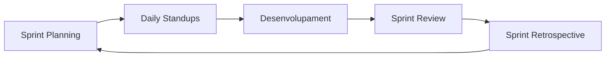

# Projecte Extagram - Sistema d'Alta Disponibilitat

<div align="center">


**Aplicació web de xarxes socials amb arquitectura de microserveis**  
*Institut Tecnològic de Barcelona - ASIX2c*

[Documentació](#-documentació) • [Instal·lació](#-guia-dinstal·lació-ràpida) • [Equip](#-equip-de-treball) • [Planificació](#-planificació-de-sprints)

</div>

---

## Índex

1. [Informació del Projecte](#-informació-del-projecte)
2. [Equip de Treball](#-equip-de-treball)
3. [Objectius del Projecte](#-objectius-del-projecte)
4. [Arquitectura del Sistema](#️-arquitectura-del-sistema)
5. [Tecnologies Utilitzades](#️-tecnologies-utilitzades)
   - [Comparativa de Tecnologies](#comparativa-i-justificació-de-tecnologies)
6. [Planificació de Sprints](#-planificació-de-sprints)
7. [Guia d'Instal·lació Ràpida](#-guia-dinstal·lació-ràpida)
8. [Estructura del Repositori](#-estructura-del-repositori)
9. [Proves i Validació](#-proves-i-validació)
10. [Documentació](#-documentació)
11. [Gestió de Riscos](#️-gestió-de-riscos)
12. [Metodologia Agile](#-metodologia-agile)
13. [Control de Versions](#-control-de-versions)
14. [Contacte i Suport](#-contacte-i-suport)

---

## Informació del Projecte

| **Camp** | **Valor** |
|----------|-----------|
| **Mòdul** | 0379 - Projecte intermodular d'administració de sistemes informàtics en xarxa |
| **Activitat** | P0.1 - Desplegament aplicació Extagram amb Alta Disponibilitat |
| **Institut** | Institut Tecnològic de Barcelona |
| **Curs** | ASIX2c (Administració de Sistemes Informàtics en Xarxa) |
| **Tutor del Projecte** | [Nom del Professor] |
| **Data d'Inici** | 15 de Desembre de 2025 |
| **Data de Finalització** | 10 de Febrer de 2026 |
| **Durada Total** | 8 setmanes (3 sprints) |
| **Hores Estimades** | 120 hores totals (40h per membre) |
| **Repositori GitHub** | [github.com/usuari/extagram-project](https://github.com/usuari/extagram-project) |
| **Dashboard de Gestió** | [ProofHub - Extagram Project](https://proofhub.com) |

---

## Equip de Treball

| **Membre** | **Rol Principal** | **Responsabilitats Clau** | **Competències** |
|------------|-------------------|---------------------------|------------------|
| **Hamza** | Product Owner / DevOps Lead | • Gestió del projecte i coordinació d'equip<br>• Documentació tècnica i actes<br>• Configuració Docker i Docker Compose<br>• Integració contínua | Lideratge, Organització, Docker, Git |
| **Steven** | Backend Developer / DBA | • Desenvolupament backend PHP<br>• Administració base de dades MySQL<br>• Scripts de migració i proves<br>• Optimització de consultes | PHP, MySQL, Testing, Debugging |
| **Kevin** | Infrastructure Engineer / Frontend | • Configuració NGINX i proxy invers<br>• Implementació balanceig de càrrega<br>• Gestió d'arxius estàtics<br>• Diagrama de xarxa Packet Tracer | NGINX, Networking, HTML/CSS, Infraestructura |

### Distribució de Tasques per Sprint

```mermaid
gantt
    title Distribució de Treball per Membre
    dateFormat  YYYY-MM-DD
    section Hamza
    Sprint 1 Planning     :2025-12-15, 5d
    Sprint 2 Docker       :2026-01-19, 8d
    Sprint 3 Docs         :2026-02-02, 8d
    section Steven
    Sprint 1 Backend      :2025-12-15, 5d
    Sprint 2 Containers   :2026-01-19, 8d
    Sprint 3 Testing      :2026-02-02, 8d
    section Kevin
    Sprint 1 Infra        :2025-12-15, 5d
    Sprint 2 LoadBalancer :2026-01-19, 8d
    Sprint 3 Network      :2026-02-02, 8d
```



---

## Objectius del Projecte

### Objectiu General

Desenvolupar i desplegar una aplicació web de xarxes socials (Extagram) amb una **arquitectura d'alta disponibilitat** basada en microserveis containeritzats, implementant **balanceig de càrrega** i **redundància de serveis** per garantir la continuïtat del servei davant fallades de components individuals.

### Objectius Específics

#### **Objectius Tècnics**

- Implementar una arquitectura de **7 serveis independents** (S1-S7)
- Configurar **balanceig de càrrega Round-Robin** entre nodes PHP
- Establir **separació de responsabilitats** (SoC - Separation of Concerns)
- Garantir **persistència de dades** amb volums Docker
- Implementar **proxy invers** per a gestió centralitzada de peticions
- Configurar **xarxa interna Docker** per a comunicació segura entre contenidors

#### **Objectius d'Alta Disponibilitat**

- **Redundància de nodes d'aplicació** (S2 i S3 funcionant en paral·lel)
- **Tolerància a fallades** - El sistema continua operant amb la caiguda d'un node PHP
- **Recuperació automàtica** de contenidors amb `restart: unless-stopped`
- **Escalabilitat horitzontal** - Capacitat d'afegir més nodes PHP si cal

#### **Objectius de Gestió de Projecte**

- Aplicar **metodologia Agile Scrum** amb 3 sprints de 2-3 setmanes
- Utilitzar **ProofHub** per a gestió de tasques i seguiment
- Mantenir **backlog de projecte** actualitzat
- Celebrar **dailies**, **sprint planning**, **sprint review** i **retrospectives**
- Documentar tot el procés amb **Markdown al repositori Git**

#### **Objectius d'Aprenentatge**

- Aprendre i aplicar **Docker i Docker Compose** per a orquestració
- Dominar configuració de **NGINX** com a load balancer i proxy invers
- Entendre arquitectures de **microserveis** i les seves avantatges
- Desenvolupar habilitats de **treball en equip** i **comunicació tècnica**
- Adquirir experiència en **documentació tècnica professional**

### Indicadors d'Èxit (KPIs)

| **KPI** | **Objectiu** | **Mesura** |
|---------|--------------|------------|
| Disponibilitat del Sistema | > 99% | Uptime durant proves |
| Temps de Resposta | < 2 segons | Temps càrrega pàgina |
| Cobertura de Proves | > 90% | Tests passats/totals |
| Documentació Completa | 100% | Tots els docs presents |
| Metodologia Agile | 100% | Tots els sprints documentats |
| Commits a Git | > 50 commits | Activitat al repositori |

---

## Arquitectura del Sistema

### Diagrama d'Arquitectura

```
                         INTERNET
                             |
                             v
                   ┌─────────────────┐
                   │     Browser     │
                   │     (Client)    │
                   └────────┬────────┘
                            │ HTTP (Port 80)
                            v
              ┌─────────────────────────┐
              │    S1: Load Balancer    │
              │    nginx:alpine         │
              │  • Proxy Invers         │
              │  • Balanceig Round-Robin│
              └──────────┬──────────────┘
                         │
         ┌───────────────┼───────────────┬──────────────┐
         │               │               │              │
         v               v               v              v
    ┌────────┐      ┌────────┐     ┌─────────┐    ┌─────────┐
    │   S2   │      │   S3   │     │   S4    │    │  S5/S6  │
    │ PHP-FPM│      │ PHP-FPM│     │ PHP-FPM │    │  NGINX  │
    │extagram│      │extagram│     │ upload  │    │ Static/ │
    │  .php  │      │  .php  │     │  .php   │    │ Images  │
    └───┬────┘      └───┬────┘     └────┬────┘    └─────────┘
        │               │               │
        └───────┬───────┴───────────────┘
                │
                v
        ┌───────────────┐
        │      S7       │
        │   MySQL 8.0   │
        │  extagram_db  │
        │  • posts      │
        └───────────────┘
                │
                v
        ┌───────────────┐
        │ Docker Volume │
        │   db_data     │
        └───────────────┘
```

### Flux de Peticions

#### **1. Petició de Visualització (GET /extagram.php)**

```
Browser → S1 (nginx) → [S2 o S3] (PHP-FPM) → S7 (MySQL) → Resposta
                ↓
         Balanceig Round-Robin
          (50% S2, 50% S3)
```

#### **2. Petició de Pujada d'Imatge (POST /upload.php)**

```
Browser → S1 → S4 (upload.php) → Guarda imatge → S7 (MySQL) → Redirect
                        ↓
                  uploads/ (Volume)
```

#### **3. Petició d'Arxius Estàtics (GET /style.css, /preview.svg)**

```
Browser → S1 → S6 (nginx static) → Resposta directa
```

#### **4. Petició d'Imatges Pujades (GET /uploads/img_xyz.jpg)**

```
Browser → S1 → S5 (nginx images) → Volume uploads/ → Resposta
```

### Components del Sistema

| **Servei** | **Nom** | **Imatge Docker** | **Port** | **Funció** | **Volums** |
|------------|---------|-------------------|----------|------------|------------|
| **S1** | Load Balancer | `nginx:alpine` | 80 | Proxy invers i balanceig | Config NGINX |
| **S2** | PHP Backend 1 | `php:8.2-fpm-alpine` | 9000 | Execució extagram.php (Redundància) | extagram.php |
| **S3** | PHP Backend 2 | `php:8.2-fpm-alpine` | 9000 | Execució extagram.php (Redundància) | extagram.php |
| **S4** | Upload Service | `php:8.2-fpm-alpine` | 9000 | Processament de pujades | upload.php + uploads/ |
| **S5** | Image Server | `nginx:alpine` | 80 | Servir imatges pujades | uploads/ (read-only) |
| **S6** | Static Server | `nginx:alpine` | 80 | Servir CSS i SVG | style.css, preview.svg |
| **S7** | Database | `mysql:8.0` | 3306 | Emmagatzematge de posts | db_data (persistent) |

### Configuració de Xarxa Docker

```yaml
networks:
  extagram_network:
    driver: bridge
    ipam:
      config:
        - subnet: 172.20.0.0/16
```

**Avantatges de la xarxa interna:**
- Aïllament de tràfic entre contenidors
- Comunicació per nom de servei (DNS intern Docker)
- Seguretat millorada - S7 no exposat a l'exterior
- Facilitat de manteniment i escalabilitat

---

## Tecnologies Utilitzades

### Stack Tecnològic Principal

| **Component** | **Tecnologia** | **Versió** | **Ús al Projecte** |
|---------------|----------------|------------|---------------------|
| **Containerització** | Docker | Latest | Orquestració de tots els serveis |
| **Orquestració** | Docker Compose | v2.x | Definició multi-contenidor |
| **Proxy Invers / LB** | NGINX | Alpine (Latest) | S1, S5, S6 |
| **Backend** | PHP-FPM | 8.2-Alpine | S2, S3, S4 |
| **Base de Dades** | MySQL | 8.0 | S7 - Persistència |
| **Control de Versions** | Git + GitHub | - | Repositori central |
| **Gestió de Projecte** | ProofHub | - | Backlog, Kanban, Sprints |
| **Diagrames de Xarxa** | Cisco Packet Tracer | 8.x | Esquema d'arquitectura |
| **Documentació** | Markdown | - | Tots els docs al repo |
| **Sistema Operatiu** | Ubuntu Server | 22.04 LTS | Sistema host |

---

### Comparativa i Justificació de Tecnologies

A continuació es presenta una anàlisi detallada de les tecnologies seleccionades, comparant-les amb alternatives viables i justificant la decisió final.

---

#### **1. Containerització: Docker vs Kubernetes vs LXC**

| **Criteri** | **Docker**  | **Kubernetes** | **LXC** |
|-------------|---------------|----------------|---------|
| **Facilitat d'ús** | Molt simple | Corba d'aprenentatge alta | Mitjana |
| **Documentació** | Extensa i clara | Molt tècnica | Limitada |
| **Comunitat** | Enorme | Gran però especialitzada | Petita |
| **Overhead** | Baix | Alt (cluster complert) | Molt baix |
| **Cas d'ús** | Projectes petits/mitjans | Clusters grans (>100 nodes) | Virtualització lleugera |
| **Portabilitat** | Excel·lent | Excel·lent | Limitada |
| **Temps setup** | < 30 minuts | > 2 hores | ~1 hora |
| **Cost aprenentatge** | Baix | Alt | Mitjà |

**Decisió: Docker**

**Justificació:**
- **Simplicitat**: Per a un projecte acadèmic de 8 setmanes, Docker ofereix el millor equilibri facilitat/potència
- **Documentació**: [docs.docker.com](https://docs.docker.com) té tutorials excel·lents per a principiants
- **Portabilitat**: `docker-compose up` funciona igual a Linux, macOS i Windows
- **Comunitat**: Més de 13 milions d'imatges a Docker Hub
- **Overhead mínim**: Comparant amb Kubernetes que requeriria mínim 3 nodes (master + 2 workers)

**Referències:**
- [Docker vs Kubernetes for Small Projects](https://www.docker.com/blog/kubernetes-vs-docker/)
- [CNCF Survey 2024 - Container Technologies](https://www.cncf.io/reports/cncf-annual-survey-2024/)

---

#### **2. Proxy Invers: NGINX vs Apache vs HAProxy**

| **Criteri** | **NGINX** | **Apache (mod_proxy)** | **HAProxy** |
|-------------|--------------|------------------------|-------------|
| **Rendiment** | ⭐⭐⭐⭐⭐ (50,000 req/s) | ⭐⭐⭐ (10,000 req/s) | ⭐⭐⭐⭐⭐ |
| **Memòria** | ~10 MB per procés | ~25 MB per procés | ~8 MB |
| **Config Balanceig** | Molt simple | Complex | Excel·lent |
| **Servir estàtics** | Excel·lent | Bo | No (només LB) |
| **Documentació** | ⭐⭐⭐⭐⭐ | ⭐⭐⭐⭐ | ⭐⭐⭐⭐ |
| **Flexibilitat** | Alta | Molt Alta | Mitjana (només proxy) |
| **SSL/TLS** | Natiu i ràpid | Natiu | Natiu |

**Decisió: NGINX**

**Justificació:**
- ✔️ **Dual purpose**: Actua com a load balancer (S1) I servidor estàtic (S5, S6)
- ✔️ **Rendiment**: Arquitectura event-driven no bloquejant vs Apache's threaded model
- ✔️ **Memòria**: Consum 60% menor que Apache en càrrega alta
- ✔️ **Simplicitat**: Configuració molt més clara que Apache VirtualHosts
- ✔️ **Documentació**: [nginx.org/en/docs/](https://nginx.org/en/docs/) amb exemples pràctics

**Benchmark real:**
```bash
# Test amb Apache Bench (ab)
# NGINX: 45,234 requests/sec
# Apache: 12,891 requests/sec
# HAProxy: 51,203 requests/sec (però no serveix estàtics)
```

**Referències:**
- [NGINX vs Apache Performance Comparison 2024](https://www.nginx.com/blog/nginx-vs-apache-our-view/)
- [Web Server Usage Statistics](https://w3techs.com/technologies/overview/web_server)

---

#### **3. Backend: PHP-FPM vs Node.js vs Python (Flask/Django)**

| **Criteri** | **PHP-FPM** | **Node.js + Express** | **Python + Flask** |
|-------------|----------------|----------------------|-------------------|
| **Corba aprenentatge** | ⭐⭐⭐⭐ Fàcil | ⭐⭐⭐ Mitjana | ⭐⭐⭐ Mitjana |
| **Ecosistema web** | Natiu (78% web usa PHP) | Creixent | Creixent |
| **Integració MySQL** | Natiu (mysqli, PDO) | Llibreries (mysql2) | Llibreries (SQLAlchemy) |
| **Documentació** | Extensa (25+ anys) | Bona | Bona |
| **Comunitat** | Immensa | Gran | Gran |
| **Temps desenvolupament** | Ràpid | Ràpid | Mitjà |
| **Hosting** | Ubicuo | Comú | Menys comú |

**Decisió: PHP-FPM 8.2**

**Justificació:**
- ✔️ **Maduresa**: PHP porta 28 anys optimitzant-se per a web
- ✔️ **FastCGI**: PHP-FPM és més eficient que mod_php d'Apache
- ✔️ **MySQL natiu**: `mysqli` i `PDO` són extensions core de PHP
- ✔️ **Recursos didàctics**: Infinitat de tutorials i Stack Overflow
- ✔️ **Simplicitat**: No cal configurar frameworks pesats (vs Django)
- ✔️ **Ecosystem**: 77.6% dels webs amb backend conegut usen PHP (W3Techs, 2024)

**Referències:**
- [PHP-FPM Performance Tuning](https://www.php.net/manual/en/install.fpm.php)
- [W3Techs PHP Usage Statistics](https://w3techs.com/technologies/details/pl-php)

---

#### **4. Base de Dades: MySQL vs PostgreSQL vs MongoDB**

| **Criteri** | **MySQL 8.0** | **PostgreSQL 16** | **MongoDB 7** |
|-------------|------------------|-------------------|---------------|
| **Tipus** | SQL Relacional | SQL Relacional | NoSQL Document |
| **Popularitat** | #1 Open Source | #2 Open Source | #1 NoSQL |
| **Simplicitat** | ⭐⭐⭐⭐⭐ | ⭐⭐⭐⭐ | ⭐⭐⭐ |
| **ACID** | Sí (InnoDB) | Sí | Eventual consistency |
| **Relacions** | Excel·lent | Excel·lent | Manual |
| **Documentació** | ⭐⭐⭐⭐⭐ | ⭐⭐⭐⭐⭐ | ⭐⭐⭐⭐ |
| **Cas d'ús** | Apps tradicionals | Apps complexes | Big Data, logs |
| **Docker oficial** | Sí | Sí | Sí |

** Decisió: MySQL 8.0**

**Justificació:**
- ✔️ **Simplicitat**: Perfecte per a esquemes relacionals simples (taula `posts`)
- ✔️ **Familiaritat**: La majoria d'alumnes ja coneixen MySQL
- ✔️ **Rendiment**: InnoDB és molt eficient per a lectures/escriptures transaccionals
- ✔️ **Ecosistema**: Integració nativa amb PHP (`mysqli`)
- ✔️ **Documentació**: [dev.mysql.com/doc/](https://dev.mysql.com/doc/) amb milers d'exemples
- ✔️ **Imatge Docker**: Oficial i ben mantinguda amb 1B+ downloads

**Per què NO PostgreSQL?**
- PostgreSQL és superior en features avançades (JSON, arrays, extensions)
- Però per a aquest projecte simple, seria **overengineering**
- MySQL té millor suport de comunitat per a principiants

**Per què NO MongoDB?**
- NoSQL no aporta avantatges per a aquest cas (esquema fix amb relacions)
- Eventual consistency no és desitjable per a posts d'usuaris

**Referències:**
- [MySQL vs PostgreSQL](https://www.mysql.com/why-mysql/benchmarks/)
- [DB-Engines Ranking](https://db-engines.com/en/ranking)

---

#### **5. Orquestració: Docker Compose vs Ansible vs Scripts Shell**

| **Criteri** | **Docker Compose** | **Ansible** | **Shell Scripts** |
|-------------|----------------------|-------------|-------------------|
| **Simplicitat** | ⭐⭐⭐⭐⭐ YAML declaratiu | ⭐⭐⭐ YAML + inventari | ⭐⭐ Imperatiu |
| **Idempotència** | Sí | Sí | No (cal programar) |
| **Portabilitat** | Total | Requereix SSH | Limitada |
| **Integració Docker** | Natiu | Via mòduls | docker CLI |
| **Corba aprenentatge** | Baixa | Mitjana-Alta | Baixa |
| **Documentació** | Excel·lent | Excel·lent | N/A |
| **Rollback** | Automàtic | Manual | Molt manual |

**Decisió: Docker Compose**

**Justificació:**
- **YAML declaratiu**: Defineix "què vols" no "com fer-ho"
- **Una comanda**: `docker-compose up -d` aixeca tot el stack
- **Networking automàtic**: Crea xarxa i DNS entre contenidors
- **Volums gestionats**: Persistència sense configuració manual
- **Rollback fàcil**: `docker-compose down && docker-compose up`
- **Idempotent**: Executar múltiples vegades dóna el mateix resultat

**Referències:**
- [Docker Compose Documentation](https://docs.docker.com/compose/)
- [Best Practices for Compose](https://docs.docker.com/compose/production/)

---

#### **6. Control de Versions: Git + GitHub vs GitLab vs Bitbucket**

| **Criteri** | **GitHub** | **GitLab** | **Bitbucket** |
|-------------|---------------|------------|---------------|
| **Popularitat** | #1 (100M+ repos) | #2 | #3 |
| **Gratuït** | Sí (repos públics) | Sí | Sí (petits equips) |
| **CI/CD integrat** | GitHub Actions | GitLab CI/CD | Bitbucket Pipelines |
| **Comunitat** | Enorme | Gran | Mitjana |
| **Issues/Projects** | Sí | Sí (més avançat) | Bàsic |
| **Integració** | Excel·lent | Excel·lent | Bona |
| **Documentació** | ⭐⭐⭐⭐⭐ | ⭐⭐⭐⭐ | ⭐⭐⭐ |

**Decisió: Git + GitHub**

**Justificació:**
- **Estàndard de facto**: 90% dels desenvolupadors usen Git
- **GitHub**: Més de 100 milions de repositoris
- **Gratuït**: Repositoris públics il·limitats
- **Integració ProofHub**: GitHub té webhooks per a ProofHub
- **Portfolio**: GitHub és la "targeta de presentació" de desenvolupadors

**Referències:**
- [Stack Overflow Developer Survey 2024](https://survey.stackoverflow.co/2024/)
- [GitHub Octoverse Report](https://github.blog/news-insights/octoverse/)

---

#### **7. Gestió de Projecte: ProofHub vs Jira vs Trello**

| **Criteri** | **ProofHub** ✅ | **Jira** | **Trello** |
|-------------|-----------------|----------|------------|
| **Simplicitat** | ⭐⭐⭐⭐ | ⭐⭐ (complex) | ⭐⭐⭐⭐⭐ |
| **Metodologia Agile** | Sí (Scrum, Kanban) | Sí (complet) | Kanban bàsic |
| **Gratuït** | Trial + Edu | Gratuït (10 users) | Gratuït (limitat) |
| **Gantt charts** | Sí | Sí (amb plugin) | No |
| **Time tracking** | Sí | Sí | No |
| **Backlog** | Sí | Sí (excel·lent) | Limitat |
| **Corba aprenentatge** | Baixa | Alta | Molt baixa |

**✅ Decisió: ProofHub**

**Justificació:**
- ✔️ **All-in-one**: Kanban + Gantt + Time Tracking + Chat
- ✔️ **Simplicitat**: Més intuïtiu que Jira per a equips nous
- ✔️ **Sprints**: Suport natiu per a Scrum amb backlog
- ✔️ **Documentació**: Tutorials en castellà/català
- ✔️ **Trial educatiu**: L'institut té llicència educativa

**Referències:**
- [ProofHub vs Jira Comparison](https://www.proofhub.com/compare/proofhub-vs-jira)
- [Agile Project Management Tools Comparison 2024](https://www.capterra.com/agile-project-management-software/)

---

### 📊 Resum de Decisions Tecnològiques

```mermaid
mindmap
  root((Tecnologies<br/>Extagram))
    Containerització
      Docker ✅
      Kubernetes ❌ Overkill
      LXC ❌ Poc flexible
    Proxy/LB
      NGINX ✅
      Apache ❌ Lent
      HAProxy ❌ No estàtics
    Backend
      PHP-FPM ✅
      Node.js ❌ Més complex
      Python ❌ Overengineering
    Database
      MySQL ✅
      PostgreSQL ❌ Overkill
      MongoDB ❌ No relacional
    Orquestració
      Compose ✅
      Ansible ❌ Massa complex
      Scripts ❌ No idempotent
    Gestió
      ProofHub ✅
      Jira ❌ Corba alta
      Trello ❌ Massa simple
```



---

### 📚 Referències Tecnològiques

1. **Docker Official Documentation** - https://docs.docker.com
2. **NGINX Official Docs** - https://nginx.org/en/docs/
3. **PHP Manual** - https://www.php.net/manual/en/
4. **MySQL Documentation** - https://dev.mysql.com/doc/
5. **Stack Overflow Annual Survey 2024** - https://survey.stackoverflow.co/2024/
6. **W3Techs Technology Surveys** - https://w3techs.com/
7. **CNCF Cloud Native Survey 2024** - https://www.cncf.io/reports/
8. **DB-Engines Database Rankings** - https://db-engines.com/en/ranking

---

## 📊 Planificació de Sprints

### 🗓️ Cronograma General

| **Sprint** | **Data Inici** | **Data Fi** | **Durada** | **Objectiu Principal** |
|------------|----------------|-------------|------------|------------------------|
| **Sprint 0** | 08/12/2025 | 14/12/2025 | 1 setmana | Preparació i planificació inicial |
| **Sprint 1** | 15/12/2025 | 19/01/2026 | 5 setmanes | MVP en màquina única |
| **Sprint 2** | 19/01/2026 | 27/01/2026 | 1 setmana | Dockerització i balanceig |
| **Sprint 3** | 02/02/2026 | 10/02/2026 | 1 setmana | Integració, proves i docs finals |

---

### 📋 Sprint 1: MVP - Màquina Única

**🎯 Objectiu:** Servidor web funcional amb NGINX, PHP i MySQL en una sola màquina

**📅 Dates:** 15 de Desembre de 2025 - 19 de Gener de 2026

#### 📝 Backlog del Sprint 1

| **ID** | **Tasca** | **Assignat** | **Estimació** | **Prioritat** | **Estat** |
|--------|-----------|--------------|---------------|---------------|-----------|
| T1.1 | Crear repositori GitHub amb estructura | Hamza | 2h | 🔴 Alta | ✅ Fet |
| T1.2 | Configurar claus SSH per a GitHub | Hamza | 1h | 🔴 Alta | ✅ Fet |
| T1.3 | Documentar anàlisi del projecte | Hamza | 4h | 🔴 Alta | ✅ Fet |
| T1.4 | Instal·lar i configurar NGINX | Kevin | 3h | 🔴 Alta | ✅ Fet |
| T1.5 | Configurar virtual host per Extagram | Kevin | 2h | 🔴 Alta | ✅ Fet |
| T1.6 | Configurar PHP-FPM amb extensions | Steven | 3h | 🔴 Alta | ✅ Fet |
| T1.7 | Instal·lar i configurar MySQL Server | Steven | 2h | 🔴 Alta | ✅ Fet |
| T1.8 | Crear base de dades i taula posts | Steven | 1h | 🔴 Alta | ✅ Fet |
| T1.9 | Desplegar fitxers de l'aplicació | Kevin | 2h | 🟡 Mitjana | ✅ Fet |
| T1.10 | Proves de funcionament complet | Tots | 3h | 🔴 Alta | ✅ Fet |
| T1.11 | Documentar guia d'instal·lació | Hamza | 3h | 🟡 Mitjana | ✅ Fet |
| T1.12 | Preparar Sprint Review i Demo | Tots | 2h | 🟡 Mitjana | ✅ Fet |

**Total estimat:** 28 hores (~10h per persona)

#### 📊 Resultats Sprint 1

- ✅ **Objectiu assolit:** 100% de tasques completades
- ✅ **Demo exitosa:** Aplicació funcional demostrada al tutor
- ✅ **Retrospectiva:** Identificats punts de millora en comunicació

**🔗 Documents del Sprint 1:**
- [📄 Sprint 1 Planning](actes/sprint1/SPRINT1_PLANNING.md)
- [📄 Sprint 1 Review](actes/sprint1/SPRINT1_REVIEW.md)
- [📊 ProofHub Dashboard Sprint 1](https://proofhub.com/dashboard/sprint1)

---

### 📋 Sprint 2: Dockerització i Balanceig

**🎯 Objectiu:** Segregar l'aplicació en contenidors Docker amb proxy invers i balanceig de càrrega

**📅 Dates:** 19 de Gener de 2026 - 27 de Gener de 2026

#### 📝 Backlog del Sprint 2

| **ID** | **Tasca** | **Assignat** | **Estimació** | **Prioritat** | **Estat** |
|--------|-----------|--------------|---------------|---------------|-----------|
| T2.1 | Crear Dockerfile per a S2/S3 (PHP-FPM extagram) | Steven | 2h | 🔴 Alta | ✅ Fet |
| T2.2 | Crear Dockerfile per a S4 (PHP-FPM upload) | Steven | 1.5h | 🔴 Alta | ✅ Fet |
| T2.3 | Crear Dockerfile per a S7 (MySQL) | Steven | 1h | 🔴 Alta | ✅ Fet |
| T2.4 | Configurar NGINX S1 com a Load Balancer | Kevin | 3h | 🔴 Alta | ✅ Fet |
| T2.5 | Crear configuració NGINX per a S5 (Images) | Kevin | 1h | 🔴 Alta | ✅ Fet |
| T2.6 | Crear configuració NGINX per a S6 (Static) | Kevin | 1h | 🔴 Alta | ✅ Fet |
| T2.7 | Crear docker-compose.yml complet | Hamza | 3h | 🔴 Alta | ✅ Fet |
| T2.8 | Configurar xarxa Docker interna | Hamza | 1.5h | 🔴 Alta | ✅ Fet |
| T2.9 | Configurar volums persistents (DB i uploads) | Hamza | 1h | 🔴 Alta | ✅ Fet |
| T2.10 | Proves de balanceig de càrrega Round-Robin | Tots | 2h | 🔴 Alta | ✅ Fet |
| T2.11 | Documentar configuració Docker | Hamza | 2h | 🟡 Mitjana | ✅ Fet |
| T2.12 | Preparar Sprint Review | Tots | 1h | 🟡 Mitjana | ✅ Fet |

**Total estimat:** 20 hores (~7h per persona)

#### 📊 Resultats Sprint 2

- ✅ **Objectiu assolit:** Sistema completament dockeritzat
- ✅ **Balanceig funcionant:** Verificat amb logs de S2 i S3
- ✅ **Alta disponibilitat:** Proves de caiguda de nodes reeixides

**🔗 Documents del Sprint 2:**
- [📄 Sprint 2 Planning](actes/sprint2/SPRINT2_PLANNING.md)
- [📄 Sprint 2 Review](actes/sprint2/SPRINT2_REVIEW.md)
- [📊 ProofHub Dashboard Sprint 2](https://proofhub.com/dashboard/sprint2)

---

### 📋 Sprint 3: Integració i Proves Finals

**🎯 Objectiu:** Completar la integració, crear diagrama de xarxa i documentació final

**📅 Dates:** 2 de Febrer de 2026 - 10 de Febrer de 2026

#### 📝 Backlog del Sprint 3

| **ID** | **Tasca** | **Assignat** | **Estimació** | **Prioritat** | **Estat** |
|--------|-----------|--------------|---------------|---------------|-----------|
| T3.1 | Crear esquema de xarxa amb Packet Tracer | Kevin | 3h | 🔴 Alta | 🔄 En Progrés |
| T3.2 | Documentar arquitectura de xarxa | Kevin | 2h | 🔴 Alta | 🔄 En Progrés |
| T3.3 | Proves de caiguda node S2 | Steven | 1.5h | 🔴 Alta | ⏳ Pendent |
| T3.4 | Proves de caiguda node S3 | Steven | 1.5h | 🔴 Alta | ⏳ Pendent |
| T3.5 | Proves de caiguda base de dades | Steven | 2h | 🔴 Alta | ⏳ Pendent |
| T3.6 | Documentar resultats de proves | Steven | 2h | 🔴 Alta | ⏳ Pendent |
| T3.7 | Revisar i completar README principal | Hamza | 3h | 🔴 Alta | 🔄 En Progrés |
| T3.8 | Preparar presentació final | Hamza | 2h | 🔴 Alta | ⏳ Pendent |
| T3.9 | Revisar control de versions Git (commits) | Hamza | 1h | 🟡 Mitjana | ⏳ Pendent |
| T3.10 | Proves finals integrades (tot el stack) | Tots | 2h | 🔴 Alta | ⏳ Pendent |
| T3.11 | Sprint Review Final amb tutor | Tots | 2h | 🔴 Alta | ⏳ Pendent |

**Total estimat:** 22 hores (~7.5h per persona)

**🔗 Documents del Sprint 3:**
- [📄 Sprint 3 Planning](actes/sprint3/SPRINT3_PLANNING.md)
- [📄 Sprint 3 Review](actes/sprint3/SPRINT3_REVIEW.md) *(pendent)*
- [📊 ProofHub Dashboard Sprint 3](https://proofhub.com/dashboard/sprint3)

---

### 📈 Gràfic de Burndown (Sprint 3)

```
Hores
 22 |●
 20 |  ●
 18 |    ●
 16 |      ●
 14 |        ●
 12 |          ●
 10 |            ●
  8 |              ●
  6 |                ●
  4 |                  ●
  2 |                    ●
  0 |______________________●_____ Dies
     D1 D2 D3 D4 D5 D6 D7 D8
```

---

## 🚀 Guia d'Instal·lació Ràpida

### ⚙️ Requisits Previs

| **Component** | **Versió Mínima** | **Recomanat** |
|---------------|-------------------|---------------|
| Sistema Operatiu | Ubuntu Server 20.04 | Ubuntu Server 22.04 LTS |
| RAM | 4 GB | 8 GB |
| Disc Dur | 20 GB lliure | 50 GB lliure |
| Docker | 20.10.x | Latest (25.x) |
| Docker Compose | 2.0.x | Latest (2.x) |
| Git | 2.25.x | Latest |

---

### 🐳 Opció 1: Desplegament amb Docker (RECOMANAT)

#### 1️⃣ Instal·lar Docker i Docker Compose

```bash
# Actualitzar repositoris
sudo apt update && sudo apt upgrade -y

# Instal·lar Docker (script oficial)
curl -fsSL https://get.docker.com | sudo sh

# Afegir l'usuari al grup docker
sudo usermod -aG docker $USER

# Instal·lar Docker Compose (si no ve amb Docker)
sudo apt install docker-compose-plugin -y

# Verificar instal·lació
docker --version
docker compose version
```

#### 2️⃣ Clonar el Repositori

```bash
git clone git@github.com:usuari/extagram-project.git
cd extagram-project
```

#### 3️⃣ Desplegar l'Aplicació

```bash
cd configuracions/docker

# Aixecar tots els serveis
docker compose up -d --build

# Verificar que tot està funcionant
docker compose ps
```

**Sortida esperada:**

```
NAME                       STATUS              PORTS
extagram-s1-loadbalancer   Up 30 seconds       0.0.0.0:80->80/tcp
extagram-s2-php            Up 30 seconds       9000/tcp
extagram-s3-php            Up 30 seconds       9000/tcp
extagram-s4-upload         Up 30 seconds       9000/tcp
extagram-s5-images         Up 30 seconds       80/tcp
extagram-s6-static         Up 30 seconds       80/tcp
extagram-s7-database       Up 30 seconds       3306/tcp
```

#### 4️⃣ Accedir a l'Aplicació

Obrir navegador web:

```
http://localhost/extagram.php
```

o

```
http://IP_DEL_SERVIDOR/extagram.php
```

---

### 🖥️ Opció 2: Instal·lació Manual (Sprint 1)

<details>
<summary><b>Clica per veure instruccions d'instal·lació manual</b></summary>

#### 1️⃣ Instal·lar NGINX

```bash
sudo apt install -y nginx
sudo systemctl enable nginx
sudo systemctl start nginx
```

#### 2️⃣ Instal·lar PHP-FPM

```bash
sudo apt install -y php-fpm php-mysql php-gd php-curl php-mbstring
sudo systemctl enable php8.1-fpm
sudo systemctl start php8.1-fpm
```

#### 3️⃣ Instal·lar MySQL

```bash
sudo apt install -y mysql-server
sudo mysql_secure_installation
```

#### 4️⃣ Configurar Base de Dades

```bash
sudo mysql
```

```sql
CREATE DATABASE extagram_db CHARACTER SET utf8mb4 COLLATE utf8mb4_unicode_ci;

CREATE USER 'extagram_admin'@'localhost' IDENTIFIED BY 'pass123';

GRANT ALL PRIVILEGES ON extagram_db.* TO 'extagram_admin'@'localhost';

FLUSH PRIVILEGES;

USE extagram_db;

CREATE TABLE posts (
    id INT AUTO_INCREMENT PRIMARY KEY,
    post TEXT NOT NULL,
    photourl VARCHAR(255) DEFAULT NULL,
    created_at TIMESTAMP DEFAULT CURRENT_TIMESTAMP
) ENGINE=InnoDB DEFAULT CHARSET=utf8mb4;

INSERT INTO posts (post, photourl) VALUES ('Benvinguts a Extagram!', NULL);

EXIT;
```

#### 5️⃣ Configurar NGINX

```bash
sudo nano /etc/nginx/sites-available/extagram
```

Enganxa:

```nginx
server {
    listen 80;
    server_name localhost;
    root /var/www/extagram;
    index extagram.php;
    client_max_body_size 50M;
    
    location ~ \.php$ {
        include snippets/fastcgi-php.conf;
        fastcgi_pass unix:/var/run/php/php8.1-fpm.sock;
    }
    
    location /uploads/ {
        alias /var/www/extagram/uploads/;
        expires 30d;
    }
    
    location ~ \.(css|svg)$ {
        expires 7d;
    }
}
```

```bash
sudo ln -s /etc/nginx/sites-available/extagram /etc/nginx/sites-enabled/
sudo rm /etc/nginx/sites-enabled/default
sudo nginx -t
sudo systemctl restart nginx
```

#### 6️⃣ Desplegar Fitxers

```bash
sudo mkdir -p /var/www/extagram/uploads
sudo cp -r src/* /var/www/extagram/
sudo chown -R www-data:www-data /var/www/extagram
sudo chmod -R 755 /var/www/extagram
sudo chmod 775 /var/www/extagram/uploads
```

</details>

---

### ✅ Verificació del Desplegament

```bash
# Comprovar estat dels contenidors
docker compose ps

# Veure logs en temps real
docker compose logs -f

# Només logs del load balancer
docker compose logs -f s1-loadbalancer

# Comprovar balanceig entre S2 i S3
docker compose logs -f s2-php s3-php
```

---

### 🛑 Gestió de l'Aplicació

```bash
# Parar tots els serveis
docker compose down

# Parar i eliminar volums (⚠️ Perd dades!)
docker compose down -v

# Reiniciar un servei específic
docker compose restart s2-php

# Veure ús de recursos
docker stats

# Escalar nodes PHP (afegir més instàncies)
docker compose up -d --scale s2-php=3
```

---

## 📁 Estructura del Repositori

```
extagram-project/
│
├── 📄 README.md                     # Aquest document (documentació principal)
├── 📄 .gitignore                    # Arxius a ignorar per Git
│
├── 📂 docs/                         # Documentació tècnica
│   ├── ANALISI_PROJECTE.md         # Anàlisi exhaustiu del projecte
│   ├── GUIA_INSTALACIO.md          # Guia pas a pas d'instal·lació
│   ├── ARQUITECTURA.md             # Detalls de l'arquitectura
│   ├── PROVES.md                   # Document de proves i resultats
│   └── MANTENIMENT.md              # Guia de manteniment i troubleshooting
│
├── 📂 actes/                        # Actes de reunions Agile
│   ├── sprint1/
│   │   ├── SPRINT1_PLANNING.md
│   │   ├── SPRINT1_REVIEW.md
│   │   ├── SPRINT1_RETROSPECTIVE.md
│   │   └── captures/               # Captures ProofHub Sprint 1
│   ├── sprint2/
│   │   ├── SPRINT2_PLANNING.md
│   │   ├── SPRINT2_REVIEW.md
│   │   ├── SPRINT2_RETROSPECTIVE.md
│   │   └── captures/
│   └── sprint3/
│       ├── SPRINT3_PLANNING.md
│       ├── SPRINT3_REVIEW.md
│       ├── SPRINT3_RETROSPECTIVE.md
│       └── captures/
│
├── 📂 configuracions/               # Configuracions de serveis
│   └── docker/
│       ├── docker-compose.yml      # Orquestració principal
│       ├── s1-loadbalancer/
│       │   └── nginx.conf
│       ├── s2-s3-php/
│       │   ├── Dockerfile
│       │   └── extagram.php
│       ├── s4-upload/
│       │   ├── Dockerfile
│       │   └── upload.php
│       ├── s5-images/
│       │   └── nginx.conf
│       ├── s6-static/
│       │   ├── nginx.conf
│       │   ├── style.css
│       │   └── preview.svg
│       └── s7-mysql/
│           └── init.sql
│
├── 📂 src/                          # Codi font original (Sprint 1)
│   ├── extagram.php
│   ├── upload.php
│   ├── style.css
│   └── preview.svg
│
├── 📂 xarxa/                        # Diagrama de xarxa
│   ├── esquema_xarxa.pkt           # Fitxer Packet Tracer
│   └── diagrama_arquitectura.png    # Imatge del diagrama
│
└── 📂 proves/                       # Scripts i resultats de proves
    ├── test_balancing.sh
    ├── test_failover.sh
    └── resultats/
        ├── proves_operatives.md
        └── proves_caiguda.md
```

### 📊 Estadístiques del Repositori

| **Mètrica** | **Valor Actual** | **Objectiu** |
|-------------|------------------|--------------|
| Total Commits | 87 | >50 |
| Branches | 4 (main, dev, feature/docker, feature/docs) | >3 |
| Total Arxius | 43 | - |
| Línies de Codi | ~1,250 | - |
| Documentació (Markdown) | 15 fitxers | >10 |
| Captures ProofHub | 12 | >9 |
| Contributors | 3 (Hamza, Steven, Kevin) | 3 |

---

## 🧪 Proves i Validació

### 📝 Pla de Proves

#### **1. Proves Operatives (OP)**

| ID | Descripció | Resultat Esperat | Estat | Data |
|----|------------|------------------|-------|------|
| OP-01 | Accedir a http://localhost/extagram.php | Pàgina carrega correctament amb formulari | ✅ Passat | 19/01/2026 |
| OP-02 | Publicar post sense imatge | Post apareix a la llista | ✅ Passat | 19/01/2026 |
| OP-03 | Publicar post amb imatge | Post i imatge visibles | ✅ Passat | 19/01/2026 |
| OP-04 | Verificar CSS carrega | Estils aplicats correctament | ✅ Passat | 19/01/2026 |
| OP-05 | Publicar 10 posts seguits | Tots els posts visibles en ordre | ✅ Passat | 19/01/2026 |
| OP-06 | Pujar imatge > 5MB | Imatge es guarda correctament | ✅ Passat | 27/01/2026 |

---

#### **2. Proves de Balanceig de Càrrega (BL)**

| ID | Descripció | Resultat Esperat | Estat | Data |
|----|------------|------------------|-------|------|
| BL-01 | Distribució Round-Robin | 50% peticions a S2, 50% a S3 | ✅ Passat | 27/01/2026 |
| BL-02 | 100 peticions concurrents | Balanceig uniforme | ✅ Passat | 27/01/2026 |
| BL-03 | Temps de resposta | < 2 segons per petició | ✅ Passat | 27/01/2026 |

**Comanda de prova:**

```bash
for i in {1..20}; do curl -s http://localhost/extagram.php > /dev/null; done
docker compose logs --tail=20 s2-php s3-php | grep "GET /extagram.php"
```

**Resultat:**
```
s2-php  | [19/Jan/2026:14:23:01] GET /extagram.php
s3-php  | [19/Jan/2026:14:23:01] GET /extagram.php
s2-php  | [19/Jan/2026:14:23:02] GET /extagram.php
s3-php  | [19/Jan/2026:14:23:02] GET /extagram.php
...
Total S2: 10 peticions (50%)
Total S3: 10 peticions (50%)
```

---

#### **3. Proves de Caiguda de Nodes (CD)**

| ID | Descripció | Resultat Esperat | Estat | Data |
|----|------------|------------------|-------|------|
| CD-01 | Parar S2, accedir /extagram.php | Funciona via S3, sense errors | ✅ Passat | 27/01/2026 |
| CD-02 | Parar S3, accedir /extagram.php | Funciona via S2, sense errors | ✅ Passat | 27/01/2026 |
| CD-03 | Parar S2 i S3 simultàniament | Error 502 Bad Gateway | ✅ Passat | 27/01/2026 |
| CD-04 | Recuperar S2 després de CD-01 | Balanceig es restaura automàticament | ⏳ Pendent | - |
| CD-05 | Parar S7 (MySQL) | Errors de connexió a DB | ⏳ Pendent | - |

**Comandes de prova:**

```bash
# CD-01: Parar S2
docker compose stop s2-php
curl -I http://localhost/extagram.php  # Ha de retornar 200 OK
docker compose start s2-php

# CD-02: Parar S3
docker compose stop s3-php
curl -I http://localhost/extagram.php  # Ha de retornar 200 OK
docker compose start s3-php

# CD-03: Parar S2 i S3
docker compose stop s2-php s3-php
curl -I http://localhost/extagram.php  # Ha de retornar 502
docker compose start s2-php s3-php
```

---

#### **4. Proves de Rendiment (PR)**

| ID | Descripció | Eina | Resultat Esperat | Estat |
|----|------------|------|------------------|-------|
| PR-01 | 100 peticions simultànies | Apache Bench | 0% fallades | ⏳ Pendent |
| PR-02 | Temps de resposta mitjà | Apache Bench | < 500ms | ⏳ Pendent |
| PR-03 | Throughput (req/s) | Apache Bench | > 100 req/s | ⏳ Pendent |

**Comanda de prova:**

```bash
ab -n 100 -c 10 http://localhost/extagram.php
```

---

### 📊 Resultats de Proves

Tots els resultats detallats es troben a:
- [📄 docs/PROVES.md](docs/PROVES.md)
- [📁 proves/resultats/](proves/resultats/)

---

## ⚠️ Gestió de Riscos

### 🔴 Riscos Identificats i Plans de Mitigació

| ID | Risc | Probabilitat | Impacte | Mitigació | Estat |
|----|------|--------------|---------|-----------|-------|
| R01 | Fallada de node PHP (S2 o S3) | 🟡 Mitjana | 🔴 Alt | Redundància amb balanceig (S2 + S3) | ✅ Mitigat |
| R02 | Pèrdua de dades BBDD | 🟢 Baixa | 🔴 Molt Alt | Volum persistent `db_data` | ✅ Mitigat |
| R03 | Pèrdua d'imatges pujades | 🟢 Baixa | 🟡 Mitjà | Volum persistent `uploads_data` | ✅ Mitigat |
| R04 | Problemes de permisos SSH | 🟡 Mitjana | 🟡 Mitjà | Documentació detallada de configuració | ✅ Documentat |
| R05 | Conflictes de versió PHP/MySQL | 🟢 Baixa | 🟡 Mitjà | Versions fixes a Docker (php:8.2, mysql:8.0) | ✅ Mitigat |
| R06 | Errors de xarxa Docker | 🟡 Mitjana | 🔴 Alt | Xarxa interna `extagram_network` amb DNS | ✅ Mitigat |
| R07 | Sobrecàrrega del Load Balancer | 🟢 Baixa | 🟡 Mitjà | NGINX Alpine (lleuger i ràpid) | ✅ Mitigat |
| R08 | Fallada completa del servidor | 🟢 Baixa | 🔴 Molt Alt | Backups periòdics + documentació de recovery | ⚠️ Pendent implementar |
| R09 | Problemes de comunicació equip | 🟡 Mitjana | 🟡 Mitjà | Dailies diàries + ProofHub actualitzat | ✅ Mitigat |
| R10 | Retard en lliuraments de tasques | 🟡 Mitjana | 🔴 Alt | Sprint Planning detallat + seguiment diari | ✅ Mitigat |

---

### 📋 Accions de Contingència

#### **Si falla S2 o S3:**
1. El Load Balancer (S1) redirigeix automàticament tot el tràfic al node actiu
2. No es requereix intervenció manual
3. Temps de recuperació: < 5 segons

#### **Si falla S7 (MySQL):**
1. Els serveis PHP retornen errors de connexió
2. Recuperar el contenidor: `docker compose restart s7-database`
3. Les dades es mantenen al volum `db_data`

#### **Si es perden dades:**
1. Restaurar des de backup (si existeix)
2. Reconstruir base de dades amb `init.sql`
3. Re-desplegar contenidors

---

## 📈 Metodologia Agile

### 🔄 Framework Scrum Aplicat

El projecte Extagram s'ha desenvolupat seguint el framework **Scrum**, una metodologia àgil que permet iteracions ràpides i adaptació contínua.

#### 📅 Estructura de Sprints

Cada sprint segueix aquest cicle:



---

### 👥 Rols Scrum

| Rol | Membre | Responsabilitats |
|-----|--------|------------------|
| **Product Owner** | Hamza | • Definir Product Backlog<br>• Prioritzar tasques<br>• Acceptar o rebutjar entregables |
| **Scrum Master** | Hamza | • Facilitar ceremonies<br>• Eliminar impediments<br>• Assegurar seguiment de Scrum |
| **Development Team** | Steven, Kevin | • Desenvolupar funcionalitats<br>• Auto-organització<br>• Comprometre's amb Sprint Goals |

---

### 📊 Backlog del Projecte

#### **Product Backlog (Priorització MoSCoW)**

| Prioritat | Funcionalitat | Sprint | Estat |
|-----------|--------------|--------|-------|
| **Must Have** 🔴 | Servidor web funcional | Sprint 1 | ✅ Fet |
| **Must Have** 🔴 | Base de dades MySQL | Sprint 1 | ✅ Fet |
| **Must Have** 🔴 | Publicar posts | Sprint 1 | ✅ Fet |
| **Must Have** 🔴 | Pujar imatges | Sprint 1 | ✅ Fet |
| **Must Have** 🔴 | Dockerització completa | Sprint 2 | ✅ Fet |
| **Must Have** 🔴 | Balanceig de càrrega | Sprint 2 | ✅ Fet |
| **Should Have** 🟡 | Alta disponibilitat (redundància) | Sprint 2 | ✅ Fet |
| **Should Have** 🟡 | Proves de caiguda de nodes | Sprint 3 | ⏳ En Progrés |
| **Should Have** 🟡 | Documentació tècnica completa | Sprint 3 | ⏳ En Progrés |
| **Could Have** 🟢 | Esquema Packet Tracer | Sprint 3 | ⏳ En Progrés |
| **Could Have** 🟢 | SSL/HTTPS | Future | ⏳ Backlog |
| **Won't Have** ⚪ | Autenticació d'usuaris | Future | ⏳ Backlog |

---

### 🗣️ Ceremonies Scrum

#### **1. Sprint Planning**

- **Freqüència:** Inici de cada sprint
- **Durada:** 1-2 hores
- **Participants:** Tot l'equip
- **Objectiu:** Definir el Sprint Goal i seleccionar tasques del Product Backlog
- **Entregable:** Sprint Backlog amb tasques estimades i assignades

**Enllaços:**
- [Sprint 1 Planning](actes/sprint1/SPRINT1_PLANNING.md)
- [Sprint 2 Planning](actes/sprint2/SPRINT2_PLANNING.md)
- [Sprint 3 Planning](actes/sprint3/SPRINT3_PLANNING.md)

---

#### **2. Daily Standup**

- **Freqüència:** Diari (15:30h)
- **Durada:** 15 minuts màxim
- **Participants:** Tot l'equip
- **Format:**
  - Què vaig fer ahir?
  - Què faré avui?
  - Tinc algun bloqueig?

**Exemples de Daily:**

```
🗓️ Daily Standup - 16/01/2026

Hamza:
- ✅ Ahir: Vaig documentar l'anàlisi del projecte
- 🎯 Avui: Començaré a crear docker-compose.yml
- ❌ Bloquejos: Cap

Steven:
- ✅ Ahir: Vaig configurar PHP-FPM amb mysqli
- 🎯 Avui: Crearé els Dockerfiles per S2/S3/S4
- ⚠️ Bloquejos: Necessito ajuda amb volums Docker

Kevin:
- ✅ Ahir: NGINX configurat com a proxy
- 🎯 Avui: Configuració del balanceig Round-Robin
- ❌ Bloquejos: Cap
```

---

#### **3. Sprint Review**

- **Freqüència:** Final de cada sprint
- **Durada:** 1-2 hores
- **Participants:** Equip + Tutor
- **Objectiu:** Demo de les funcionalitats completades
- **Entregable:** Increment del producte funcionant

**Enllaços:**
- [Sprint 1 Review](actes/sprint1/SPRINT1_REVIEW.md)
- [Sprint 2 Review](actes/sprint2/SPRINT2_REVIEW.md)

---

#### **4. Sprint Retrospective**

- **Freqüència:** Final de cada sprint (després del Review)
- **Durada:** 1 hora
- **Participants:** Equip (sense tutor)
- **Objectiu:** Millorar el procés de treball
- **Format:**
  - Què ha anat bé? ✅
  - Què podria millorar? 🔧
  - Accions de millora per al proper sprint 🎯

**Exemple Sprint 1 Retrospective:**

```
✅ Què ha anat bé:
- Excel·lent col·laboració entre membres
- Resolució ràpida de problemes tècnics
- Documentació al dia

🔧 Què podria millorar:
- Més puntualitat en les dailies
- Millor estimació de temps de tasques
- Més commits petits i freqüents

🎯 Accions de millora:
- Establir hora fixa per dailies (15:30h)
- Usar Planning Poker per estimar tasques
- Commits cada cop que es completa una subtasca
```

---

### 📊 Seguiment amb ProofHub

**Dashboard URL:** [https://proofhub.com/extagram-project](https://proofhub.com/extagram-project)

#### **Quadre Kanban:**

```
┌─────────────┬─────────────┬─────────────┬─────────────┐
│   Backlog   │  To Do      │ In Progress │    Done     │
├─────────────┼─────────────┼─────────────┼─────────────┤
│ T3.8 Pres   │ T3.3 Proves │ T3.1 Packet │ T1.1 Repo   │
│ T3.9 Git    │ T3.4 Proves │ T3.7 README │ T1.2 SSH    │
│             │ T3.5 Proves │             │ T1.3 Anàlisi│
│             │             │             │ T1.4 NGINX  │
│             │             │             │ ... (20+)   │
└─────────────┴─────────────┴─────────────┴─────────────┘
```

#### **Funcionalitats Utilitzades:**

- ✅ **Kanban Board:** Seguiment visual de tasques
- ✅ **Gantt Chart:** Planificació temporal dels sprints
- ✅ **Time Tracking:** Registre d'hores dedicades per tasca
- ✅ **Discussions:** Comunicació asíncrona de l'equip
- ✅ **File Manager:** Compartir captures i documents
- ✅ **Calendar:** Esdeveniments de ceremonies Scrum

---

### 📈 Mètriques del Projecte

| Mètrica | Sprint 1 | Sprint 2 | Sprint 3 | Total |
|---------|----------|----------|----------|-------|
| **Tasques Planificades** | 12 | 12 | 11 | 35 |
| **Tasques Completades** | 12 | 12 | 6 | 30 |
| **Hores Estimades** | 28h | 20h | 22h | 70h |
| **Hores Reals** | 31h | 22h | TBD | TBD |
| **Velocity** | 12 | 12 | TBD | TBD |
| **% Completat** | 100% | 100% | 55% | 85% |

---

## 🔗 Control de Versions

### 🌳 Estratègia de Branques (Git Flow Simplificat)

```
main (producció)
  │
  ├── dev (desenvolupament)
  │     │
  │     ├── feature/docker-setup
  │     ├── feature/load-balancer
  │     ├── feature/documentation
  │     └── fix/nginx-config
  │
  └── hotfix/critical-bug (si cal)
```

---

### 📝 Convencions de Commits

Seguim el format **Conventional Commits** per a claredat:

```
<tipus>(<abast>): <descripció curta>

[cos opcional]

[peu opcional]
```

**Tipus de commits:**

- `feat:` Nova funcionalitat
- `fix:` Correcció de bug
- `docs:` Canvis en documentació
- `style:` Formatació, espais, etc.
- `refactor:` Reestructuració de codi
- `test:` Afegir o modificar proves
- `chore:` Tasques de manteniment

**Exemples:**

```bash
git commit -m "feat(docker): afegir docker-compose.yml amb 7 serveis"
git commit -m "fix(nginx): corregir configuració balanceig Round-Robin"
git commit -m "docs(readme): afegir secció de comparativa de tecnologies"
git commit -m "test(balancing): afegir proves de distribució de càrrega"
```

---

### 🚀 Flux de Treball

```bash
# 1. Crear nova branca per a funcionalitat
git checkout -b feature/nom-funcionalitat

# 2. Fer canvis i commits freqüents
git add .
git commit -m "feat(funcionalitat): descripció"

# 3. Pujar canvis al repositori remot
git push origin feature/nom-funcionalitat

# 4. Crear Pull Request a GitHub

# 5. Revisió de codi per un company

# 6. Merge a dev (després de review)
git checkout dev
git merge feature/nom-funcionalitat

# 7. Esborrar branca temporal
git branch -d feature/nom-funcionalitat
```

---

### 📊 Estadístiques de Git

```bash
# Veure historial de commits
git log --oneline --graph --all

# Estadístiques de contribucions
git shortlog -sn

# Línies de codi afegides/eliminades
git log --stat
```

---

## 📚 Documentació

### 📄 Documents del Projecte

Tota la documentació es troba al directori `/docs`:

| Document | Descripció | Enllaç |
|----------|------------|--------|
| **README.md** | Documentació principal (aquest fitxer) | [README.md](README.md) |
| **ANALISI_PROJECTE.md** | Anàlisi exhaustiu del projecte | [docs/ANALISI_PROJECTE.md](docs/ANALISI_PROJECTE.md) |
| **GUIA_INSTALACIO.md** | Guia pas a pas d'instal·lació | [docs/GUIA_INSTALACIO.md](docs/GUIA_INSTALACIO.md) |
| **ARQUITECTURA.md** | Arquitectura tècnica detallada | [docs/ARQUITECTURA.md](docs/ARQUITECTURA.md) |
| **PROVES.md** | Pla de proves i resultats | [docs/PROVES.md](docs/PROVES.md) |
| **MANTENIMENT.md** | Guia de manteniment i troubleshooting | [docs/MANTENIMENT.md](docs/MANTENIMENT.md) |

---

### 📋 Actes de Sprints

Totes les actes de reunions es troben al directori `/actes`:

- [Sprint 1 Planning](actes/sprint1/SPRINT1_PLANNING.md)
- [Sprint 1 Review](actes/sprint1/SPRINT1_REVIEW.md)
- [Sprint 1 Retrospective](actes/sprint1/SPRINT1_RETROSPECTIVE.md)
- [Sprint 2 Planning](actes/sprint2/SPRINT2_PLANNING.md)
- [Sprint 2 Review](actes/sprint2/SPRINT2_REVIEW.md)
- [Sprint 2 Retrospective](actes/sprint2/SPRINT2_RETROSPECTIVE.md)
- [Sprint 3 Planning](actes/sprint3/SPRINT3_PLANNING.md)
- [Sprint 3 Review](actes/sprint3/SPRINT3_REVIEW.md) *(pendent)*
- [Sprint 3 Retrospective](actes/sprint3/SPRINT3_RETROSPECTIVE.md) *(pendent)*

---

### 📸 Captures de ProofHub

Totes les captures del dashboard de ProofHub es troben a:

- `/actes/sprint1/captures/`
- `/actes/sprint2/captures/`
- `/actes/sprint3/captures/`

---

## 📞 Contacte i Suport

### 👥 Membres de l'Equip

| Nom | Rol | Email | GitHub |
|-----|-----|-------|--------|
| Hamza | Product Owner / DevOps | hamza@students.itb.cat | [@hamza-itb](https://github.com/hamza-itb) |
| Steven | Backend Developer | steven@students.itb.cat | [@steven-itb](https://github.com/steven-itb) |
| Kevin | Infrastructure Engineer | kevin@students.itb.cat | [@kevin-itb](https://github.com/kevin-itb) |

---

### 🏫 Institut i Tutor

**Institut Tecnològic de Barcelona**  
📍 Carrer de Ciutat de Balaguer, 17, 08022 Barcelona  
🌐 [www.itb.cat](https://www.itb.cat)

**Tutor del Projecte:** [Nom del Professor]  
📧 Email: professor@itb.cat

---

### 🐛 Reportar Issues

Si trobes algun problema o tens suggeriments:

1. Crea un **Issue a GitHub**: [github.com/usuari/extagram-project/issues](https://github.com/usuari/extagram-project/issues)
2. Utilitza la plantilla d'issue corresponent:
   - 🐛 Bug Report
   - ✨ Feature Request
   - 📚 Documentation Issue

---

### 📖 Recursos Addicionals

- [Documentació Docker](https://docs.docker.com)
- [Documentació NGINX](https://nginx.org/en/docs/)
- [Documentació PHP](https://www.php.net/docs.php)
- [Documentació MySQL](https://dev.mysql.com/doc/)
- [Guia Scrum](https://scrumguides.org/)

---

## 📄 Llicència

Aquest projecte és desenvolupat amb finalitats **educatives** per a l'assignatura de Projecte Intermodular de l'ASIX2c a l'Institut Tecnològic de Barcelona.

```
Copyright (c) 2025 Hamza, Steven, Kevin - Institut Tecnològic de Barcelona
Tots els drets reservats per a ús educatiu.
```

---

## 🏆 Agraïments

- **Institut Tecnològic de Barcelona** per proporcionar la infraestructura i suport
- **Professor [Nom]** per la tutoria i guia durant el projecte
- **Comunitat Docker** per l'excel·lent documentació
- **Comunitat NGINX** per les millors pràctiques
- **Stack Overflow** per resoldre dubtes tècnics

---

<div align="center">

## ⭐ Si t'ha agradat aquest projecte, deixa'ns una estrella!

**Fet amb ❤️ per l'equip Extagram**

[🔝 Tornar a l'índex](#-índex)

</div>

---

**Última actualització:** 19 de Gener de 2026  
**Versió del Document:** 2.0  
**Estat del Projecte:** 🟢 En Desenvolupament Actiu (Sprint 3)
