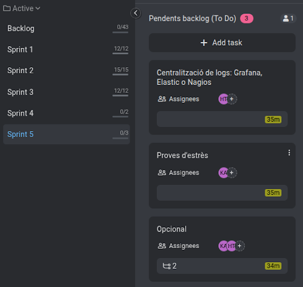

# ACTA - Sprint 5 Planning

## Informacio de la Reunio

| Camp | Valor |
|------|-------|
| Data | 02/03/2026 |
| Hora | 15:30 - 16:00 |
| Lloc | Aula ASIX |
| Sprint | Sprint 5 |
| Duracio Sprint | 02/03/2026 - 10/03/2026 |

## Assistents

| Nom | Rol | Assistencia |
|-----|-----|-------------|
| Hamza | Product Owner / DevOps Lead | Present |
| Kevin | Infrastructure / Frontend | Present |

---

## 1. Objectiu del Sprint

Centralització de logs: Grafana, Elastic o Nagios i proves d'estrès. I com opcional Dashboard de rendiment i automatització de la posada a producció del desplegament amb Vagrant/Ansible/CI-
CD.

---

## 2. Backlog del Sprint

### Tasques Assignades

| ID | Tasca | Assignat | Estimacio | Prioritat |
|----|-------|----------|-----------|-----------|
| T1.1 | Centralització de logs: Grafana, Elastic o Nagios | Hamza | 3h | Alta |
| T1.2 | Proves d'estrès | Kevin | 3h | Alta |
| T1.3 | Dashboard de rendiment | Hamza, Kevin | 2h | Alta |
| T1.4 | automatització de la posada a producció del desplegament amb Ansible. | Hamza, Kevin | 3h | Alta |

Total estimat: 11 hores 

---

## 3. Captura ProofHub

---

## 4. Propera Reunio

| Tipus | Data | Hora |
|-------|------|------|
| Daily Standup | 02/03/2026 | 15:30 |
| Sprint Review | 10/03/2026 | 16:00 |

---

## 5. Team

| Rol | Nom |
|-----|-----|
| Product Owner | Hamza |
| Developer | Kevin |

---

Acta generada: 02/03/2026
Versio: 1.1
