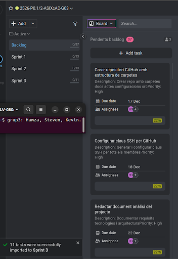

# ACTA - Sprint 1 Planning

## Informacio de la Reunio

| Camp | Valor |
|------|-------|
| Data | 15/12/2025 |
| Hora | 09:00 - 10:30 |
| Lloc | Aula ASIX / Online |
| Sprint | Sprint 1 |
| Duracio Sprint | 15/12/2025 - 19/01/2026 |

## Assistents

| Nom | Rol | Assistencia |
|-----|-----|-------------|
| Hamza | Product Owner / DevOps Lead | Present |
| Steven | Backend Developer / DBA | Present |
| Kevin | Infrastructure / Frontend | Present |

---

## 1. Objectiu del Sprint

Crear un MVP (Minimum Viable Product) de l'aplicacio Extagram funcionant en una sola maquina amb servidor web NGINX o Apache, PHP i MySQL.

---

## 2. Backlog del Sprint

### Tasques Assignades

| ID | Tasca | Assignat | Estimacio | Prioritat |
|----|-------|----------|-----------|-----------|
| T1.1 | Crear repositori GitHub i estructura de carpetes | Hamza | 2h | Alta |
| T1.2 | Configurar claus SSH per GitHub | Hamza | 1h | Alta |
| T1.3 | Documentar analisi del projecte | Hamza | 4h | Alta |
| T1.4 | Installar i configurar NGINX | Kevin | 3h | Alta |
| T1.5 | Configurar virtual host per extagram | Kevin | 2h | Alta |
| T1.6 | Configurar PHP-FPM | Steven | 3h | Alta |
| T1.7 | Installar i configurar MySQL | Steven | 2h | Alta |
| T1.8 | Crear base de dades i taula posts | Steven | 1h | Alta |
| T1.9 | Desplegar fitxers de l'aplicacio | Kevin | 2h | Mitjana |
| T1.10 | Proves de funcionament | Tots | 3h | Alta |
| T1.11 | Documentar guia d'installacio | Hamza | 3h | Mitjana |
| T1.12 | Preparar Sprint Review | Tots | 2h | Mitjana |

Total estimat: 28 hores (aproximadament 10h per persona)

---

## 3. Definicio de Done (DoD)

Una tasca es considera completada quan:

- El codi/configuracio esta funcionant correctament
- Esta documentat al repositori GitHub
- Ha estat revisat per un altre membre de l'equip
- Les proves han passat satisfactoriament
- Commit pujat a GitHub amb missatge descriptiu

---

## 4. Dependencies Identificades

```
T1.1 --> T1.2 --> T1.3
              |
              v
         T1.4 --> T1.5 --> T1.9 --> T1.10
              |
         T1.6 --> T1.7 --> T1.8 -->
```

---

## 5. Riscos del Sprint

| Risc | Probabilitat | Impacte | Accio |
|------|--------------|---------|-------|
| Problemes amb permisos SSH | Mitjana | Alt | Documentar proces detallat |
| Conflictes de versio PHP | Baixa | Mitja | Usar versio estable |
| Errors de connexio MySQL | Mitjana | Alt | Verificar credencials |

---

## 6. Captura ProofHub



---

## 7. Propera Reunio

| Tipus | Data | Hora |
|-------|------|------|
| Daily Standup | 16/12/2025 | 09:00 |
| Sprint Review | 19/01/2026 | 10:00 |

---

## 8. Signatures

| Rol | Nom | Signatura |
|-----|-----|-----------|
| Product Owner | Hamza | _____________ |
| Developer | Steven | _____________ |
| Developer | Kevin | _____________ |

---

Acta generada: 15/12/2025
Versio: 1.0
