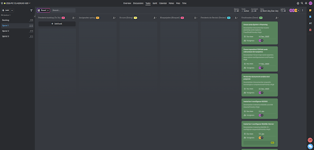

# ACTA - Sprint 1 Review

## Informacio de la Reunio

| Camp | Valor |
|------|-------|
| Data | 19/01/2026 |
| Hora | 10:00 - 11:30 |
| Lloc | Aula ASIX / Online |
| Sprint | Sprint 1 |

## Assistents

| Nom | Rol | Assistencia |
|-----|-----|-------------|
| Hamza | Product Owner / DevOps Lead | Present |
| Steven | Backend Developer / DBA | Present |
| Kevin | Infrastructure / Frontend | Present |
| Professor | Tutor | Present |

---

## 1. Resum del Sprint

### Objectiu del Sprint

Crear un MVP de l'aplicacio Extagram funcionant en una sola maquina.

### Resultat

- [ ] Objectiu assolit completament
- [ ] Objectiu assolit parcialment
- [ ] Objectiu no assolit

---

## 2. Revisio de Tasques

| ID | Tasca | Assignat | Estat | Comentaris |
|----|-------|----------|-------|------------|
| T1.1 | Crear repositori GitHub | Hamza | | |
| T1.2 | Configurar claus SSH | Hamza | | |
| T1.3 | Documentar analisi | Hamza | | |
| T1.4 | Installar NGINX | Kevin | | |
| T1.5 | Configurar virtual host | Kevin | | |
| T1.6 | Configurar PHP-FPM | Steven | | |
| T1.7 | Configurar MySQL | Steven | | |
| T1.8 | Crear BBDD | Steven | | |
| T1.9 | Desplegar aplicacio | Kevin | | |
| T1.10 | Proves funcionament | Tots | | |
| T1.11 | Guia installacio | Hamza | | |
| T1.12 | Preparar Review | Tots | | |

---

## 3. Demostracio

### Funcionalitats Demostrades

1. Acces a l'aplicacio web
2. Publicar un post amb text
3. Pujar una imatge
4. Visualitzar posts

---

## 4. Retrospectiva

### Que ha anat be?

1.
2.

### Que podria millorar?

1.
2.

---

## 5. Captura ProofHub

---

## 6. Signatures

| Rol | Nom | Signatura |
|-----|-----|-----------|
| Product Owner | Hamza | _____________ |
| Developer | Steven | _____________ |
| Developer | Kevin | _____________ |

---

Acta generada: 19/01/2026
