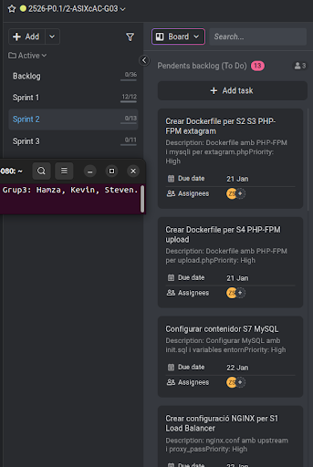

# ACTA - Sprint 2 Planning

## Informacio de la Reunio

| Camp | Valor |
|------|-------|
| Data | 20/01/2026 |
| Hora | 15:00 - 15:30 |
| Lloc | Aula ASIX |
| Sprint | Sprint 2 |
| Duracio Sprint | 20/01/2026 - 02/02/2026 |

## Assistents

| Nom | Rol | Assistencia |
|-----|-----|-------------|
| Hamza | Product Owner / DevOps Lead | Present |
| Steven | Backend Developer / DBA | Present |
| Kevin | Infrastructure / Frontend | Present |

---

## 1. Objectiu del Sprint

Segregar l'aplicacio en contenidors Docker, implementant proxy invers, balanceig de carrega i separacio de serveis segons l'arquitectura definida.

---

## 2. Backlog del Sprint

| ID | Tasca | Assignat | Estimacio | Prioritat |
|----|-------|----------|-----------|-----------|
| T2.1 | Crear Dockerfile per S2/S3 (PHP-FPM extagram) | Steven | 2h | Alta |
| T2.2 | Crear Dockerfile per S4 (PHP-FPM upload) | Steven | 1.5h | Alta |
| T2.3 | Crear Dockerfile per S7 (MySQL) | Steven | 1h | Alta |
| T2.4 | Crear configuracio NGINX per S1 (Load Balancer) | Kevin | 3h | Alta |
| T2.5 | Crear Dockerfile per S5 (Images server) | Kevin | 1h | Alta |
| T2.6 | Crear Dockerfile per S6 (Static server) | Kevin | 1h | Alta |
| T2.7 | Crear docker-compose.yml | Hamza | 3h | Alta |
| T2.8 | Configurar xarxa Docker | Hamza | 1.5h | Alta |
| T2.9 | Configurar volums persistents | Hamza | 1h | Alta |
| T2.10 | Proves de balanceig de carrega | Tots | 2h | Alta |
| T2.11 | Documentar configuracio Docker | Hamza | 2h | Mitjana |
| T2.12 | Preparar Sprint Review | Tots | 1h | Mitjana |

---

## 3. Captura ProofHub

---

## 4. Team

| Rol | Nom | 
|-----|-----|
| Product Owner | Hamza |
| Developer | Steven | 
| Developer | Kevin |

---

Acta generada: 20/01/2026
