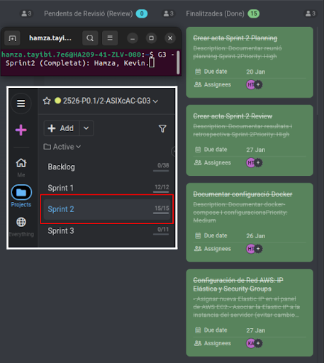

# ACTA - Sprint 2 Review

## Informacio de la Reunio

| Camp | Valor |
|------|-------|
| Data | 27/01/2026 |
| Hora | 10:00 - 11:30 |
| Lloc | Aula ASIX / Online |
| Sprint | Sprint 2 |

## Assistents

| Nom | Rol | Assistencia |
|-----|-----|-------------|
| Hamza | Product Owner / DevOps Lead | Present |
| Steven | Backend Developer / DBA | Present |
| Kevin | Infrastructure / Frontend | Present |
| Professor | Tutor | Present |

---

## 1. Objectiu del Sprint

Segregar l'aplicacio en contenidors Docker amb proxy invers i balanceig de carrega.

---

## 2. Revisio de Tasques

| ID | Tasca | Assignat | Estat | Comentaris |
|----|-------|----------|-------|------------|
| T2.1 | Dockerfile S2/S3 | Steven | | |
| T2.2 | Dockerfile S4 | Steven | | |
| T2.3 | Dockerfile S7 | Steven | | |
| T2.4 | Config NGINX S1 | Kevin | | |
| T2.5 | Dockerfile S5 | Kevin | | |
| T2.6 | Dockerfile S6 | Kevin | | |
| T2.7 | docker-compose.yml | Hamza | | |
| T2.8 | Xarxa Docker | Hamza | | |
| T2.9 | Volums persistents | Hamza | | |
| T2.10 | Proves balanceig | Tots | | |
| T2.11 | Documentacio | Hamza | | |
| T2.12 | Preparar Review | Tots | | |

---

## 3. Demostracio

```bash
docker-compose up -d
docker-compose ps
docker-compose logs -f s1-loadbalancer
```

---

## 4. Captura ProofHub



---

## 5. Signatures

| Rol | Nom | Signatura |
|-----|-----|-----------|
| Product Owner | Hamza | _____________ |
| Developer | Steven | _____________ |
| Developer | Kevin | _____________ |

---

Acta generada: 27/01/2026
