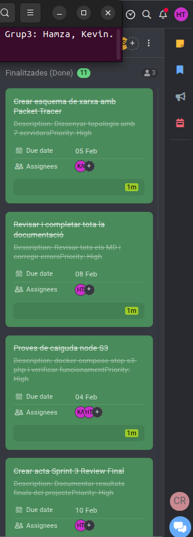

# ACTA - Sprint 3 Review (Final)

## Informacio de la Reunio

| Camp | Valor |
|------|-------|
| Data | 10/02/2026 |
| Hora | 15:00 - 15:30 |
| Lloc | Aula ASIX |
| Sprint | Sprint 3 |

## Assistents

| Nom | Rol | Assistencia |
|-----|-----|-------------|
| Hamza | Product Owner / DevOps Lead | Present |
| Kevin | Infrastructure / Frontend | Present |

---

## 1. Resum del Projecte Complet

### Objectius Assolits

| Sprint | Objectiu | Estat |
|--------|----------|-------|
| Sprint 1 | MVP en maquina unica | ✓ |
| Sprint 2 | Dockeritzacio i balanceig | ✓ |
| Sprint 3 | Integracio i proves | ✓ |

---

## 2. Revisio de Tasques Sprint 3

| ID | Tasca | Assignat | Estat |
|----|-------|----------|-------|
| T3.1 | Esquema Packet Tracer | Kevin | ✓ |
| T3.2 | Doc. arquitectura xarxa | Kevin | ✓ |
| T3.3 | Proves caiguda S2 | Hamza, Kevin | ✓ |
| T3.4 | Proves caiguda S3 | Hamza, Kevin | ✓ |
| T3.5 | Proves caiguda BBDD | Hamza, Kevin | ✓ |
| T3.6 | Doc. proves | Hamza, Kevin | ✓ |
| T3.7 | Revisio documentacio | Hamza | ✓ |
| T3.8 | Control versions Git | Hamza | ✓ |
| T3.9 | Proves finals | Tots | ✓ |
| T3.10 | Implementació LDAP | Tots | ✓ | Alta |

---

## 3. Resultats de Proves

### Proves Operatives

| ID | Prova | Resultat |
|----|-------|----------|
| OP-01 | Acces aplicacio | ✓ |
| OP-02 | Post sense imatge | ✓ |
| OP-03 | Post amb imatge | ✓ |
| OP-04 | CSS carrega | ✓ |
| OP-05 | Multiples posts | ✓ |

### Proves de Caiguda

| ID | Prova | Resultat |
|----|-------|----------|
| CD-01 | Caiguda S2 | ✓ |
| CD-02 | Caiguda S3 | ✓ |
| CD-03 | Caiguda S2+S3 | ✓ |
| CD-04 | Recuperacio | ✓ |

---

## 4. Retrospectiva del Projecte

### Que ha anat be?

1. Planificació amb Sprints i ProofHub - La divisió del projecte en 3 sprints amb seguiment detallat a ProofHub ens va permetre mantenir el control de tasques, deadlines i progrés de l'equip de manera ordenada i professional.
2. Arquitectura de microserveis amb Docker Compose - La implementació dels 8 serveis independents (Load Balancer, 2 PHP backends, Upload, Images, Static, MySQL, LDAP) va funcionar molt bé, demostrant escalabilitat i facilitat de manteniment.
3. Seguretat implementada correctament - HTTPS amb Let's Encrypt, autenticació LDAP, segmentació de xarxa en 3 capes i domini públic amb DuckDNS van aportar un nivell de seguretat professional al projecte.

### Que podria millorar?

1. Proves de càrrega més exhaustives - Només vam fer proves bàsiques de fallada (S2, S3, S7). Hauríem d'haver implementat proves de càrrega amb eines com Apache Bench o JMeter per validar realment l'alta disponibilitat sota estrès.
2. Documentació incremental durant el desenvolupament - Tot i tenir documentació completa al final, crear-la progressivament durant cada sprint hauria estalviat temps i evitat haver de recordar detalls tècnics a posteriori.

### Llicons Apreses

1. La importància de la documentació tècnica clara - Un README ben estructurat amb diagrames de xarxa, instruccions d'instal·lació i troubleshooting és essencial. Facilita tant la comprensió del projecte per tercers com el manteniment futur.
2. Treball en equip amb Git i branques - Utilitzar branques (main, dev, feature) i fer commits descriptius va millorar la col·laboració i va permetre revertir canvis quan era necessari sense afectar la branca principal.
3. Adaptació davant canvis en l'equip - Quan un membre de l'equip va marxar, inicialment vam pensar que el projecte es ressenteria i no podríem complir els deadlines. Però ens vam reorganitzar, redistribuir tasques i vam descobrir que amb bona comunicació i compromís podíem tirar endavant i fins i tot completar totes les funcionalitats planificades.

---

## 5. Captura ProofHub Final

---

## 6. Contribucions per Membre

| Membre | Contribucions Principals |
|--------|-------------------------|
| Hamza | Gestio projecte, Docker Compose, Documentacio |
| Kevin | NGINX, Balanceig, Packet Tracer |

---

## 7. Team

| Rol | Nom | 
|-----|-----|
| Product Owner | Hamza |
| Developer | Kevin | 
---

Projecte completat: 10/02/2026
Versio Final: 1.0
