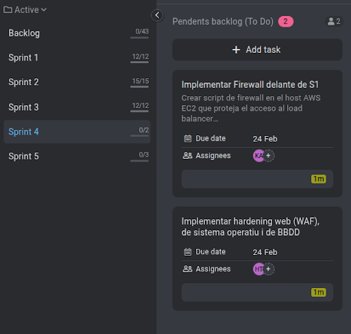

# ACTA - Sprint 4 Planning

## Informacio de la Reunio

| Camp | Valor |
|------|-------|
| Data | 23/02/2026 |
| Hora | 15:30 - 16:00 |
| Lloc | Aula ASIX |
| Sprint | Sprint 4 |
| Duracio Sprint | 17/02/2026 - 24/02/2026 |

## Assistents

| Nom | Rol | Assistencia |
|-----|-----|-------------|
| Hamza | Product Owner / DevOps Lead | Present |
| Kevin | Infrastructure / Frontend | Present |

---

## 1. Objectiu del Sprint

Implementar firewall davant de S1 i Implementar hardening web (WAF), de sistema operatiu i de BBDD

---

## 2. Backlog del Sprint

### Tasques Assignades

| ID | Tasca | Assignat | Estimacio | Prioritat |
|----|-------|----------|-----------|-----------|
| T4.1 | Implementar Firewall delante de S1 | Kevin | 3h | Alta |
| T4.2 | Implementar hardening web (WAF), de sistema operatiu i de BBDD | Hamza | 3h | Alta |

Total estimat: 6 hores 

---

## 3. Captura ProofHub

---

## 4. Propera Reunio

| Tipus | Data | Hora |
|-------|------|------|
| Daily Standup | 17/02/2026 | 15:30 |
| Sprint Review | 24/02/2026 | 16:00 |

---

## 5. Team

| Rol | Nom |
|-----|-----|
| Product Owner | Hamza |
| Developer | Kevin |

---

Acta generada: 23/02/2026
Versio: 1.1
