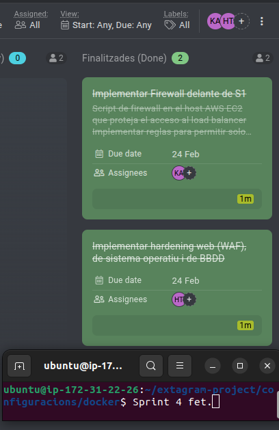

# ACTA - Sprint 4 Review

## Informacio de la Reunio

| Camp | Valor |
|------|-------|
| Data | 24/02/2026 |
| Hora | 16:00 - 16:30 |
| Lloc | Aula ASIX |
| Sprint | Sprint 4 |

## Assistents

| Nom | Rol | Assistencia |
|-----|-----|-------------|
| Hamza | Product Owner / DevOps Lead | Present |
| Kevin | Infrastructure / Frontend | Present |

---

## 1. Resum del Sprint

### Objectiu del Sprint

Implementar firewall davant de S1 i Implementar hardening web (WAF), de sistema operatiu i de BBDD

### Resultat

- [x] Objectiu assolit completament
- [ ] Objectiu assolit parcialment
- [ ] Objectiu no assolit

---

## 2. Revisio de Tasques

| ID | Tasca | Assignat | Estat | Comentaris |
|----|-------|----------|-------|------------|
| T4.1 | Implementar Firewall delante de S1 | Kevin | ✓ | Fet |
| T4.2 | Implementar hardening web (WAF), de sistema operatiu i de BBDD | Hamza | ✓ | Fet |

---

---

## 4. Retrospectiva

### Que ha anat be?

1. 
2. 

### Que podria millorar?

1. 
2. 

---

## 5. Captura ProofHub

---

## 6. Team

| Rol | Nom | 
|-----|-----|
| Product Owner | Hamza | 
| Developer | Kevin |

---

Acta generada: 23/02/2026
