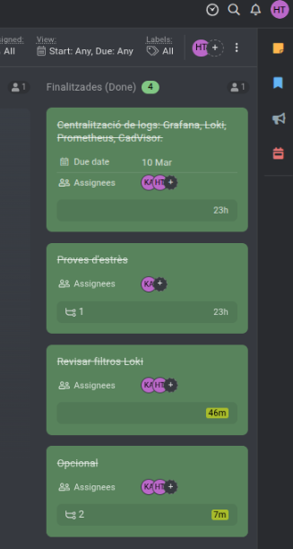

# ACTA - Sprint 5 Review

## Informacio de la Reunio

| Camp | Valor |
|------|-------|
| Data | 10/03/2026 |
| Hora | 16:00 - 16:30 |
| Lloc | Aula ASIX |
| Sprint | Sprint 5 |

## Assistents

| Nom | Rol | Assistencia |
|-----|-----|-------------|
| Hamza | Product Owner / DevOps Lead | Present |
| Kevin | Infrastructure / Frontend | Present |

---

## 1. Resum del Sprint

### Objectiu del Sprint

Centralització de logs: Grafana, Elastic o Nagios i proves d'estrès. I com opcional Dashboard de rendiment i automatització de la posada a producció del desplegament amb Vagrant/Ansible/CI-
CD.

### Resultat

- [x] Objectiu assolit completament
- [ ] Objectiu assolit parcialment
- [ ] Objectiu no assolit

---

## 2. Revisio de Tasques

| ID | Tasca | Assignat | Estat | Comentaris |
|----|-------|----------|-------|------------|
| T5.1 | Centralització de logs: Grafana, Elastic o Nagios | Hamza | ✓ | Fet |
| T5.2 | Proves d'estrès | Kevin | ✓ | Fet |
| T5.3 | Dashboard de rendiment | Hamza, kevin | ✓ | Fet |
| T5.4 | Automatització de la posada a producció del desplegament amb Ansible.| Hamza, Kevin | ✓ | Fet |
| T5.5 | Alertes Telegram | Hamza, Kevin | ✓ | Fet |

---

## 4. Retrospectiva

### Que ha anat be?

1. Ens hem coordinat molt bé dividint la feina: mentre un li fotia canya a les proves d'estrès, l'altre anava muntant tota la part visual. El dashboard final de Grafana ens ha quedat molt net i professional.
2. L'automatització amb Ansible ha estat un encert total. Al principi costa arrencar, però un cop fet el playbook ens ha estalviat moltíssim temps per aixecar i configurar tot l'entorn de producció de cop.

### Que podria millorar?

1. Vam perdre bastant temps barallant-nos amb la configuració del Promtail i les etiquetes (labels) de Loki a Grafana per "tonteries" de sintaxi i formats. Per al pròxim projecte hem de llegir millor la documentació oficial abans de tocar fitxers a cegues.
2. Quan vam fer les proves d'estrès, vam generar tants logs i mètriques de cop que no havíem previst bé el consum de recursos de la pròpia monitorització. Ens va faltar posar límits des del minut zero.

---

## 5. Captura ProofHub

---

## 6. Team

| Rol | Nom | 
|-----|-----|
| Product Owner | Hamza | 
| Developer | Kevin |

---

Acta generada: 10/03/2026
